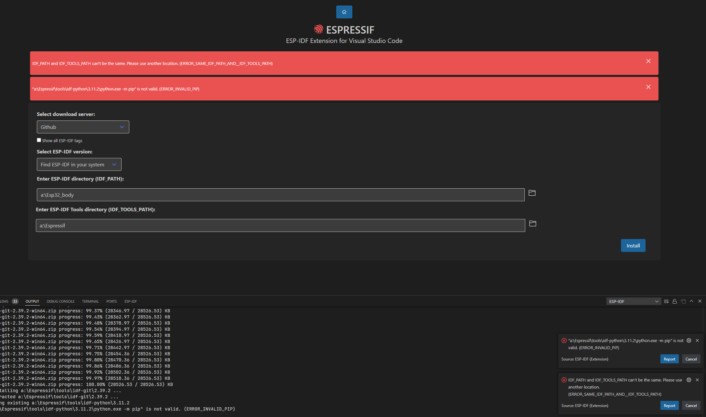

# ESP32入门

### ESP32与vscode开发环境搭建

#### 参考

1. https://blog.csdn.net/XiaoXiaoPengBo/article/details/123979246
2. https://www.esp32.com/viewtopic.php?t=23976

#### 问题

按照这个流程钟的第一个方法试了不行，于是去试第二个方法

第二个方法遇到下面这两个问题

* 一个是文件夹重名，我一个文件夹叫Espressif，一个叫Espressif_body它说我不行。。反正注意分开把
* 第二个是python.eve -m pip not valid

