# LGS5148板子

### 基本介绍

LGS5148 是小型 48V、0.6A 同步降压 DC-DC 转换器，采用 3mm X 3mm SOT23-6 封装，输出电压可通过外部电阻分压器进行调整。

### 封装

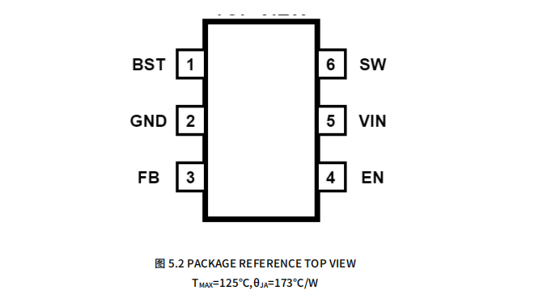

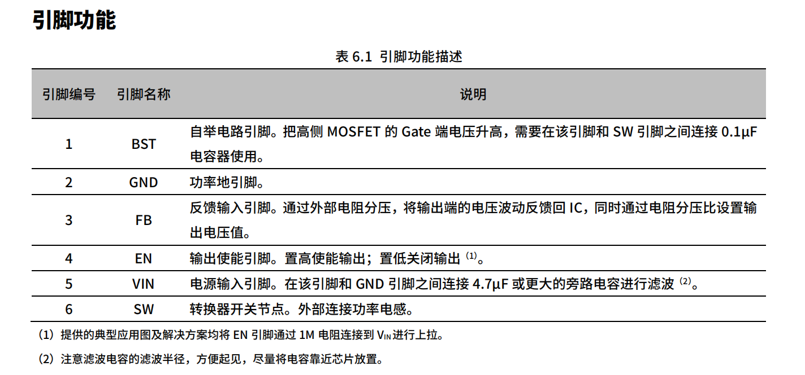

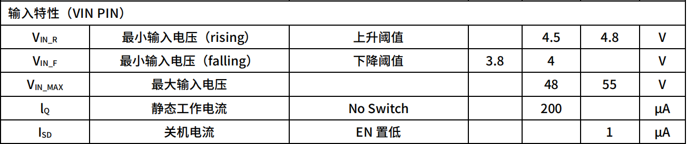

### 典型应用

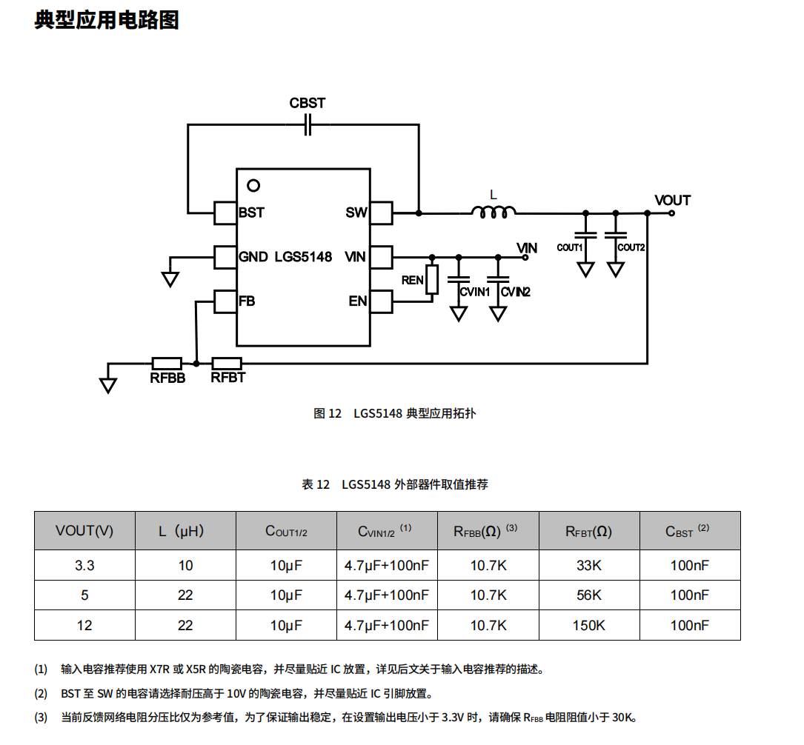

### 输出电压

LGS5148 的电压调节回路会将 FB 电压调节至与内部参考电压相同，可以通过改变 R1 和 R2 的电阻比例来调节输出电压大小。电阻分压器从输出节点连接到地，中点连接至 FB 引脚。

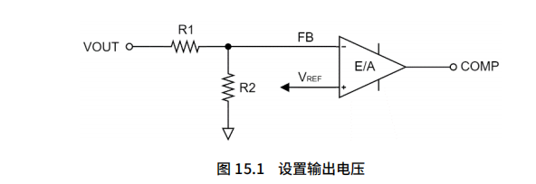

R2可根据以下公式计算：
$$
R_2 = \frac{V_{FB}}{V_{OUT}-V_{FB}}* R_1
$$
输出电压配置参考

| $V_0(V)$ | $R_1 (k\Omega)$ | $R_2 (k\Omega)$ |
| -------- | --------------- | --------------- |
| 3.3      | 33              | 10.7            |
| 5        | 56              | 10.7            |
| 12       | 150             | 10.7            |

较大的分压电阻可以减少流过分压网络的电流，提高电压转换效率。但是电阻阻值太大会使反馈回路更容易受噪声影响。建议使用精度±1%或者更好的分压电阻，温度系数 100mmp 或更低，电阻阻值限制在 K 级。

如果 FB 引脚接地或断开，输出电压值会被驱动至输入电压值附近。应注意，此时接在输出的负载可能会损坏。

反馈回路应保持远离 PCB 噪声干扰的地方，可参考后文给出的 PCB 布局参考。

### 前馈电容

在某些情况下，前馈电容 CFF可以跨接在 VOUT-FB 的电阻上来增加环路相位裕度，提高负载瞬态响应。

CFF 的引入可以在反馈回路中与反馈电阻形成新的零点(ZFF)和极点(PFF)，如果将零点置于出现单位增益的频率之前可以增加

频率带宽，使得稳压器输出振铃减小并更快稳定，从而提高系统的瞬态响应。

通常 CFF 的选择值越大可以提供更大的带宽，但是过大的 CFF 会造成环路增益带宽频率过高，导致环路不稳定。CFF 的一般值

在 22pF~220pF 之间。

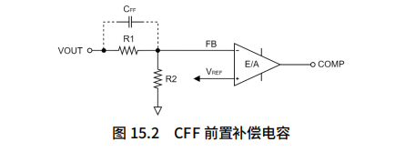

 $C_{FF}$ 可根据以下公式估算
$$
C_{FF} = \frac{\sqrt{\frac{V_{FB}}{V_{OUT}}}}{2\pi * R_1 * f_c}
$$

### 自举电容 $C_{BST}$

LGS5148 降压驱动器高侧开关驱动电路要求偏置电压高于 VDD，以确保高侧 MOS 管处于开启状态。BST 和 SW 之间的电容

CBST作为“电荷泵”，将 BST 端的电压升高到 SW+VDD（VBST-SW=5V）, 为 CBST充电的导通二极管集成在 LGS5148 的芯片内

部，尽可能最小化使用方案的尺寸。CBST推荐使用 0.1µF 电容器，耐压值高于 10~16V。

### 输入电容$C_{VIN}$ 

LGS5148 要求使用去耦电容来滤除输入端的噪声干扰。去耦电容典型推荐值为 4.7µF，额定电压必须大于 IC 所要求的最大

输入电压，最好应为最大输入电压的两倍(1)。该电容的增加可以减小输入电压纹波，并且在负载瞬变时保持输入端电压的稳定。

同时，在输入端与滤波电容并联一个小型 100nF 陶瓷电容有助于滤除高频噪声。小型电容器滤波半径小，应放置在距离芯片尽可能近的位置，以确保其发挥最好的滤波效果。

在 LGS5148 的测试过程中，我们选择了 4.7µF，100V，X7R 和 100nF，100V，X7R 的陶瓷电容器。

（1） 陶瓷电容的直流偏置效应（DC-Bias Effect）使得电容的有效值下降。请尽可能参照所选电容器的直流偏压特性选择合适的电容.封装尺寸、额定电压和介质材料都会造成额定电容值和有效电容值的差异。

### 输出电容 $C_{OUT}$

LGS5148 允许使用的输出电容值范围比较广，为保证成本和较小的体积，尽量选择合适的输出电容。实际应用中，输出电容会直接影响输出电流瞬态响应时的电压过冲/欠冲和输出电压的纹波。当负载发生瞬态变化时，输出电容需要在环路调节完成前提供电荷,瞬态电压变化值$\Delta V_{OUT}$可由以下公式计算：
$$
\Delta V_{OUT} = \Delta I_{OUT} * ESR
$$
其中$\Delta I_{OUT}$表示负载电流的跳变值，ESR 为输出电容的等效串联电阻值。

输出电压纹波由两部分组成：一是电感电流纹波流过输出电容的 ESR 引起的，二是电感电流纹波对输出电容充放电引起的。
$$
\Delta V_{OUT-ripple} = \frac{\Delta I_L}{8* C_{OUT}*F_{SW}}+\Delta I_L * ESR
$$
 $\Delta I_L$ 表示电感纹波电流， $F_{SW}$ 表示MOSFET开关频率，为了在瞬态变化中保持较小的输出电压过冲或欠冲、减小输出纹波，需要电容具有较大的容值和较小的 ESR，这也会使成本和体积增加，选择合适的输出电容至关重要(1)(2)。

（1） 输出电容过大也会影响芯片的正常启动和回路稳定性。

（2） 可以直接使用典型应用中推荐的 10µF,100V,X7R 的陶瓷电容，或者将其作为一个选择输出电容值的起点

### 功率电感 L

对于功率电感的选型主要考虑电感的饱和电流，要基于所期望的纹波电流∆I𝐿𝐿，即电感中随负载电流变化的交流电流有效值。

一般控制在最大负载电流 $I_{OUT-MAX}$ 的20%-40%之间。电感值可由以下公式进行计算：
$$
\Delta I_L = \frac{(V_{IN}-V_{OUT})*D}{L*F_{SW}}
$$
 $D$ 表示开关占空比，可用 $D = \frac{V_{OUT}}{V_{IN}}$ 近似计算，得到的电感值单位为 $\mu H$。

电感饱和电流值必须高于最大的负载电流和纹波电流之和：
$$
I_{L-MAX} \geq I_{OUT-MAX} + \frac{\Delta I_L}{2}
$$
一般来说，选择电感值较低的电感会具有更小的 DCR，能应对更快速的瞬态响应，使用方案的尺寸更小。但是过低的电感会

产生更大的电感电流纹波，从而导致使用同样 $C_{OUT}$ 时的输出电压纹波更大。

经过测试，典型应用中推荐的电感值可以作为使用参考。

### 参考PCB布局

LGS5148 的高集成度使 PCB 板布局非常简明清晰。较差的布局会影响 LGS5148 的性能，造成电磁干扰(EMI )、电磁兼容性

(EMC)差、地跳以及电压损耗，进而影响使用的稳定性。为了优化其电气和热性能，请参照下列规则来实现 PCB 布局布线，

确保最佳性能：

■ 将高频陶瓷输入电容 CVIN 尽可能放置在距离 LGS5148 的 VIN 和 GND 引脚近的位置，以降低引入到输出引脚的高频噪

声，减小 EMI 辐射。此外，保持输入输出电容在所在层上连接到大面积 GND 上。

■ 对功率回路最好使用大面积覆铜的方式，使输入输出连接回路尽可能宽，减小传输过程中的损耗，使效率最大化。

■ 为增强散热和连接性，可以增加过孔数量来实现顶层和其他电源层或地层之间的互连。请确保 PCB 板有足够的铺铜区

域用来散热，使结温保持在 125℃以下。

■ 应考虑电感所产生的 ACR 和 DCR 损耗，所造成的热量传导给芯片。可酌情将电感放置稍远或合理设计热岛。

■ 反馈电阻 RFBT 和 RFBB 应位于靠近 FB 引脚的位置，将前馈电容 CFF 与 RFBT 平行放置，反馈回路与 FB 和 GND 引脚距离

必须近，适当的与 VOUT距离可以相对放远一些，需要保证反馈回路远离任何噪声源（如 SW 节点）。

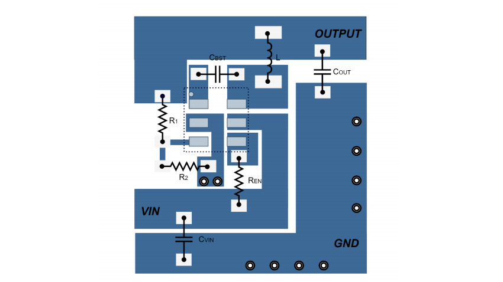

## 其他特性

### 软起动（soft start）

LGS5148 设置内部软启动。软启动可防止在启动过程中输出电压超调。芯片启动时，IC 内部电路会产生一个软启动电压(VSS) ，该电压从 0V 开始上升，当它小于内部参考(VREF)时，VSS代替 VREF作为误差放大器的参考电压；当 VSS超过 VREF时，误差放大器使用 VREF作为参考电压。

在整个启动阶段，开关电流限制依然有效，避免上电即短路的情形发生。当输出有非常大的电容时（例如 2200µF 甚至更大），输出电压上升速度会比 VSS慢，受限于最大开关限流，从启动到达到目标电压设定值的时间会大于软启动过程的时间。

### EN--IC使能

EN 引脚的电压控制 LGS5148 的启动和关闭。当 EN 电压小于 VEN_OUT时芯片保持低功耗待机状态，此时的输入电流为 30µA（VIN=24V），当 EN 引脚处电压大于 VEN_OUT时，IC 进入软启动模式。在 IC 关闭过程中，EN 引脚电压下降到 VEN_OUT-VEN_HYST区间时，LGS5148 稳压器停止工作，重新进入待机状态。

如无特殊要求，可将 EN 引脚通过一个 1M 电阻连接到 VIN 上，当 VIN 上电时可同时保持使能打开（注：EN 引脚耐压值为6V）。

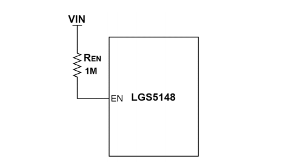

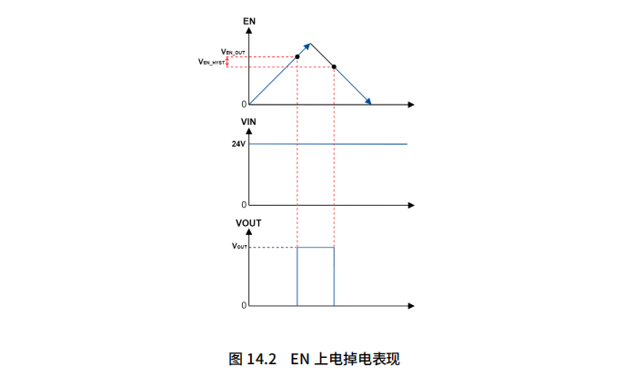

### 最大电流限制

稳压器输出具备逐周期过流限制功能。当 SW 电流触发$I_{LIMIT.SW(PEAK)}$,BUCK 输出会进入逐周期限流状态。$I_{LIMIT.SW(PEAK)}$与电感大小和输入压差相关，$I_{LIMIT.SW(PEAK)}$仅为参考最小值。当长时间过流或短路时，将可能触发全局 OTP 保护。

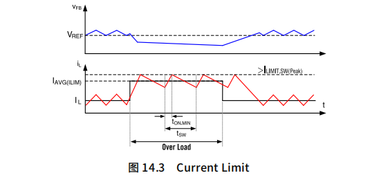

### 输入欠压保护（VULO）

为了防止芯片在低电压下的误操作，LGS5148 内部集成一个欠压锁定电路。当 VIN 电压低于低于一定值时，会触发 UVLO 保护机制，关闭稳压器输出。当 VIN大于  $UVLO_{rising}$时会重新启动芯片。UVLO 机制允许 VIN降低过程中工作在更小电压 $UVLO_{falling}$下。

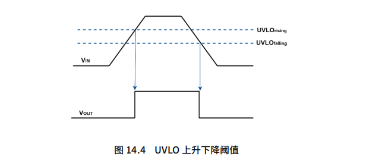