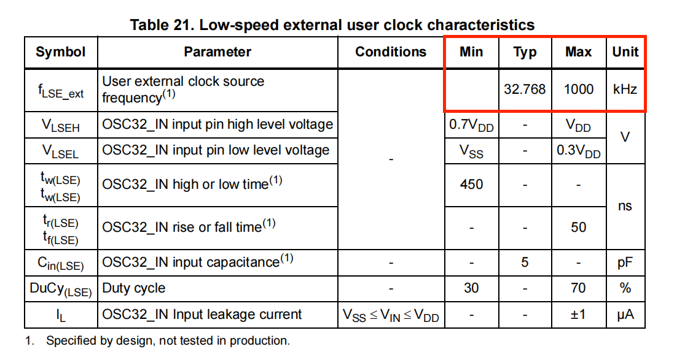

这篇文章参考F103C8T6数据手册

### 单片机最小系统

单片机最小系统主要包括

* 单片机
* 时钟电路
* 复位电路
* 电源电路
* 程序加载口

### STM32的三种启动模式

### 复位电路(reset)

手册第66页

NRST连接着一个永久上拉电阻，当它接低电平时就复位

* NRST代表not reset

其中红色方框部分为硬件消抖，因为复位需要低电平一段时间才能reset。也有类似的会作为初次复位的作用，不过stm32芯片里自带上电复位。而且如果是上电复位的话电容应该更大些。上电复位的原理是电容初始电压为0时相当于导线。

### 滤波电容

其中我们有个 5*100nf 和 4.7uf的一组滤波电容

### 外部时钟

翻到手册第55页，我们找到专门讲外部晶振特点的章节

外部晶振分为高速晶振和低速晶振，用HSE(High Speed External)和LSE(Low Speed External)

我们发现外部高速晶振的最低频率是1MHz，最高是25MHz，然后官方推荐的是8MHz的，所以通常选用8MHz的

然后是外部低速晶振最大是1000kHz，通常为32.768kHz约等于 $2^{15}$

#### 这里推荐用有源晶振

简单理解，不用加复杂的外部电路

#### 无源和有源区别

* **无缘晶振就是一个晶体**， 必须要结合外围电路构成一个振荡器才能输出特定频率的信号，而这个振荡器是需要提供电源的。MCU可以用无源晶振是因为其内部集成有构成振荡器的电路，晶体不好集成就只好外加了

* 有源晶振是真正意义上的振荡器，里面包含了**晶体和外围电路**，只要外部提供一个电压源就可以输出信号

#### 晶振电路

可以参考下面这个网址[传送门](https://blog.csdn.net/CTianshen/article/details/109154057)

* 外部高速晶振接OSC_IN 和 OSC_OUT

* 外部低速晶振接OSC32_IN 和 OSC32_OUT

##### 无源晶振

* 可以参考以下中文网址

[传送门](https://genuway.com/3486.html)

* 或者直接看原文档高速和低速表格数值下面的note 部分

##### 有源晶振

* 可以不用管什么电容，直接接OSC_IN，让OSC_OUT悬空
* 在有三态引脚（Tri-state)的有源晶振中，Tri-state引脚可控制晶振的输出，其中
  * 高电平：支持输出
  * 低电平：禁用输出
  * 如果不需要三态功能，建议引脚悬空
  * [传送门](https://www.genuway.com/2201.html)

#### 晶振电路PCB设计要点

源自晶振电路章节下[传送门](https://blog.csdn.net/CTianshen/article/details/109154057)最下面的一小节

* 晶振信号线最短原则，减小输出失真和启动稳定时间。（线路太长会增加寄生电容，容易发生串扰，影响其他信号线
* 其他信号线远离晶振线（特别是模拟信号线)。因为（晶振线信号跳动频繁，产生的磁场不断变化，附近的线易受到干扰（电磁感应定律）
* 晶振焊接面可以采用包地处理，并多打地孔晶振底层保持完整的地平面，不要有走线；。（这个地主要是给干扰信号一个的泄放通道）
* 金属外壳的晶振外壳接地。

### 电源

使用线性稳压器(LDO)，具体使用以元器件数据手册为准，这里以HE9073A33M5R，SOT-23-5的封装为准

首先我们从手册中对封装的各个引脚有基本认识

然后参考典型应用使用即可

### 串口转USB

使用CH340芯片，有很多封装，这里选择CH340N，SOP8，引脚最少。

在芯片接3.3V和5V时使用不同策略。 接5V时需要接一个100nF的退藕电容

### PCB设计小知识点

* 1个12mil的孔径可以认为承载0.5A的电流（mil代表密耳，1mil约为0.0254mm，1mm相当于39.37密耳
* 