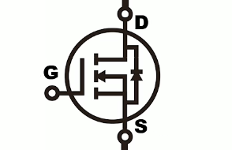
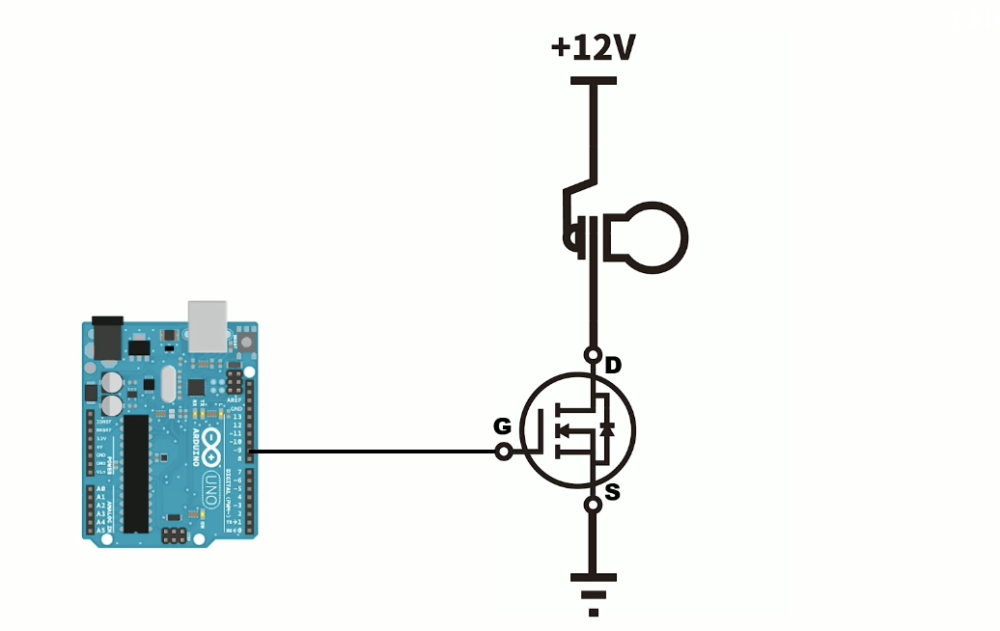
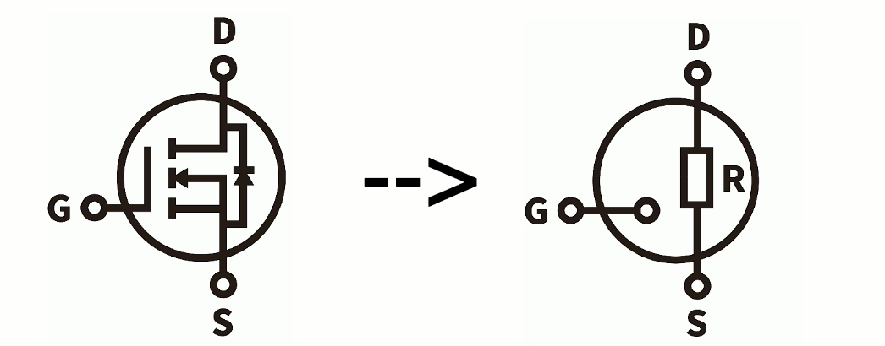
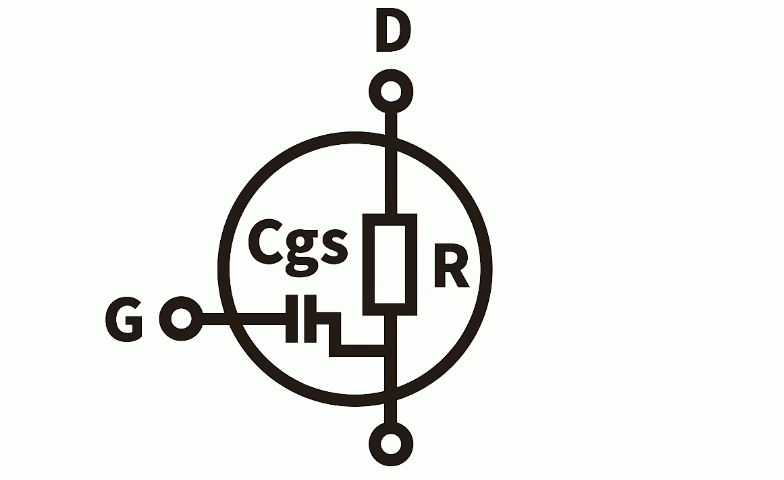
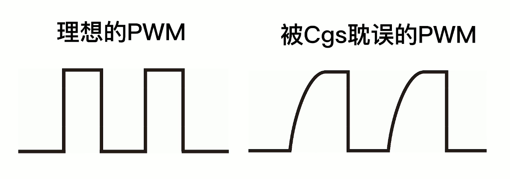
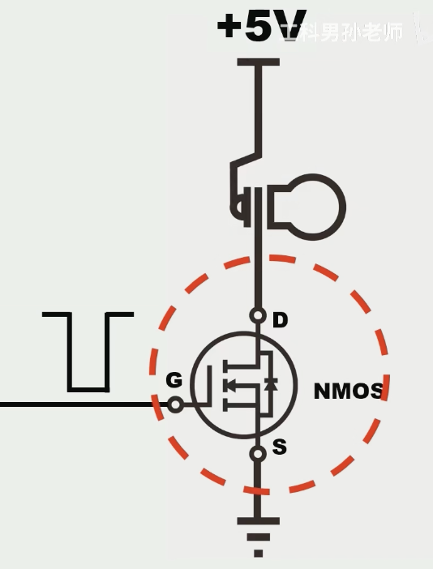
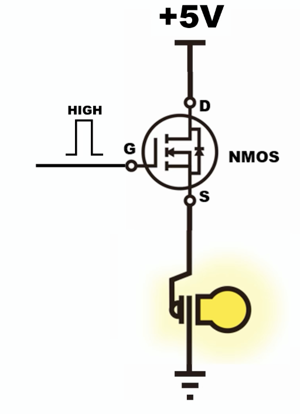
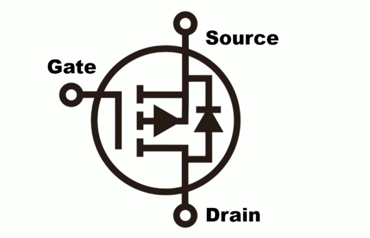
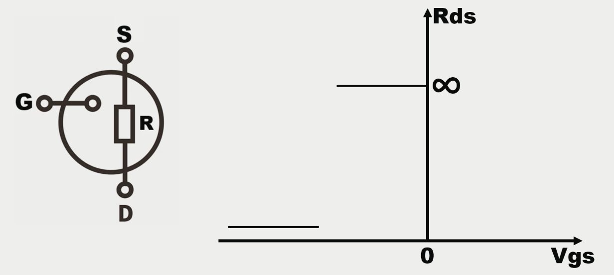
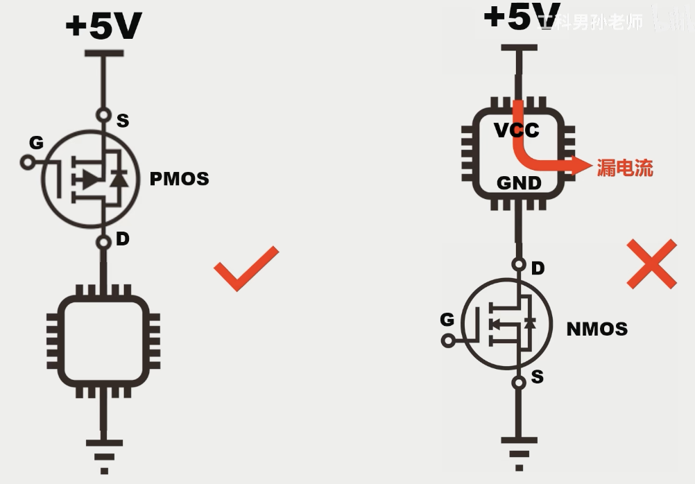

## mos

mos管（mosfet）可以理解为一种用高低电平控制的开关，分为nmos和pmos。相比继电器，它能够实现非常快速的开关控制，我们就来认识一下。

### nmos

nmos大概长这样，有三个引脚

* D：Drain 漏极
* G：Gate 栅极
* S：Source 源极

其中G引脚是控制引脚，我们通过单片机的IO口输出高低电平就可以控制它的开关啦。

#### 典型案例

我们将单片机的IO口连接刀这个nmos的G极，再接上一个12V和GND，注意要共地！

当单片机IO口输出高电平，nmos等效为闭合的开关，灯泡亮起

当单片机IO口输出低电平，nmos等效为松开的开关，灯泡熄灭

当我们不断地对这个IO口输出高低电平，我们实际上输出的波形就相当于一个个PWM波（方波），当我们控制PWM波的占空比或者说调节这个开关的持续时间时，我们就可以调节这个灯泡的亮度，这就是PWM波调光。

这就是nmos最常见的用法，用nmos控制一个功率器件，比如一个电机，水泵，电磁铁等

#### 等效模型

为了更好地讲清楚下面的选型参数，我们先来讲解一下nmos的等效模型

nmos可以看成是一个电压控制的电阻，这个电压指的是GS之间的电压，电阻指的是DS之间的电阻

##### Vgsth

对于这个电压控制的电阻， 可以理解为这个电阻的大小会随着GS电压的变化而变化。当GS的电压小于某个特定值时，RS之间的电阻基本上是无穷大的；当这个电压值大于这个特定值时，DS之间的电阻接近于0。等于的话我们先不用管。我们将这个临界的电压值称之为Vgsth，可以在数据手册里找到它。

> 所以我们选择二极管的时候，目标的Vgsth应该小于高电平的电压值。比如高电平是5V，选择3V的Vgsth比较合适。太小太大都不合适。

##### Rdson

我们上面知道当GS为高电平，二极管被打开时，RS之间的电阻接近于0，但是也是有数值的，这个数值就是Rdson。我们把mos管被完全打开时的DS电阻称为Rdson。

> 一般Rdson越小，nmos价格越高，体积也会比较大

##### Cgs

Cgs指的是GS之间的寄生电容，这是一个制造工艺的问题，所有nmos都有。这个寄生电容会影响到nmos的打开速度，因为电压需要先给电容充电。这就导致GS的电压不能一下子到达给定的数值

会有一个爬升的过程。我们可以用示波器观察到这个过程，当PWM的周期接近于这个爬升时间时，这个PWM波就会失真，也就构不成方波了。

> 一般来说Cgs大小与Rdson成反比

#### 选型

* 封装：封装就是nmos的外形和尺寸。一般来说封装越大，能承受的电流也就越大。
* Vgsth：我们选择二极管的时候，目标的Vgsth应该小于高电平的电压值
* Rdson：选择较小的Rdson可以减小分压
* Cgs：根据PWM的周期决定电容的大小。一般来说Cgs大小与Rdson成反比。

#### 实例

* slowdance相框
* 或者自动拍摄水滴的装置

#### 应用

注意，在这个电路中我们的nmos只能放在灯泡的下面，我们可以用反证法验证一下

假如我们放在灯泡的上面，G极处于高电平，那么此时DS之间是通路，S极的电压也为5V，为了维持nmos的打开状态，GS的电压必须高于Vgsth+5V，如果这个高电平没有这么高的电压，那么就不能正常工作了，陷入一个不确定的状态。

### pmos

与nmos一样，pmos也有三个引脚，只不过pmos中间的箭头是朝外的。而且S极和D极的位置也发生了变化

#### 控制逻辑

当单片机IO口连接G极发送高电平时，pmos关闭，发送低电平时，pmos打开。正好和nmos相反

#### 等效模型

与nmos相同，pmos的等效模型也可以看成是电压控制的电阻，但它GS之间的电压和DS之间的电阻阻值的关系有些不同

就是当GS的之间的电压比较小的时候，DS之间的电阻接近无穷大；当GS之间的电压比较大的时候，DS之间的电阻接近0。

之所以这里的电压是个负值是因为我们使用它时一般都是S极接电源，G极接单片机IO口，所以方向与GS相反。

上面的有点绕，可以理解为当单片机IO口输出低电平时，SD之间的电阻比较小，接近0，SD之间为通路；当单片机IO口输出高电平时，SD之间的电阻比较大，接近无穷，SD之间为断路。Vsource 与 Vgate的差值比较大时，SD之间为通路，反之为断路。

### nmos和pmos的区别

nmos和pmos虽然看上去只是功能相反而已，但是在实际应用中还是有细微的差别

#### 应用

当我们想要用nmos作为开关控制比如说芯片这样的元器件，为了防止出现芯片持续接电源漏电流的问题，我们最好是把mos管放在芯片和5V之间，这样能够控制芯片的供电链路，同时芯片也能良好地接地，不会出现通信混乱的问题。

但随之而来的问题是nmos放上面，需要较高的电压来控制它的开关闭合（详见nmos应用章节）所以这时候我们会采取用pmos放在上面的方案，来用较低的电压驱动它

#### 市场

Rdson： nmos < pmos

价格：nmos < pmos

型号：nmos > pmos

出于成本和易用性考虑，能用nmos尽量nmos

### 全桥整流电路

