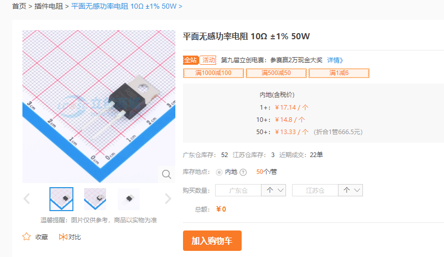
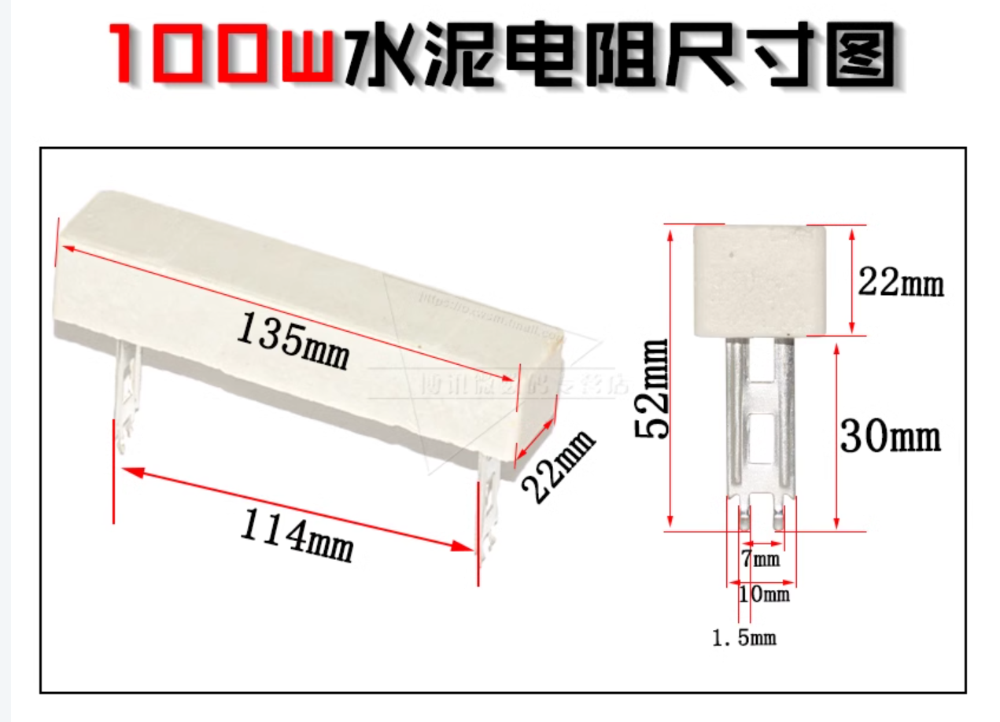

# 容组改进方案

### 能量控制方法

比赛中对超级电容的能力上限规定为2200焦耳，我们的超电实际测下来大概1900焦耳。而比赛中对这个的排查是检测电压，但是总的焦耳只要不超过2200就不会管。

而针对这个规定，我们目前使用的是被动均衡方案。我理解的是如果充电充到某个电容的电压过高就把它能量放掉。但是这样只确保电压不会违规，但还有些电容的性能没有榨干完，而且放掉的能量也是浪费。那么如果我们能够将放掉的能量拿来充给电压较低的电容，那就相当于更好地利用了。这个就是比较新的方案，叫做主动均衡，目前就只有广州城市理工大学的开源

### 主动均衡方案

主动均衡的话这个思路可以，不过方法有挺多种

1. 将大电容多余的能量先放到小电容里，然后用小电容的能量给比较低电压的电容充电
2. 用主动均衡器，可以淘宝搜搜看，一般是电池用的

### 广城理开源

广城理用的就是第一种方案。但第一种方案有个问题就是一般能量都是从高压往低压走，但如果想充的电容电压相对比较高怎么办呢？于是就用到了一个叫做电荷泵的结构（我也不是很懂）就可以实现从低压往高压充电。它其他的结构有很多mos，不断开关开关，还有H桥的结构，这些我一时之间也不是很懂

#### 问题

* 它的这一版的开源方案的问题就是它一旦主动均衡开启了就没办法关了，而这么多的mos开关开关起来都有2-3w的功率了，这部分的功率属于电路的静态功率。对比原来我们自己的超级电容方案，我们的静态功率相当于0w。那这部分功率一场比赛下来消耗下来可能还不如我们原来的那版。

### 方案

#### 芯片

我们可以加个stm32的芯片通过adc采样，用pid算法+pwm控制来实现比较平滑的控制。

这里学长选用了stm32G030K8T6这个型号，比较新的版本，封装更小，引脚刚好够，而且内置的晶振的准度也比较高，只不过没有can通信，不过问题不大。

具体的引脚功能分布为：2路PWM，10路ADC（其中1路监控整体电压保险），9路ENABLE，3路LED，其他就SWD那样。

[G0系列官网keil驱动？](https://www.keil.arm.com/packs/stm32g0xx_dfp-keil/devices/)不是很确定它的名字

#### 控制

然后具体控制mos的话，学长讲说：简单就是两个引脚，一个Enable，另一个PWM，然后好像是这个控制电路的原因，不太记得了，就PWM它这里只接受大于等于3.4V的输入，而EN引脚的输入只需要2V，所以我们就可以让他们所有都都公用PWM波，需要哪个就打开哪个的EN引脚就好了，这样静态功率就到了原来开源方案的2/9。

#### 主动被动结合

还有一点就是说，目前看到的方案基本要么是主动，要么是被动均衡。但学长有提到说我们有可能会出现动能回收的情况，在英雄身上，所以还是有被动均衡的需要，所以其实可以把它们结合起来。被动均衡就是原先那个方案，用电阻来放能量吧（好像）。然后细致一点可以给这个也用PWM占空比来控制。

然后因为动能回收的功率有可能很高，到100W，这里给个极限值，那一般的电阻扛不住，这里介绍了两种。

* 一个就是插件电阻，它上面那个带个洞的金属板就是可以装散热片的地方

* 另一个是水泥电阻（南科大现在在用这个），说是简单粗暴

### 任务

* 把给的一个小板子，嘉立创已经共享了，焊一下MCU和一些电容和下载口
* 给这块板子写程序，学长已经配置好了cubemx的程序