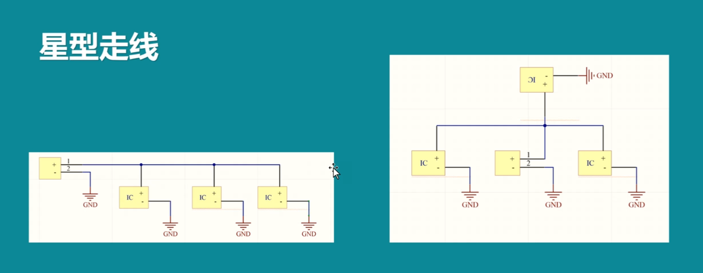
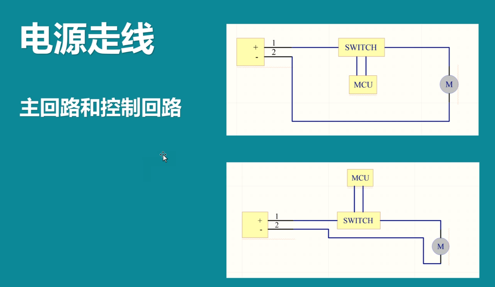
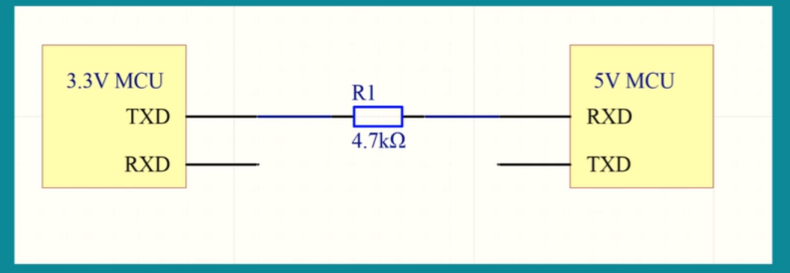
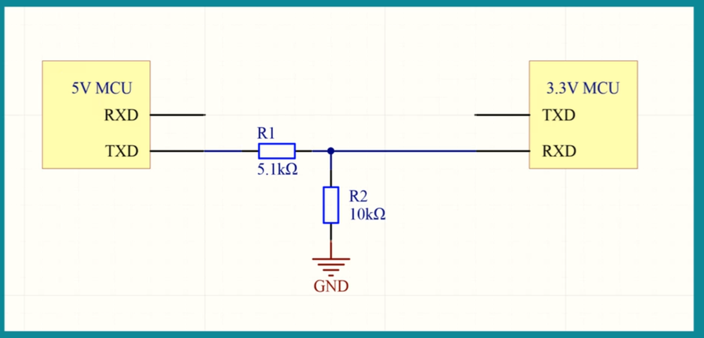
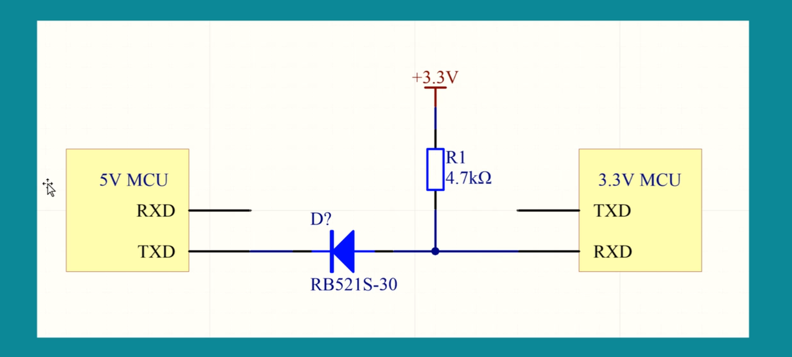

### 电源

LDO线性稳压电源 DCDC 开关稳压电源

LDO：使用简单，输出电压质量高，LDO芯片可以抑制干扰，但是电源效率低，只适合给小功率的东西供电，输入输出压差比较大效率低，大功率LDO成本高 

DCDC：电源效率高，大功率只能用DCDC，使用复杂，输出电源质量没有LDO好。DCDC都需要电感，二极管

#### 经典型号

LDO：78M05 RT9193-3.3V

#### 电源质量参考标准

输入电压 输出功率，输出电压，输出电流，纹波，负载调整率，电源效率，精度

#### 电源走线

如果一个电源需要给多个设备供电，我们需要用星型走线

左边是错误示范，就是如果前面的设备电源出了问题，后面的设备也会跟着出问题

尽量采用右边的示范，避免互相之间的干扰

上面的一种电路回路把把MCU放在电源的主回路里面，可能根据电磁感应定律什么的，会形成内部的电磁干扰，外部相抵消。所以把控制回路放外面更好一些。尽量保证电源主回路的线短，围成的面积小

### 电容

大电容储能：如果电源的线走得比较长，如果没有电容，如果负载电流突变，就会造成电压跌落，设备就不能正常工作了。而有了大电容就能储能提供能量，电容两边电压不能突变，它可以稳压瞬间提供大电流，电压就不至于跌落。

小电流滤波：针对不同频率有不同的滤波电容。

规则：2个100uf电容好于一个200uf电容，2个电容的滤波效果更好。

走线先接电容后接用电设备比较好

### 电平转换电路

#### 1

这里我们有3.3V的模块和一个5V的单片机进行信号收发。

从3.3V-5V，能否识别为高电平得看具体单片机的数据手册，大多数可以。因为单片机的IO可以配置成5V输出，为了防止错误代码输出5V给到3.3V的模块，我们需要加一个电阻来分压限流，安全保险。这里5V单片机接收要浮空输入，不然的话上下拉电阻对输入的3.3V容易有影响，可以自己分析一下

#### 2

高电平到低电平，这里我们有5V的模块和3.3V的单片机进行信号收发。

我们可以通过串联分压来从5V降到3.3V。同时要注意电阻的选型，不能太大。如果电阻阻值很大，那么电流就会变小，上升沿和下降沿的时间会变长。可能的原理：因为电路中会出现寄生电容，所以会形成RC电路，涉及到一个时间常数，与电阻R和电容C有关，电阻越大那么从电平从高到低或者从低到高所用的时间越长。[RC电路分析](https://blog.csdn.net/qq_38639612/article/details/122459816)

如果这两个引脚的通讯频率比较高的话，这个电阻就要选得比较小一点。

#### 3

这里我们有一个5V单片机，一个二极管，和3.3V的模块。

情况1：如果单片机TXD引脚输出5V的话，那么此时二极管不导通，相当于断路，那么RXD就是高电平

情况2：如果单片机TXD引脚输出0V，低电平的话，那么此时二极管导通，由二极管的特性，我们知道它会有一部分的压降，那么压降完的电压就会给到我们的TXD，而这部分压降就会给到3.3V模块的RXD上，所以此时RXD就是低电平。

[二极管特性视频](https://www.bilibili.com/video/BV1pu4y1f7iZ/?spm_id_from=333.337.search-card.all.click&vd_source=4ae85c9aa63e99071b3c53715d6ff461)

问题：二极管有反向恢复时间，如果通讯速率很快的话，需要上反向恢复时间较短的二极管，如肖特基二极管

如果二极管的压降比较大，那么RXD处的电压比较高可能会导致模块识别错了。

### 待看

1. https://blog.csdn.net/qq_25814297/article/details/123152158
