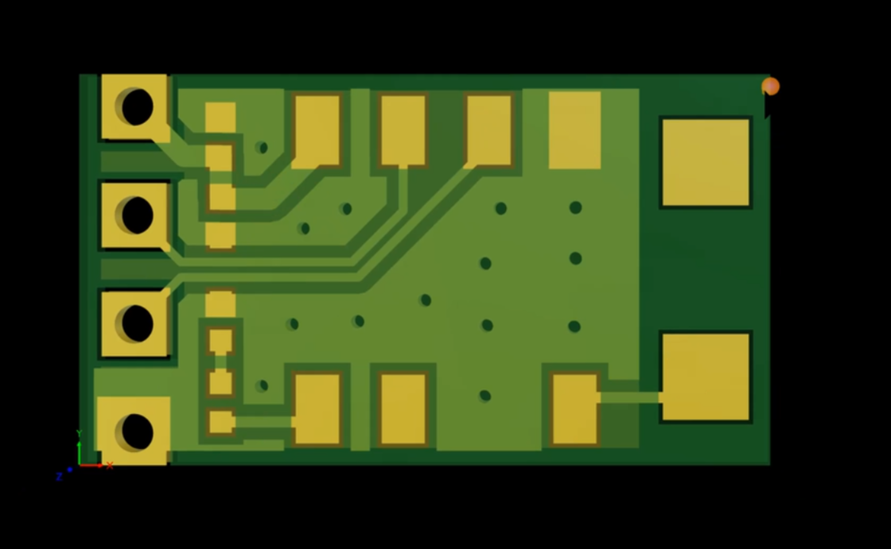
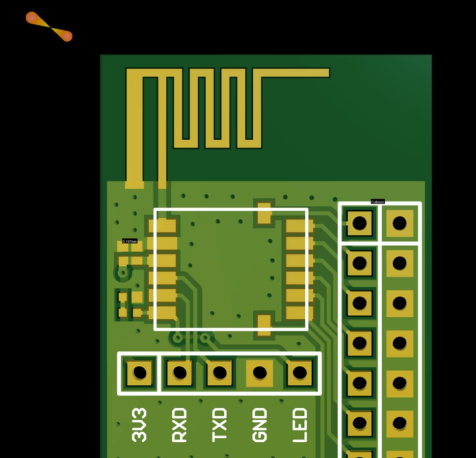
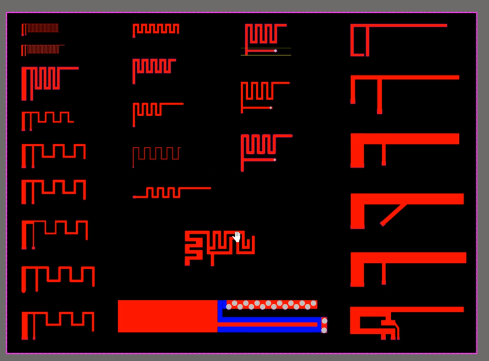
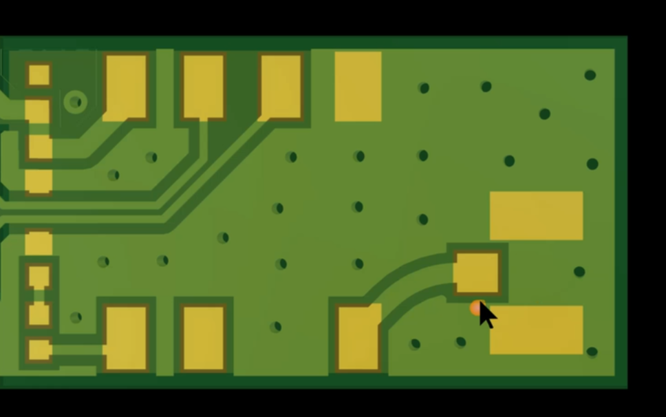

### 蓝牙模块硬件部分

[蓝牙模块硬件讲解视频](https://www.bilibili.com/video/BV1hP4y1x7Nv/?spm_id_from=333.788.recommend_more_video.6&vd_source=4ae85c9aa63e99071b3c53715d6ff461) 硬件部分电控不需要看

#### 蓝牙天线

##### 种类

1. 陶瓷贴片天线：体积小，成本高，蓝牙耳机，跟贴片电容差不多
2. PCB天线：用PCB画，成本小，蓝牙鼠标键盘用的多。效果比陶瓷天线好
3. FPC天线：FPC天线就是柔性PCB，用在手机上多一点
4. SMA IPEX天线连接器：通过延长线伸出去，路由器上比较多，效果最好，体积最大

#### 参考设计

**陶瓷天线**

中间铺铜的是蓝牙模块，右边的两个大焊盘就是天线的位置，只用一端接，天线附近不要铺铜，最好天线部分是伸出去的，保证天线周围是净空的。

PCB天线，也是不能铺铜，一边接焊盘，一边接GND，要注意打充足的过孔，天线2.4G都是固定的。上面这个图是信号最好的天线

这么多都是天线

IPX

需要铺铜，在封装焊盘上焊上连接器就可以了，再接上外置的天线

> 天线，晶振下面禁止走信号线，会造成阻抗变化