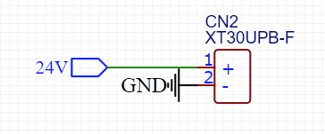

### XT30板载公头卧贴

xt30一般的原理图都是1是正极2是负极

像这样子

结果这个XT30板载的公头卧贴是反过来的2是正极，1是负极（但是母头卧贴又没事）

### 电源设计

反面教材，这个很容易烧，千万别

### 犯傻了

把复位引脚下拉了，我就说怎么排查了一天都出问题，要上拉上拉上拉，（重要的事情说三遍！！！！！！！！！！！！！

### OLED模块

OLED模块不同商家的VCC和GND可能是反的！！要注意
