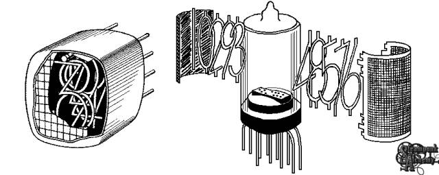
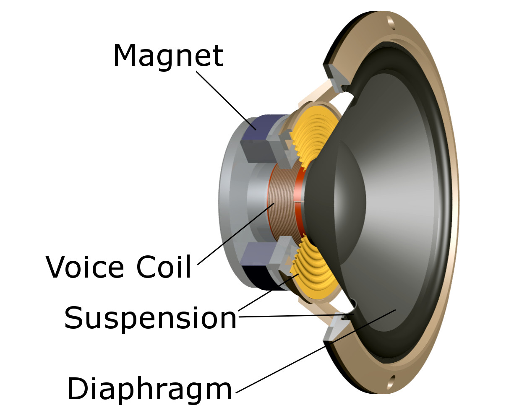
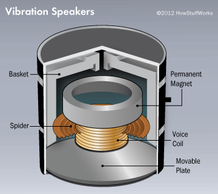
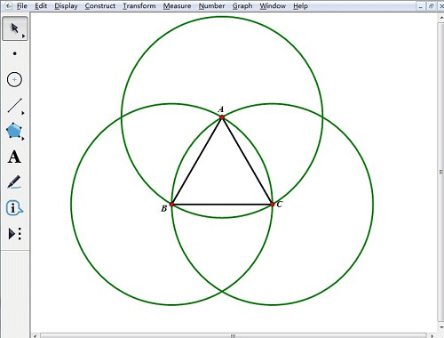
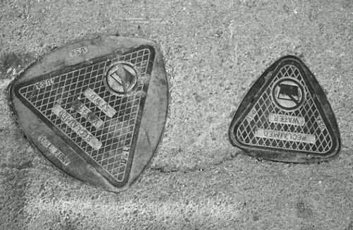
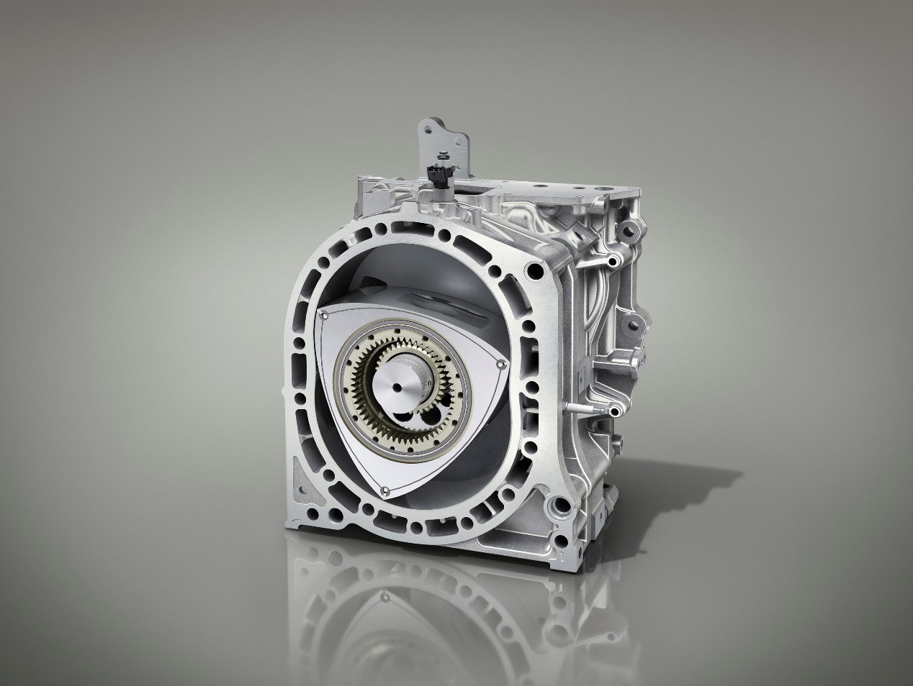

# **Highbay 项目介绍**

### **辉光管**

#### **背景**

辉光管发明于1950年代中期，为了实现一种非点阵而是线状化地显示数字的方式。辉光管出现之后被大量用在各行各业，因为当时的辉光管是唯一能显示数字和符号的电子器件，所以诞生初期的1950年-1990年代很多电子设备上都能看到它的身影，例如计时器、计数器、计算器和一些工业仪器上，甚至在一些特别老的电梯上还能看到使用辉光管来显示楼层。

#### **原理与结构**

我们在高中学过电子跃迁，焰色反应，可以用外部能量比如燃烧和通电将粒子激发，而被激发的粒子从激发态降回基态时会以光的形式释放出能量。

而辉光管则是以在充有稀有气体氖气的真空管内放置两个电极，并在两端通上170V电压的形式激发中性原子和分子。这一过程叫做辉光放电现象，根据管内充入的稀有气体的不同，会发出不同颜色的光，与霓虹灯类似。而因为橙色的光最容易分辨，穿透力强，所以橙色的辉光管最常见。

但只是发光还不够，我们需要用它来显示数字和图案。而辉光放电效应的特点就是密闭容器内发光的部分总是围绕在阴极电极的周围。所以我们只要将阴极电极制作成一个数字或者图案就可以看到它在发光了，这就是它的原理。

我们把它拆解开来可以看到，它由一个金属丝网制成的阳极和10个阴极，形状为数字0到9组成。

#### **局限**

辉光管需要比较高的驱动电压，而且玻璃容易破碎，导致惰性气体泄漏，长期阴极放电会发黑导致寿命不长。随着后来更加先进的LED技术的兴起，辉光管逐渐退出了历史的舞台。

#### **参考文章**

1. https://nixieclock.org/?page_id=2226严泽远老师
2. https://www.elecfans.com/d/2080718.html
3. https://www.zhihu.com/tardis/zm/art/426184180?source_id=1005

### **共振音箱**

#### **原理**

我们生活中常见的音箱通过电流控制线圈带动薄膜振动，并利用声腔的共振效果，通过空气将声音传达到我们的耳朵。

而共振音箱则有所不同，它自身并没有薄膜声腔，而是通过驱动器比如金属芯蕊将线圈的振动传递到接触面，利用振动和接触面产生共振，将振动转化为声波，再通过空气传达到我们的耳朵。

#### **特点**

而随着接触物体的腔体大小和材质发声变化，共振音箱的音质和音色也会发生变化。

腔体方面，一般来说同价位的入耳式耳机普遍比头戴式的音质要差一些就是因为它的腔体大小不够，没有良好的共振环境。而落地音箱的声场，空间感，低频更加好就是因为它足够大的腔体大小。所以当接触面的腔体更大，往往它的空间感和低频更强。

材料方面比如木质材料的中低频更加出色，金属材料音色更加清脆，中空墙体空间感增加。

#### **参考文章**

1. https://www.bilibili.com/video/BV1h34y1v7UK/?spm_id_from=333.337.search-card.all.click&vd_source=4ae85c9aa63e99071b3c53715d6ff461 
2. https://patents.google.com/patent/CN203788453U/zh
3. https://blog.csdn.net/u010538116/article/details/80757052
4. https://gorillagadgets.com/blogs/gorilla-gadgets-blog/gorilla-university-how-do-vibration-speakers-work

### **直流无刷电机**

#### **原理**

#### 

#### **参考**

1. https://www.bilibili.com/video/BV1ig411S7gX/?spm_id_from=333.337.search-card.all.click&vd_source=4ae85c9aa63e99071b3c53715d6ff461
2. https://zhuanlan.zhihu.com/p/147659820

### **自平衡莱洛三角**

#### **原理**

是通过用动量轮，角动量守恒的原理来保持平衡的

#### **莱洛三角形数学性质**

分别以正三角形的顶点为圆心，以其边长为半径作圆弧，由这三段圆弧组成的曲边三角形称为莱洛三角形。它有着极其神奇的性质：在任何方向上都有相同的宽度，即从任何一段圆弧到其所对的端点的距离是相等的，它也是除了圆之外另一个满足定宽曲线的图形，这也造就了它在很多生活中的应用。

可以看看参考1的视频来形象地了解一下它。

#### **应用**

##### **井盖**

分别以正三角形的顶点为圆心，以其边长为半径作圆弧，由这三段圆弧组成的曲边三角形称为莱洛三角形。它有着极其神奇的性质：在任何方向上都有相同的宽度，即从任何一段圆弧到其所对的端点的距离是相等的，它也是除了圆之外另一个满足定宽曲线的图形，这也造就了它在很多生活中的应用。

可以看看参考1的视频来形象地了解一下它。

#### **应用**

##### **井盖**

除了圆形之外，还有什么形状的下水道井盖不会掉入下水道？

正方形或者长方形的井盖都能从底座的对角线掉进去

##### **转子发动机**

我们在初中学习了热机的四冲程发动机原理，但是除了活塞在气缸里做往复直线运动这种方式，其实历史上还出现过直接在气缸中做旋转运动的发动机，叫做转子发动机。

在1991年的24小时耐力赛，搭载发动机的马自达车队凭借领先第二名2圈获得冠军，出道即巅峰。

这款发动机选择莱洛三角形作为转子的原因是其定宽曲线的性质。它把汽缸分成三个独立空间，三个空间各自先后完成进气、压缩、做功和排气，三角转子自转一周，发动机点火做功三次。由于以上运动关系，输出轴的转速是转子自转速度的3倍，因而搭载转子发动机的汽车在速度和功率上有一定的优势。

然而转子发动机本身也有着热效率低，损耗大，燃烧不充分等缺点，现今只有马自达公司仍在进行研发，并没有成为主流车厂的选择。

##### **方孔****钻头**

莱洛三角形同时也被使用在金属加工的车床上。思考一下，正常我们的车洗工艺都是使刀或被加工物体旋转，不断切削出我们想要的形状，那么车床是如何加工出方孔的呢？

其实答案就是用一个莱洛三角形状的刀头进行旋转，这样我们就能加工出无比接近方形的金属孔洞。

#### **参考**

1. https://www.youtube.com/watch?v=quuw4HC96bE 讲解莱洛三角形原理最清晰的视频 from youtube
2. https://www.masters.tw/242144/reuleaux-triangle 很多莱洛三角形生活中的应用
3. https://blog.csdn.net/antkillerfarm/article/details/80965770 关于定宽曲线和莱洛三角的讲解csdn
4. https://www.zhihu.com/question/50891355/answer/310849484 转子发动机的讨论
5. https://zhuanlan.zhihu.com/p/653707483
6. https://www.youtube.com/watch?v=PLZJPhPCa74 方孔钻头

### **自平衡立方块**

#### **原理**

和前面的自平衡莱洛三角应该差不多，动量轮，角动量守恒那些

#### **参考**

1. https://www.bilibili.com/video/BV1Dz4y197Qq/?spm_id_from=333.788.top_right_bar_window_custom_collection.content.click&vd_source=4ae85c9aa63e99071b3c53715d6ff461

### **特斯拉的蛋**

#### **结构**

采用电容分相单相方案，

#### **参考**

1. https://www.youtube.com/watch?v=CGoxvDmgUAg

### **特斯拉线圈球（等离子球 辉光球）**

#### **结构**

1. 特斯拉线圈球由充有di稀有气体通常为氖气的玻璃球
2. 底座的震荡电路板
3. 玻璃球的中心有一个电极，通常是一个金属球或尖端

#### **原理**

当通过12V的直流电时，震荡电路板会将直流电转化为高频高压电，经过电极释放出来，形成强电场，空腔内的带电粒子在电场作用下运动,与中性气 体分子发生非弹性碰撞,将能量传递给气体分子.吸 收能量后的气体分子有两种状态,即激发态和电离 态,处于激发态的原子很不稳定,它们会很快地回到 基态并以光子的形式释放能量.辉光球发出的光就是 大量原子在能级间跃迁的结果,光线显示了带电粒子在电场中运动的路径.

1. **玻璃球**：等离子体球的外壳通常是由玻璃制成的透明球。
2. **中心电极**：在玻璃球的中心有一个电极，通常是一个金属球或尖端。
3. **惰性气体**：玻璃球内充有低压的惰性气体，如氖气或氩气。

**高频高压电源**：中心电极连接到一个高频高压电源，这个电源通常产生几千伏的电压，频率在几十千赫兹到几百千赫兹之间。

2. **电离气体**：高频高压电源在电极周围产生强电场，这个电场足够强大，可以电离惰性气体分子。电离过程将气体分子分解成带正电的离子和自由电子。
3. **等离子体形成**：电离后的气体变成等离子体（第四态物质），其中包含自由电子和离子。由于电场的作用，自由电子在电极周围加速，产生碰撞并发出光。
4. **放电路径**：等离子体球内的放电路径是随机的，因为电离过程在整个气体中均匀发生。然而，当你用手触摸玻璃球表面时，手指的存在改变了电场分布，使得放电路径集中到你的手指附近。这样，电弧就会集中到玻璃球内靠近你手指的位置，产生明显的光束。

当手指触摸等离子体球的玻璃表面时，局部电场增强、电容效应和人体导电性等因素使得电弧集中连接到手指附近，产生了明显的光束和放电现象。这展示了电场、等离子体和放电路径的基本物理原理。

#### **参考**

1. http://wltb.cnjournals.com/ch/reader/download_pdf_file.aspx?journal_id=wltb&file_name=8101D5DAB1C08948E21F236F1F6D0B3DA54C4623393DD47A031AACA8935658A6036C74A151FC4E917BD2FF1445DC0222200985B1E9222B17246F9AA9F292DBF5&open_type=self&file_no=20190203

### **等离子环**

参考

1. https://www.bilibili.com/read/cv30450526/?jump_opus=1