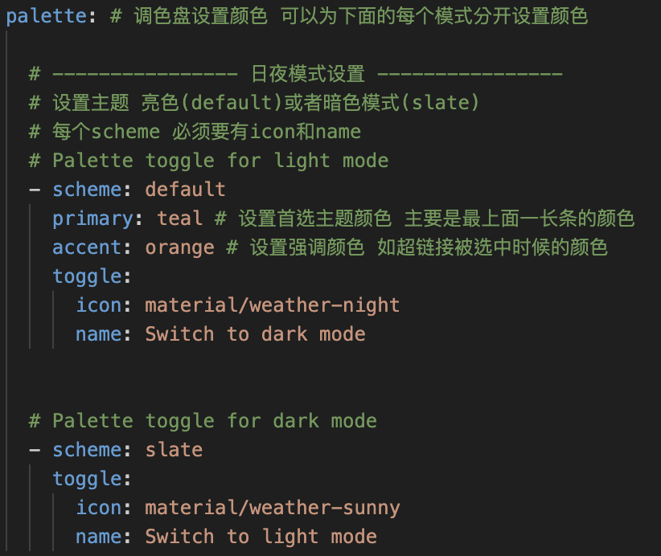

这里先贴着所有的东西，之后再整理

### 照片

[照片无法渲然问题传送门](https://github.com/mkdocs/mkdocs/discussions/2754)

### 虚拟环境

不需要再PulishMySite.yml那里自己新建一个虚拟环境，在部署的时候会报错

要是显示什么插件没安装，去PublishMySite.yml那里用装pip install 装

### 参考

[mkdocs学习笔记](https://blog.xiiigame.com/2021-03-02-mkdocs-material学习笔记/)

[b站大佬网站](https://yang-xijie.github.io/BLOG/Markdown/github-pages/)

[csdn完整教程](https://blog.csdn.net/m0_63203517/article/details/129755527)

https://www.aiferu.xyz/archives/31.html

### 字体

目前只搞出了Jetbrains Mono

其他：Consolas HYZhengYuan

### 基础流程

1. 如果你可以直接运行第二步可以不需要）在你想建的目录首先用python创建虚拟环境
2. 安装mkdocs

```
pip install mkdocs 
```

3. 新建mkdocs项目

```python
mkdocs new mkdocs-site #mkdocs-site is the name of the project
```

4. 之后我们会发现我们的目录底下出现了一个mkdocs-site 的目录（这个就是我们之后的根目录，我们进入它，用code . 打开

```
cd mkdocs-site
code . #open with vscode 
```

5. 我们可以看到这样的文件结构


其中index.md是我们想要创建的网站的根目录页面，mkdocs.yml是我们的配置文件

6. 我们在terminal mkdocs-site 文件夹下输入以下代码就可以启动我们本地网站的页面啦

```
mkdocs serve
```

如果想要停下只需要ctrl + c，win/mac

7. 之后为了将网站发布到github pages上，我们需要用到github workflow，我们在mkdocs-site目录下执行以下操作

```
mkdir .github
cd .github
mkdir workflows
cd workflows
vim PublishMySite.yml
```

8. 用vim在yml中写入以下内容

```
name: publish site
on: # 在什么时候触发工作流
  push: # 在从本地main分支被push到GitHub仓库时
    branches:
      - main
  pull_request: # 在main分支合并别人提的pr时
    branches:
      - main
jobs: # 工作流的具体内容
  deploy:
    runs-on: ubuntu-latest # 创建一个新的云端虚拟机 使用最新Ubuntu系统
    steps:
      - uses: actions/checkout@v2 # 先checkout到main分支
      - uses: actions/setup-python@v2 # 再安装Python3和相关环境
        with:
          python-version: 3.x
      - run: pip install mkdocs-material # 使用pip包管理工具安装mkdocs-material
      - run: mkdocs gh-deploy --force # 使用mkdocs-material部署gh-pages分支
```

9. 配置完之后我们要用git工具来同步到服务器，同样的我们在mkdocs-site文件夹下进行

```
git init
git add
git commit -m "init"
```

10 之后我们去github官网上进行新仓库的设置

Github > New Repository > Set Repo's Name > Settings > Actions > General >

* Actions permissions: Allow all actions and reusable workflows
* Workflow permissions: Read and write permissions
* Allow Github Actions to create and approve pull requests
* Click save


11. 设置完之后我们回到我们的终端，输入以下代码来初始化我们的github仓库

```
git remote add origin https://github.com/yan000000000/yan000_tour.git# change to your github repo
git branch -M main
git push -u origin main
```

这里github action第一次push可能不会自动运行，改点东西再试试

12. 当我们的github action 成功启动我们可以在Actions那一栏中看到如下界面


我们可以看到我们的网页成功部署啦，只不过还没有部署到github pages里面，所以也没有相应的网址，这时候我们再在github配置关于我们仓库部署github pages的设置

Github > Settings > Pages > Build and deployment > Branch > gh-pages branch


修改好之后再次看看actions是否正常运行，如果没有再次启动actions就push点东西，看看有没有成功部署到gh-pages

13. 当我们点开发现里面的deploy to GitHub Pages 已经成功并出现了我们的github pages 网址我们就成功啦


### material

[material for mkdocs官网](https://squidfunk.github.io/mkdocs-material/)

Material for MkDocs 是一个比较现代化的主题或者说类似网页的css，可以帮助我们把普通比较原始的mkdocs渲染成更好看的样子

在我们的workflows那里其实已经有一步帮我们下载mkdocs-material了，所以在服务器上我们是已经有了的，如果在本地跑也想看到这样的效果，可以打开虚拟环境用以下代码安装

```
pip install mkdocs-material
```

之后我们只需要在mkdocs.yml来配置就好啦，回忆一下mkdocs.yml是我们网站的配置文件

我们在文件里写下

```
theme: 
  name: material
```

就可以渲染成它默认的样子了，

#### 参考

[Material for MkDocs 官网教程手册](https://squidfunk.github.io/mkdocs-material/setup/changing-the-colors/) 一步一步跟着走很好玩！

[csdn](https://blog.csdn.net/m0_63203517/article/details/129765689)

#### 踩坑

1. 那个palette scheme 要么只能日夜，要么就是直接设置。从直接设置换成日夜记得要把原来的删掉，不然会报错


这样就会出问题，



这样就好了，可以给日夜分别设置颜色

2. 如果导入的图片样式是这样子的，需要在assets/前面加上../才能找到


#### 额外css

https://www.mkdocs.org/user-guide/customizing-your-theme/

要放在和md文件同一个地方才能应用，终于呜呜呜
