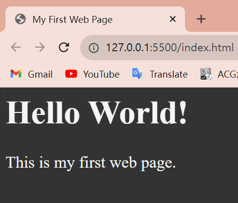

# lesson 1

---


### what is html

*Hyper Text Markup Language -- the most basic building block of the web*

`Hypertext` --> refers to links that connect web pages to one another

uses markup to annotate text, images and other content


### naming rule for a html file

*   no uppercase
*   no space


### first html

```html
<!DOCTYPE html>
<html lang="en">  
    <head>	<!-- area not seen on the page, metadata about the page -->
        <meta charset="UTF-8">
        <title>My First Web Page</title> <!-- the text on the head of the page -->
      <!-- this part is the css -->
        <style>  
            html {
                font-size: 22px
            }

            body{
                background-color: #333;
                color: whitesmoke;
            }
        </style>
      <!-- this part is the css -->
    </head>

    <body>
        <h1>Hello World!</h1>  <!-- this part is the h1 title for the body area -->
        <p>This is my first web page.</p> 
    </body>

</html>
```

`<html lang="en">` --> add `lang` attribute to the html start tag to declare the language of the document

``<meta charset="UTF-8">` --> declaring the character encoding 

`<!DOCTYPE html>` --> this is a doc type declaration that you should have in every html file at the very beginning




(the output looks like this)


### 2 main part

*there is 2 main part under html tag*

*   ##### head

the part can't be seen in the page

*   ##### body

the part can be seen


### extension

*   vs code

**1**.**prettier**

(to adjust the tab for the code)


**2.vscode**-**icons**

(turn on to check out the file type quickly in icon)


**3.github** **theme**

(used for the whole interface)


**4.live** **server**

(to check out the result of html instantly in a outer browser)


### quick tool

*   validator.w3.org 

*a website to act as a compiler online*