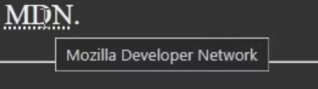

# lesson 3--Text Basic

---

### header hierachy

```html
<h1>Hello world </h1>
<p>
  i am learning html
</p>
<h2>I'm ready </h2>
...
```

from the h1 which its font size is the biggest to the h6 which its font size is the smallest

>   # Hello world
>
>   i am learning html
>
>   ## I'm ready

just like this

### `<hr>`

*horizontal rule*

```html
<hr>
```

with a single line of `<hr>` you can print out the horizontal rules

>---

just like this


### `<br>`

*break rule -- stands for break line*

with a single `<br>`, you can skip a line

```html
<p>
  hi
  <br> good morning
</p>
```

it will be like

>   hi
>
>   good morning


### block level element & inline level element

*block level element automatically skip a line when defined while inline level element didn't*

*   block level element 

```html
<p> <h1> <h2> 
```

*   inline level element

```html
<em></em> <strong></strong>
```

`<em>`--> italic 

`<strong>`--> bond


### space collapse

```html
<p>
  i am    asleep
</p>
```

>i am asleep

the space between the char will be delete automatically

### html entities

*   space

```html
<p>
  i hope you will be better&nbsp;.
</p>
```

>   i hope you will be better .

it will print out a small space between the `better` and `period`

*   < & >

```html
<p>
  &lt; <!-- less than --> &gt; <!-- greater tan --> 
</p>
```

>   < >

*   copy

```html
<p>
  &copy; <!-- the copy for copy right -->
</p>
```

>   （copy right）


### abbreviation

```html
<abbr title="Mozilla Developer Network">MDN</abbr>
```

>   MDN (when you place your mouse above it you can see the whole name for the abbr)




### address

```html
<address>
...</address>
```

content --> italic


### comment

```html
<!-- TODO: Add more places -->
```

we don't see it, just a note

ctrl + u --> look at the source code to view in the browser

