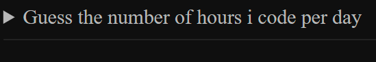
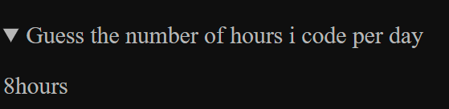
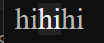

# semantic tag

---

### semantic

it provides meaning rather than a generic writer


### header

the basic structure or index

```html
<header>
... 
</header>
```

only to denote that the content between the header is the header


### main

*the main area*

```html
<main>
...
</main>
```


### footer

*the end of the page*

```html
<footer>

</footer>
```


### section or article

*mainly they are the same*

can both pass the validator test

*   article can be more organize
*   section can be more casual

<font color='#12b312'>just personal experience</font>

>   whether section or article is still debating


### multiple nav

```html
<nav aria-label="primary-navigation">
</nav>
or
<nav aria-labelledby="primary-navigation">
<h2>
  Primary Navigation
  </h2>
</nav>
```

optional, the primary navigation is just a tag to the reader, i reckon, i am not sure, check more on gpt


### aside

```html
<aside>
  <details>
    <summary>
      Guess the number of hours i code per day
    </summary>
    <p>
      8 hours
    </p>
  </details>
</aside>
```



if i click on the triangle beside the sentence



it is like a folder


### mark

```html
<p>
  hi<mark>hi</mark>hi
</p>
```



In the video, it's sth like highlighter, but in my web it act like a bold, no clue


### time

```html
<time datetime="08:00"> 8 a.m.</time>
```

no actual function, just record it and ask gpt another time


### 2 things to avoid

*   div

```html
<div></div>
```

no meaning at all

*   span

```html
<span></span>
```

used when learning css