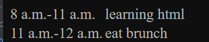
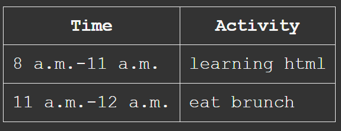
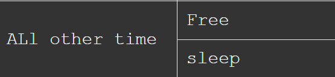
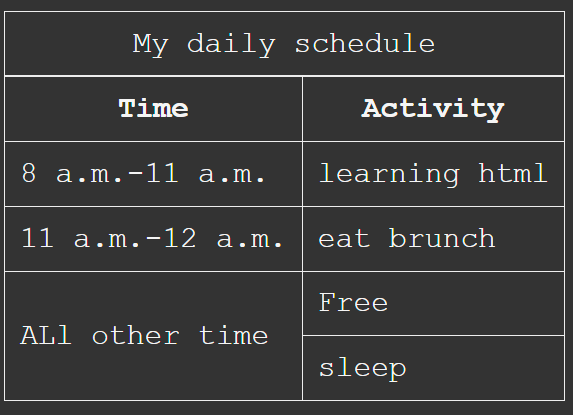
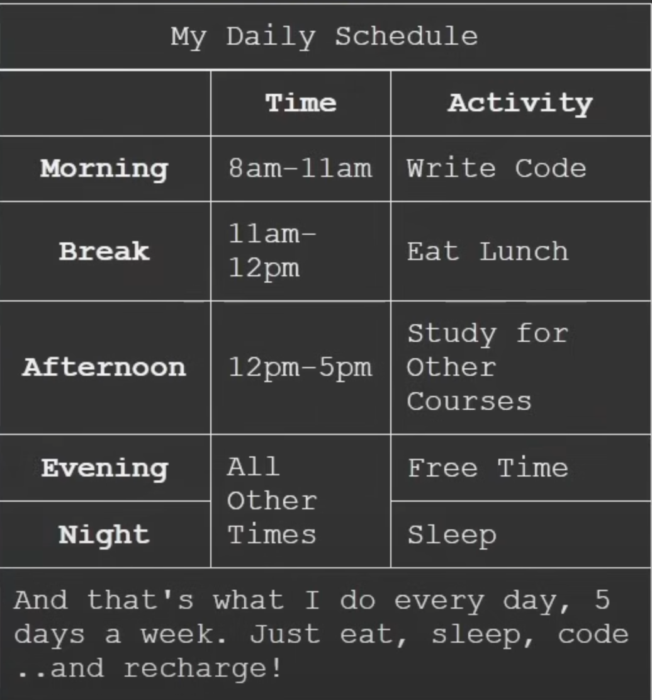

# table

---

### basic outline for table

```html
<table>
  					<tr>
  							<th>Time</th>
              	<th>Activity</th>
  					</tr>
            <tr>
                <td><time datetime="8:00">8 a.m.</time>-<time datetime="11:00">11 a.m.</time></td>
                <td>learning html</td>
            </tr>

            <tr>
                <td><time datetime="11:00">11 a.m.</time>-<time datetime="12:00">12 a.m.</time></td>
                <td>eat brunch</td>
            </tr>
        </table>

```

`<tr>` stands for table row

`<td>` stands for table data

`<th>` stands for table header



it looks like this without css



this is after css;


### rowspan & colspan

```html
<table>
  <tr>
  <td rowspan="2">All other time</td>
  </tr>
</table>
```



`rowspan` stand for take up how many row

`colspan` stand for take up how many column


### caption

```html
<table>
  <caption>My daily routine</caption>
  ...
</table>
```



automatically add a title on the table


### semantic in table

```html
<table>
  	<thead>
  	<tr>
    	<th>Time</th>
      <th>Activity</th>
    </tr>
  		</thead>
       <tbody>
  
  		</tbody>
			<tfoot>
  		</tfoot>
</table>
```

*   thead you can add this to the beginning of each row to give them a title (morning, break)
*   tbody
*   tfoot(the last block)

just to make it easy to read the structure




### more semantic meaning

```html
<th scope="row"></th>
<th scope="col"></th>

<th id="time" scope="row"></th>
<th id="name" scope="row"></th> 
id is available as well
make it more clear
```

