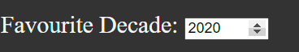
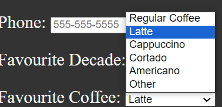
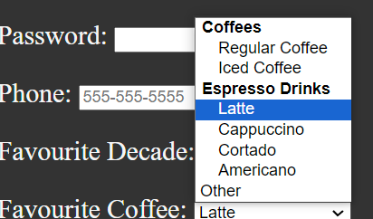
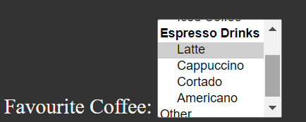
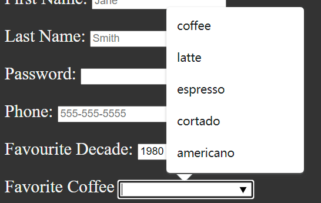
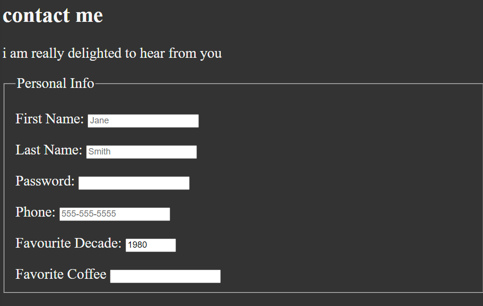
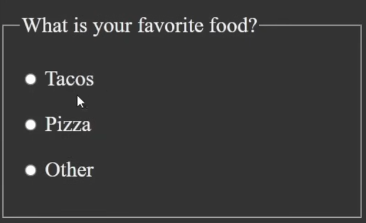
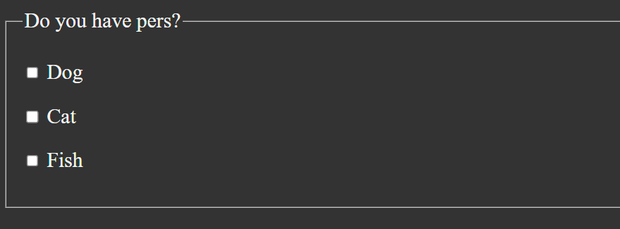
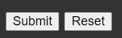

# forms & input

---


### input

```html
<form action="https://httpbin.org/get" method="get">
  <label for ="firstName">First Name:</label>
  <input type="txt" name="firstName" id="firstName" placeholder="Jane"
         autocomplete="on" required autofocus>
</form>
```

sending the info to the own server, in this case will send to a website

`get` the method to deal with the info, often post

`label` every input has a label 

>for attribute value should absolutely match the id value

`type` input type

`placeholder` the text display when you haven't type (usually an example for the blank)

`autocomplete` expecting a on or off statement, it will remember the other inputs that have been entered into this form

`required` this will required this field to have information before it can be submitted (we put required it equal to true, else just not it there)

`autofocus` only one element in the form or on the page can actually have autofocus, it will put the focus on the input when the page load


#### password

when you define a password bar, there is a input type named password

```html
<input type="password">
your input become asterisk
```


#### telephone

when you define a telephone bar, there  is a input type named tel

```html
<input type="tel" pattern="[0-9]{3}-[0-9]{3}-[0-9]{4}">
```


#### decade

```html
<input type="number" name="decade" id="decade" min="1950" max="2020" step="10" value="1980">
```

we have button to click to adjust the decade



 

### select

```html
<label for="coffee">Favourite Coffee:</label>
<select name="coffee" id="coffee">
  <option value="regular coffee">Regular Coffee</option>
  <option value="latte" selected>Latte</option>
  <option value="cappuccino">Cappuccino</option>
  <option value="cortado">Cortado</option>
  <option value="Americano">Americano</option>
  <option value="other">Other</option>
</select>
```



you can put selected to choose the one default, else it is the top one


#### option group

```html
<label for="coffee">Favourite Coffee:</label>
<select name="coffee" id="coffee">
  <optgroup label="coffees">
  <option value="regular coffee">Regular Coffee</option>
  <option value="iced coffee">Iced Coffee</option>
    </optgroup>
  <optgroup label="Espresso Drinks">
  <option value="latte" selected>Latte</option>
  <option value="cappuccino">Cappuccino</option>
  <option value="cortado">Cortado</option>
  <option value="Americano">Americano</option>
    </optgroup>
  <option value="other">Other</option>
</select>

```



set them in groups


#### multiple choice

```html
<label for="coffee">Favourite Coffee:</label>
<select name="coffee" id="coffee" multiple size="6">
  
</select>

```

`multiple` stands for multiple choices

`size` stands for the maximum options which can display on the screen for once



the selection bar is fixed on the window instead of displaying after clicking the button


### other type of selection

type = text

```html
<label for="coffee">Favorite Coffee</label>
<input type="text" name="coffee" id="coffee" list="coff-list">
<datalist id="coffee-list">
		 <option value="coffee">
     <option value="latte">
     <option value="espresso">
     <option value="cortado">
     <option value="americano">
</datalist>
```



### <u>fieldset</u>

```html
<fieldset>
  <legend>
    Personal Info
  </legend>
</fieldset>
```




### dot selection

type = radio

```html
<fieldset>
  <legend>
    What is your favorite food?
  </legend>
<p>
  <input type="radio" name="food" id="tacos" value="tacos">
  <label for="tacos">Tacos</label>
</p>
<p>
  <input type="radio" name="food" id="pizza" value="pizza">
  <label for="pizza">Pizza</label>
</p>
<p>
  <input type="radio" name="food" id="other" value="other">
  <label for="other">Other</label>
</p>
  </fieldset>
```



>   make sure under the radio type they should have the same value for the name attribute so that they can only choose one

if you define 2 name value, then they can choose 2 option


### multiple selection

type = checkbox

```html
<fieldset>
  <legend>
    Do you have pers?
  </legend>
  <p>
    <input type="checkbox" name="pets" id="dog" value="dog">
    <label for="dog">Dog</label>
  </p>
  <p>
    <input type="checkbox" name="pets" id="cat" value="cat">
    <label for="cat">Cat</label>
  </p>
  <p>
    <input type="checkbox" name="pets" id="fish" value="fish">
    <label for="fish">Fish</label>
  </p>
</fieldset>
```




### text area

type=textarea

```html
<fieldset>
  <legend>
    Send Me A Note
  </legend>
  <label for="message">Your Message:</label>
  <br>
  <textarea name="message" id="message" cols="30" rows="10" placeholder="Type your message here"></textarea>
</fieldset>
```


### button

```html
<button type="submit">
   Submit
</button>
<button type="reset">
  Reset
</button>
<button type="submit" formaction="https://httpbin.org/post" formmethod="post">
</button>
```



>   for the post button, it is used for sending a url that didn't display the info directly in the url
>
>   on the opposite, get always print the info inside the url

