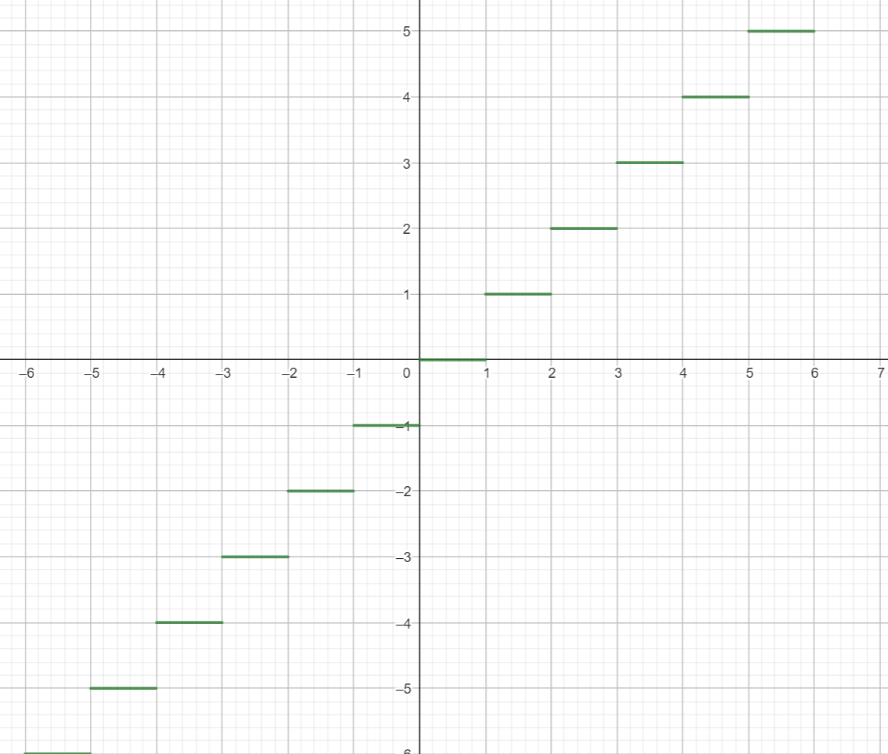

# 函数

## 概念

### 常量和变量

大学中，没有那么绝对清晰的常量与变量

e.g.可能在题目中将一个变量看成常量

### 函数

*在定义域 D，对于D中任意的X，f为x到y的对应关系，对于每个x只有**唯一**的y与之对应，则f被称为x到y的一个函数*
$$
D \ \ x \in D \ f: x \rightarrow y 
$$

### 定义域

$$
\ln x^2 \neq \ 2 lnx ,\ \ (\sqrt{x})^2 \neq \sqrt{x^2}
$$

### 例题

$$
f(x + 1) = x^2 - x \ \ f(x) = ?\\
1.换元法 ： x + 1 = t, x = t - 1, 代入解\\
2.凑： f(x + 1) = x(x - 1), = （x + 1 - 1)(x + 1 - 1)换
$$

### 函数表示方法

*   分段函数

    *   取整函数 

        *y = [x] 不超过 x 的最大整数*， [1.5] = 1, [-1.1] = -2, 可用数轴来解

*   列表法
*   图像法

### 周期函数

$$
f(x+T) = f(x)
$$

最小T为函数的最小正周期

### 奇函数&偶函数

$$
f(-x)=f(x)偶函数\\ f(-x)= -f(x)奇函数
$$

*   定义域对称

### 单调增&单调减

$$
x_1 < x_2 \ \ f(x_1) < f(x_2)单调增\\
x_1 < x_2 \ \ f(x_1) > f(x_2)单调减\\
$$

*   注意定义域

### 界

*   有界

​	|f(x)| <= M

*   无界

​	任给M, x |f(x)|*> M

*   上下界

### 反函数

*将原有的对应关系反过来*

定义域 --> 值域

值域 --> 定义域

>   注意： f 一 一 对应才能有反函数，比如二次函数没有反函数

