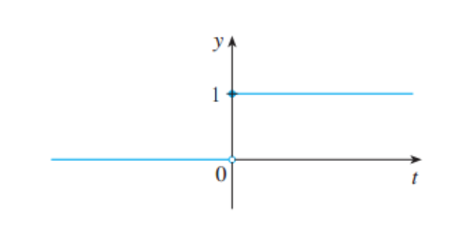

# 左极限右极限

### heaviside function

$$
H(t) = \begin{cases}0, \  t < 0\\ 1, \  t \geq 0\end{cases}
$$

> it is named by the electrical engineer Oliver Heaviside. While the function is used to describe the variation of current when the switch is turn on in a second

t从左端趋近0， h(t)就趋近0；t从右端趋近0， h(t)就趋近1

> t在趋近0的过程中没有趋向一个唯一的数 -> $lim_{t\rightarrow 0}H(t)$ 不存在

由此我们引入了单侧极限的概念

### 单侧极限

左极限：

$lim_{x \rightarrow a+} f(x)= L$ 代表函数值随从a的左端趋近a时的极限为L

右极限：

$lim_{x\rightarrow a-} f(x) = L$ 代表函数值从a的右端趋近a时的极限为L

> 如果函数$f(x)$ 在 $a$ 处有极限， 当且仅当 $a$ 处的左右极限均存在且相等
>
> 即，左右极限相等是判断函数在某点是否存在极限的充分必要条件 