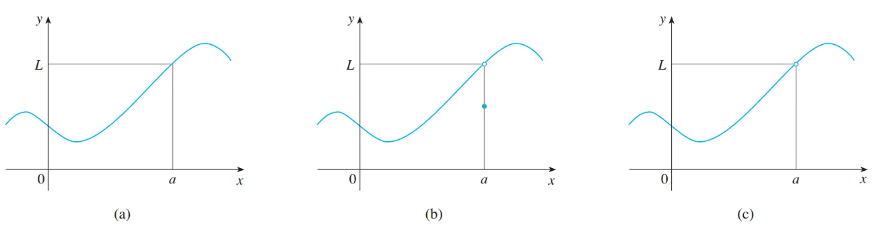

# 无穷

### 切线问题

从引入部分的切线问题，我们可以发现：当我们取得的点Q越靠近点P，那么直线PQ的斜率也越靠近过点P的切线的斜率，因此我们有了极限的直观定义

### 极限的直观定义

> 若自变量 $x$ 在 $a$ 附近时 $f(x)$ 由定义，那么有$\lim_{x\rightarrow a}f(x) = L$ ,即当 $x$ 充分趋近 $a$ （但不等于 $a$ )时， $f(x)$ 的极限值等于 $L$ 

其中不等于 $a$ 意思是，在x趋近于 $a$ 的时候，**不需要考虑 $x = a$ 的情况，甚至 $f(x)$ 可以不需要再 $x = a$ 上有定义。换句话说，我们关注的是逼近 $a$ ,而不是等于 $a$** 

上面三幅图中，(a)(b)中函数再 $x=a$ 处有定义， 但(b)中 $f(x)\neq L$ , (c)中函数在 $x=a$ 处没有定义

但都有$lim_{x\rightarrow a}f(x) = L$ 

#### 例题

求$lim_{x\rightarrow 1}\frac{x-1}{x^2 - 1}$ 的极限

就算函数在$x = 1$ 处没有定义，但是不影响求极限

### 坑

##### 1. 

求极限$lim_{t\rightarrow 0}\frac{\sqrt{t^2 + 9} - 3}{t^2}$ 

直观思考，$t^2 \rightarrow 0$ $\sqrt{t^2 + 9} \rightarrow 3$ , so numerator -> 0 but denominator -> 0, no answer?

需要化简 

##### 2. 

求极限$lim_{x\rightarrow 0}\sin(\frac{\pi}{x})$ 

obviously, 在 $x = 0$ 处函数又没有定义

如果取一般值会出现全是0便误认为是0

> 错误 sin的图像在定义域内来回震荡，没有固定取值，因此我们说$lim_{x\rightarrow 0}\sin(\frac{\pi}{x})$ 不存在

#### 技巧

$lim_{x\rightarrow 0}\frac{\sin(x)}{x}$ 求极限

当 $x = 0$ $f(x)$ 没有定义

x = 1 

### 总结

按照直观的定义去求极限不太靠谱，会出问题，因为我们不知道**x该逼近到什么程度才适合**

