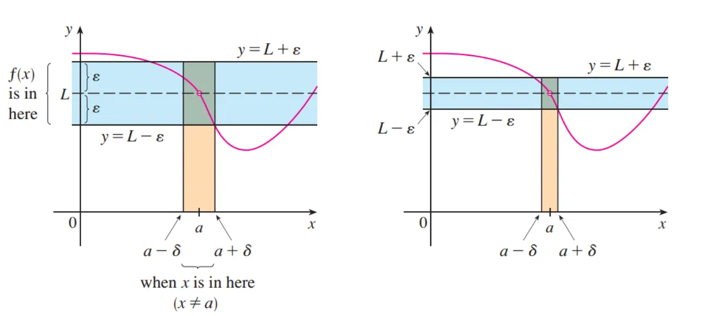

# 极限的严格定义

## 引入严格定义

前面我们学习了极限的直观定义，我们发现这个直观定义对解决某些问题不够充分，因为“**x逼近a，则f(x)逼近L**这种表述比较含糊，不够准确

### 含糊

比如下面两个极限，我们要证明他们的正确性，只靠直观定义还不够
$$
lim_{x \rightarrow 0}(x^3 + \frac{\cos(5x)}{1000}) = 0.0001, \ lim_{x \rightarrow 0}\frac{sin(x)}{x}
$$
因此我们需要极限的严格定义

考虑如下函数
$$
f(x) = \begin{cases}2x - 1,\ x \neq 3 \\ 6,\ x = 3\end{cases}
$$
直观上看，我们有 $x \rightarrow 3$ 但 $x \neq 3$ 时， $f(x) \rightarrow 5$ , 即$lim_{x\rightarrow 3}f(x) = 5$ 

* 为了获得$f(x)$ 在逼近3时更多的信息，我们提出问题

> 当$x$ 离3多近的时候，f(x)与5的差值会小于0.1？

x与3的距离可以写作|x - 3|, 且 |x - 3| > 0. f(x)与5的差值可以写成|f(x) - 5|,同样的我们有|f(x) - 5| > 0,所以我们的问题就是找到一个数 $\delta$ 使得
$$
当 0 < |x-3| < \delta, 有|f(x) - 5| < 0.1
$$
注意到，我们使$\delta = 0.05$ 时，不等式成立，也就是说
$$
|f(x) - 5| = |2x - 1 - 5| = 2|x -3| < 0.1 \\

0 < |x - 3| < 0.05，|f(x) - 5| < 0.1
$$
因此 $\delta = 0.05$ 就是上述问题的一个解，也就是说当x与3的距离在0.05之内，f(x)与5的距离就在0.1之内

如果我们将$\delta$ 改成0.01，0.001，同样的我们会有f(x)与5的距离更小

> 不难想到，为了让5精确地成为f(x)在x逼近3时的极限，我们不仅要让f(x)与5的差值小于上述3个数，我们还要它小于任意的正数

如果用$\epsilon$​ 表示任意正数，那么上述关系可以写为
$$
当0 < |x-3| < \delta = \frac{\epsilon}{2} 时, |f(x) - 5| < \epsilon
$$
这就是x逼近3时，f(x)逼近5在数学上的严格描述，它告诉我们，总可以使得x与3的距离在$\frac{\epsilon}{2}$ 内，使得f(x)与5的距离在任意的正数$\epsilon$ 内

上述不等式可以改写成如下形式
$$
当 3-\delta < x < 3 + \delta时， 5 - \epsilon < f(x) < 5 + \epsilon
$$

该图告诉我们，令x处于区间($3 -\delta$ , $3 + \delta$)之内，可以使得f(x)处于区间($5 - \epsilon$, $5 + \epsilon$)

### 极限的严格定义

> 设 $f$ 在点 $a$ 的某一去心邻域内有定义，如果对于任意的 $\epsilon > 0$ ,总存在一个 $\delta > 0$ 使得当  $0 < |x-a|< \delta$ 时，  $|f(x) - L| < \epsilon$ ，那么 $L$ 就是 $f(x)$ 当  $x \rightarrow a$​ 时的极限

#### 定义理解

由于 $|x-a|$ 是  $x$ 到 $a$ 的距离,  $|f(x) - L|$ 是 $f(x)$ 到  $L$ 的距离，并且 $\epsilon$ 可以任意小，那么极限的定义可以这么理解

 **$lim_{x\rightarrow a} f(x) = L$ 意味着 $f(x)$ 与 $L$ 的距离可以任意小(arbitrarily small)，只需要让 $x$ 与 $a$ 的距离充分小（但不等于0）**

或者

 **$lim_{x\rightarrow a}f(x) = L$ 意味着函数值 $f(x)$ 可以任意地靠近 $L$ ,只需要让 $x$ 充分靠近 $a$​ (但不等于a)**

#### 区间理解

 $|x-a|<\delta$ 等价于 $a - \delta < x < a+\delta \ (x \neq a)$  ,同样地， $|f(x) - L| < \epsilon \Rightarrow L - \epsilon < f(x) < L + \epsilon$，如此定义可以表述为

 **$lim_{x\rightarrow a}f(x) = L$ 意味着对每个 $\epsilon > 0$ (无论 $epsilon$ 有多小)，我们总能找到一个 $\delta > 0$ ，使得当 $x$ 属于开区间 $(a -\delta,a+\delta)$ 且 $x \neq a$ 时， $f(x)$ 属于开区间 $(L-\epsilon, L+\epsilon)$** 

#### 图像理解

**如果 $lim_{x\rightarrow a}f(x) = L$ ，那么我们可以找到一个 $\delta > 0$ ，使得如果把 $x$ 限制在区间 $(a-\delta, a+\delta)$ 之内，并且 $x\neq a$ ,那么曲线 $y = f(x)$ 将会落在两条水平线 $y = L + \epsilon$ 和 $y = L - \epsilon$ 之内。如果存在这样一个 $\delta$ ，那么任何更小的 $\delta$ 也可以**

这个过程必须对任意地正数 $\epsilon$ 都成立。如果选择了更小地 $\epsilon$ ，那就需要一个更小的 $\delta$ 

### 例题

证明 $lim_{x\rightarrow3}(4x-5) = 7$ 

#### 第一步：初步分析，猜 $\delta$ （逆推）

我们需要找到一个 $\delta$ ，对于正数 $\epsilon$,使得 $\delta$ 满足当 $0 < |x-3|< \delta$ ，有 $|(4x-5)-7| < \epsilon$ 

我们发现 $|4x-12|< \epsilon \Rightarrow 4|x - 3|$ 

则问题变成当 $0 < |x-3|< \delta$ ，有 $0 < |x-3|< \frac{\epsilon}{4}$ 

所以 $\delta \leq \frac{\epsilon}{4}$​  

> 注意这一步只是草稿和分析，如果先这写这一步就则逻辑就错误变成了找到一个 $\epsilon$ 使得 $\delta$ 在范围内

#### 第二步：证明这个 $\delta$ 的确合适(正写)

对于任意的 $\epsilon > 0$ ,令 $\delta = \frac{\epsilon}{4}$ ,当 $0 < |x - 3| < \delta$ ,有 $|(4x-5)-7| \leq 4|x - 3|<4\delta = 4(\frac{\epsilon}{4}) = \epsilon$ 

即对任意的 $\epsilon > 0$, 当 $0 < |x-3|< \delta$ ,有$|(4x-5)-7| < \epsilon$ 

所以 $lim_{x\rightarrow3}(4x-5) = 7$ 成立

### 单侧极限的严格定义

#### 左极限的定义

如果对于任意的 $\epsilon >0$ ,总存在一个 $\delta > 0$ 使得当 $a -\delta < x<a$ 时，有 $|f(x) - L| < \epsilon$ ,那么有 

 $lim_{x\rightarrow a^-}f(x) = L$ 

#### 右极限的定义

如果对于任意的 $\epsilon >0$ ,总存在一个 $\delta > 0$ 使得当 $a -\delta < x<a$ 时，有 $|f(x) - L| < \epsilon$ ,那么有 

 $lim_{x\rightarrow a^+}f(x) = L$  

### 无穷极限的严格定义

> 让函数 $f$ 在 $a$ 的去心 $\delta$ 邻域内有定义， 如果对于任意给定的正数 $M$ , 总有一个正数 $\delta$ 与之对应，使得当 $0 < |x-a| < \delta$ 时， 有 $f(x) > M$ ，那么有 $lim_{x\rightarrow a}f(x) = \infty$  

这也就是说，在 $x$ 靠近 $a$ 的过程中， $f(x)$ 可以任意大（比给定的 $M$ 还要大）如果我们选定一个更大的 $M$ ，就会有个更小的 $\delta$ 与之对应