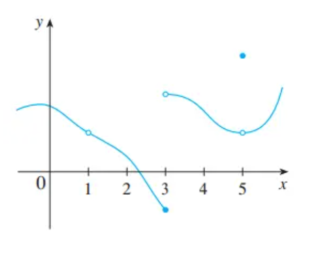
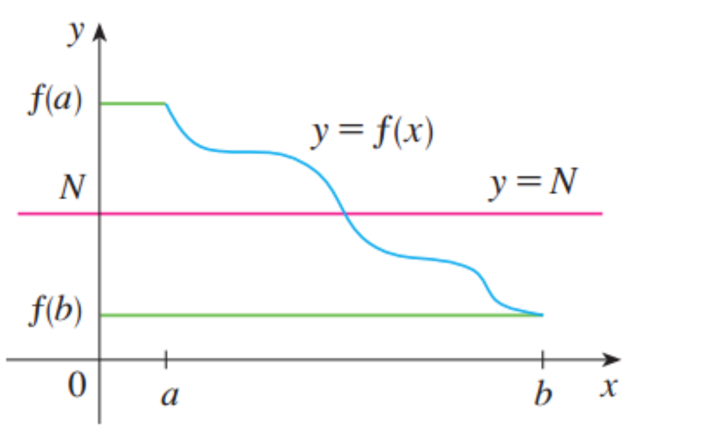

# 连续

有些函数在求 $x \rightarrow a$ 时的极限时，可以直接求函数在 $x = a$ 处的值，我们称具有这种特性函数在"在a点连续"。连续性的数学定义于日常用语中的’连续性‘有紧密联系（连续的过程时逐步，渐渐发生的，而不会中途突然中断，或者突然变化

### 函数在某点连续的数学定义

> 如果 $lim_{x\rightarrow a} f(x) = f(a)$ ， 那么函数 $f$ 在 $a$ 点连续

从中可以看出，函数要在a点连续，需要满足3个条件

*  $f(a)$ 有定义（也就是说， $a$ 在 $f$ 的定义域内）
*  $lim_{x\rightarrow a} f(x) $存在，（也就是不会出现趋近无穷或者无法确定极限数值）
*  $lim_{x\rightarrow a} f(x) = f(a)$ 

**只有这三个条件同时满足时，函数在 $x = a$ 处才是连续的** 这个定义保证了函数值在 $a$ 点附近的取值不会出现“跳跃性”的变化

如上图中的三个不连续点，分别对应了定义中的三个条件

* 函数 $x = 1$ 处是不连续的，因为函数 $f(1)$ 没有定义
* 函数 $x = 3$ 处是不连续的，因为该点的极限不存在
* 函数在 $x = 5$ 处是不连续的，因为该点的极限不等于该点的函数值 

[更多例题理解](https://zhuanlan.zhihu.com/p/64419253)

### 函数单侧连续的定义

> 如果 $lim_{x\rightarrow a^+} f(x) = f(a)$ ，那么函数 $f$ 在 $a$ 点右侧连续
>
> 如果 $lim_{x\rightarrow a^-} f(x) = f(a)$ ,那么函数 $f$ 在 $a$ 点左侧连续 

### 函数在区间上连续的定义

如果函数 $f$ 在定义域的某个区间上的每一个点都连续，那么函数在这个区间上连续。（如果函数 $f$ 在区间的左（右）端点有定义，而在右（左）端点没有定义，我们把这个连续性理解为自端点右（左）侧连续。）

### 例题

证明函数 $f(x) = 1 - \sqrt{1 - x^2}$ 在区间 $[-1, 1]$ 上连续

解答 令 -1 < a < 1, 根据极限法则，我们有

 $lim_{x\rightarrow a} f(x) = lim_{x\rightarrow a}(1 - \sqrt{1 - x^2})$ 

 $= 1 - lim_{x\rightarrow a} \sqrt{1 - x^2}$ 

 $= 1 - \sqrt{lim_{x\rightarrow a}(1 - x^2)}$ 

 $= 1 - \sqrt{1 - a^2}$ 

 $ = f(a)$ 

因此根据定义，当 $-1 < a < 1$ 时，函数在 $a$ 点连续

> 证明连续可以直接用极限与函数值比较

### 复杂函数的连续性

> 若函数 $f$ 和 $g$ 都在 $a$ 点连续，且 $c$ 为常数，那么下面的函数也在 $a$ 处连续.
>
>  $f + g$  $f -g$  $cf$  $fg$  $\frac{f}{g} \ if \ g(a) \neq 0$  

这5个函数的连续性可以根据极限法则来证明

### 多项式函数和有理函数 etc

> **多项式函数，有理函数，根式函数，三角函数在定义域内连续！**

其实大多数熟悉的函数都在定义域内的每个点上连续

### 复合函数的连续性

> **定理8：**如果函数 $f$ 在 $b$ 点连续，且 $lim_{x\rightarrow a}g(x) = b$ ,那么 $lim_{x\rightarrow a}f(g(x)) = f(b)$ 即  $lim_{x\rightarrow a}f(g(x)) = f(lim_{x\rightarrow a}g(x))$ 

即当 $x$ 逼近 $a$ 时， $g(x)$ 逼近 $b$ , 又由于函数 $f$ 在 $b$ 处连续，所以当 $g(x)$ 逼近 $b$ 时， $f(g(x))$ 就逼近 $f(b)$ 

如果令 $f(x) = \sqrt[n]{x}$ n是正整数用此定理可以推出极限法则10

> **定理9：**如果函数 $g$ 在 $a$ 处连续，且 $f$ 在 $g(a)$ 处连续，那么复合函数 $f(g(x))$也在 $a$ 处连续。

证明：由于 $g$ 在 $a$ 处连续所以有 $lim_{x\rightarrow a} g(x) = g(a)$ 

又由于函数 $f$ 在  $b = g(a)$ 处连续，运用定理8，我们可以得到

 $lim_{x\rightarrow a} f(g(x)) = f(g(a))$ 

所以定理9又被描述成**“连续函数的复合函数是连续函数”**

### 介值定理（The intermediate Value Theorem)

> **定理10：** 如果函数 $f$ 在闭区间 $[a,b]$ 上连续， $N$ 表示介于 $f(a)$ 与 $f(b)$ 之间的任意值，且 $f(a) \neq f(b)$ ,那么在开区间 $(a,b)$ 内一定存在一个数 $c$ ，使得 $f(c) = N$ 

即表明：连续函数可以取 $f(a)$ 与 $f(b)$ 之间的每一个值

用图像来理解的话，就是在 $f(a)$ 与 $f(b)$ 之间画出任意一条水平线 $y = N$ 可以发现我们无法找到 $f$ 的图像越过这条直线直接从 $f(a)$ 到 $f(b)$ 

**注意：** 函数值 $N$ 可以对应多个自变量的取值