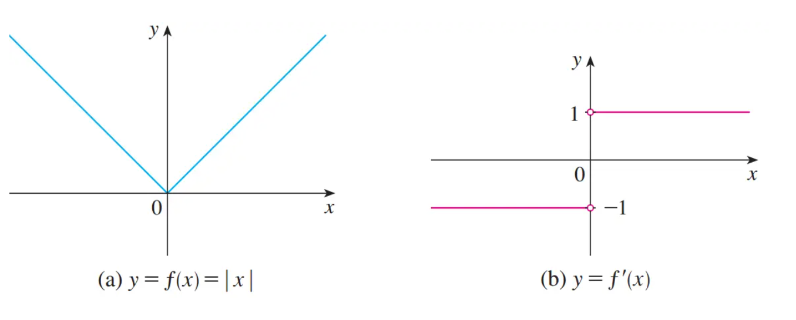

# 导函数

### 导函数的定义

当导数从上文某个点的导数变成一个函数上各个点的导数的集合时，也就说如果对一个函数上任意的 $x$ 导数都存在，每个 $x$ 都有与之对应的 $f'(x)$ 我们就可以把 $f'(x)$ 当成一个新的函数， 并称之为 $f$ 的导函数。 $f'(x)$ 是基于函数 $f$ 通过上述极限运算推导出来的，且导函数的值由原函数上所有的点的斜率来确定

### 导函数的微分符号记法

常见的导函数表达方式如下
$$
f'(x) = y' = \frac{dy}{dx} = \frac{df}{dx} = \frac{d}{dx}f(x) = Df(x) = D_xf(x)
$$
这里的符号 $D$ 和 $\frac{d}{dx}$ 被称为**微分算符(differentiation operations)** ， 他们表示微分运算-计算导函数的过程

> 符号 $\frac{d}{dx}$ 是由莱布尼兹引入的，不能把它看成一个比率（暂时?)，它仅仅是 $f'(x)$ 的一个同义词。

但这个符号却非常有用且具有启发性，特别是与变化量的表示方法联合使用的时候。如  $\frac{dy}{dx} = lim_{\Delta x\rightarrow 0}\frac{\Delta y}{\Delta x}$ 

如果需要指出导函数 $\frac{dy}{dx}$ 在一个特定点 $a$ 处的值，我们可以用符号  $\frac{dy}{dx}|_{x = a}$ 表示，这里的竖线表示在某处  $\frac{dy}{dx}|_{x = a} = f'(a)$ 

### 可微分的

> 如果函数 $f$ 在 $a$ 点的导函数 $f'(a)$ 存在，我们就说函数 $f$ 在 $a$ 点是**可微分的** 。如果函数在某个开区间上的每一个点都是可微分的，我们就说这个函数在这个区间上是可微分的

例如，函数 $f(x) = |x|$ 在 $x < 0$ 和 $x > 0$ 时，导函数存在，而在 $x = 0$ 导函数不存在，所以我们说该函数在除了 $x = 0$ 之外的所有实数上是可微分的。从下图看出，原函数在 $x = 0$ 处是没有切线的

> 定理：如果函数在 $a$ 点可微，那么该函数一定在 $a$ 点连续

上述定理的逆命题，即’如果函数在 $a$ 点连续，那么该函数在 $a$ 点一定可微‘是不对的。**如果函数在某点连续，该函数不一定在该点可微** 比如上述的绝对值函数在 $f(0)$ 是连续的，但是不可微

### 函数什么情况下不可微

* **原函数在某点没有切线。**其本质原因在于原函数在该点的左极限和右极限不相等，导致原函数在该点的极限不存在，因此也就不可微分。如上述绝对值函数

* **函数在某点不连续** 上述定理告诉我们，如果函数 $f$ 在 $a$ 点不连续，那么它在 $a$ 不可微（即逆否命题是正确的）。导致不连续的情况除了左右极限不相等之外，还包括函数在该点没有定义，换句话说，要想可微分，还需要保证没有间断点
* **函数曲线在某点的切线与 $x$ 轴垂直**。即斜率无穷大。 $lim_{x\rightarrow a} |f'(x)| = \infty$ ,这意味着切线在 $x\rightarrow a$ 时变得越来越陡

以上四幅图均为不可微分的情况：综合来看我们知道，从几何图像上来看，可微的实质时函数图像上所有点上是平滑的，没有端点、尖角、和拐点

如下图所示

