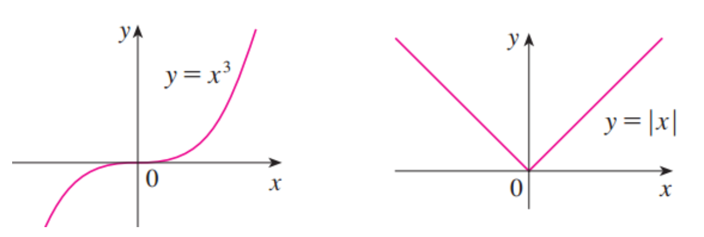

### 最大值最小值问题

* 如何设置罐头的形状可以让成本最低
* 航天飞机的最大加速度是多少（影响到飞行员能承受的加速度的极限）
* 咳嗽时，器官收缩到多大可以使得排气最快
* 血管以多大角度分叉，可以让心脏泵血消耗最少的能量？

这些问题可以被归结为求函数的最大值或者最小值的问题

### 极大值和极小值的定义

> 如果对于函数 $f$ 定义域内的任意自变量 $x$ , 都满足 $f(c)\geq f(x)$ ,那么 $f(c)$ 就是**绝对极大值**（最大值）
>
> 如果对于函数 $f$ 定义域内的任意自变量 $x$ , 都满足 $f(c)\leq f(x)$ ,那么 $f(c)$ 就是**绝对极小值**（最小值）

在一定区间内满足上述条件，即有局部极大值\极小值

### 最值定理

> 如果函数在闭区间上连续，那么这个函数一定在这个闭区间内有最大值和最小值

**注意最值定理中的两个前提（闭区间和连续）**

左边这个函数没有最大值，因为它不是连续函数；右边这个没有最大值和最小值，因为它是开区间

### 如何找到极大极小值

1. 基本不等式
2. 二次函数
3. 导数为0

### 费马引理

> 如果函数 $f$  在 $c$ 点有局部极大值或者局部极小值，且该点的**导数存在**，那么 $f'(c) = 0$ 

注意该命题的逆命题是不对的，如上图

左边的函数虽然在 $x = 0$ 处导数等于 $0$ ，但是此处并没有极值；右边函数虽然在 $x = 0$ 处有极小值，但是导数不存在

既然如此，费马引理有什么用呢？它告诉我们在找极值的时候，至少要考察一下 $c$ 点的导数（不论这个导数是等于0还是不存在）来看看临界点的情况

### 罗尔定理

> 如果函数 $f$ 满足下列三个假设： $f$  在闭区间 $[a, b]$ 上连续；在开区间 $(a,b)$ 上是可微分的； $f(a) = f(b)$ ；那么在开区间 $(a,b)$ 内一定存在数 $c$ 使得 $f'(c) = 0$  

例：证明方程 $x^3 + x - 1 = 0$ 含有一个实根

**第一步：用介值定理看看这个方程是否有根**

令 $f(x) = x^3+x-1$ 因为 $f(0) = -1 < 0$ , 且 $f(1) = 1 > 0$ 又因为函数 $f$ 是多项式函数(即定义域内连续)，那么根据介值定理，至少存在一个数 $c \in (0, 1)$ 使得 $f(c) = 0$ 

**第二步：再看看这个函数的根是否只有一个。这里采用反证法**

假设函数 $f$ 有两个根 $a, b$ ，那么 $f(a) = 0 = f(b)$ ，根据罗尔定理，在 $(a,b) $ 一定存在一个数 $c$ 使得 $f'(c) = 0$ 

然而对所有的 $x$ ，有根据 $f'(x) = 3x^2 + 1 \geq 1$ ，即不存在 $c$ 使得 $f'(c) = 0$ 

前后矛盾，故假设有两个根不成立的，因此只有一个根

### 拉格朗日中值定理

>如果函数 $f$ 满足下列两个假设： $f$ 在闭区间 $[a,b] $ 上连续；在开区间 $(a,b)$ 上是可微分的，那么在开区间 $(a,b)$ 内一定存在数 $c$ 使得 $f'(c) = \frac{f(b) - f(a)}{b-a}$  