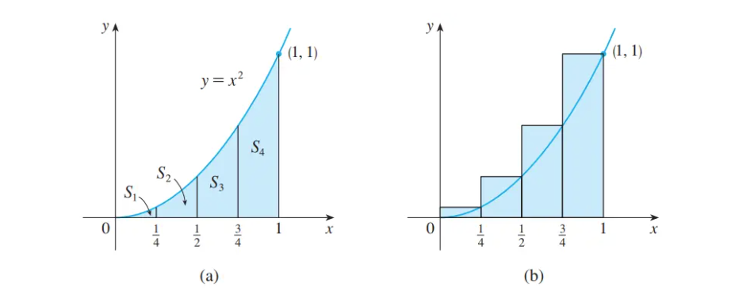

# 定积分

### 面积问题

对于一个多边形来说，我们可以通过传统的分割三角形方法来求得多边形的面积。如果要求由曲线构成的区域的面积呢？

回想我们在定义切线时，我们用割线的斜率来近似切线的斜率，然后取这些近似的极限。在面积问题上我们同样采取这种策略。用矩形逼近面积S然后让矩形的数量增加并取这些矩形的面积的极限。

### 示例1

如下图，我们利用矩形近似的方法估算抛物线 $y = x^2$ 在 $[0, 1]$ 区域内的面积

我们将区域 $s$ 分成四段使各段底边相等，并用矩形代替每个小段，矩形的高与右边界的函数值相等

用 $Ln$ 来表示小矩形的面积之和，即有
$$
Ln = \frac{1}{4}\cdot(\frac{1}{4})^2 + \frac{1}{4}\cdot(\frac{1}{2})^2 + \frac{1}{4}\cdot(\frac{3}{4})^2 + \frac{1}{4}\cdot(1)^2 = \frac{15}{32} = 0.46875
$$
从上图可知有 $Ln > S$ ，即  $0.46875 > S$ 

同样地我们可以构造如下更小的矩形来近似区域 $S$ ,即以小段儿的左边界函数值为小矩形的高

如下图

用 $Rn$ 来表示小矩形的面积之和，即有
$$
Rn = \frac{1}{4}\cdot0^2 + \frac{1}{4}\cdot(\frac{1}{4})^2 + \frac{1}{4}\cdot(\frac{1}{2})^2 + \frac{1}{4}\cdot(\frac{3}{4})^2 = \frac{7}{32} = 0.21875
$$

从上图可知， $S > Rn$, 即 $S > 0.21875$

当我们不断增加小段儿的个数时，我们可以把 $Ln$ 写成一般形式
$$
Ln = \frac{1}{n}\cdot(\frac{1}{n})^2 + \frac{1}{n}\cdot(\frac{2}{n})^2 + \frac{1}{n}\cdot(\frac{3}{n})^2 + \cdots + \frac{1}{n}\cdot(\frac{n}{n})^2 \\
= \frac{1}{n}\cdot(\frac{1}{n})^2(1^2 + 2^2 + 3^2 + \cdots + n^2)\\
= \frac{1}{n^3}(1^2 + 2^2 + 3^2 + \cdots + n^2)
$$
由于平方和公式
$$
(1^2 + 2^2 + 3^2 + \cdots + n^2) = \frac{(n+1)n(2n+1)}{6}
$$
则有
$$
Ln = \frac{1}{n^3}\cdot\frac{(n+1)n(2n+1)}{6} = \frac{(n+1)(2n+1)}{6n^2}
$$
当我们取无穷多个小矩形之后，我们有
$$
lim_{n\rightarrow \infty}Rn = lim_{n\rightarrow \infty}\frac{(n+1)(2n+1)}{6n^2}\\
= lim_{n\rightarrow \infty}\frac{1}{6}(\frac{n+1}{n})(\frac{2n+1}{n})\\
=lim_{n\rightarrow \infty}\frac{1}{6}(1+\frac{1}{n})(2+\frac{1}{n})\\
= \frac{1}{6}\cdot 1 \cdot 2\\ = \frac{1}{3}
$$
同理可得
$$
lim_{n\rightarrow \infty}Rn = \frac{1}{3}
$$

因此，我们将区域 $S$ 的面积 $A$ 定义为 $n$ 个矩形的面积之和的极限，即
$$
A = lim_{n\rightarrow \infty}Rn = lim_{n\rightarrow \infty}Ln = \frac{1}{3}
$$

### 面积问题一般化

考虑到一般的函数曲线构成的区域 $S$ 的面积问题，如下图所示

我们将 $S$ 分成 $n$ 个小段儿。区间 $[a, b]$ 的宽度为 $b-a$ ，所以 $n$ 个小段儿的宽度为
$$
\Delta x = \frac{b -a}{n}
$$
因此我们有 $[x_0, x_1], [x_1, x_2], \cdots [x_{n-1}, x_n]$ 

如果用宽度为 $\Delta x$, 高度同等于右端点的函数值的矩形表示第 $i$ 个小段儿，那么第 $i$ 个小段儿 $S_i$ 的面积为 $f(x_i)\Delta x$, 那么这 $n$ 个小矩形的面积之和为
$$
Ln = f(x_1)\Delta x + f(x_2)\Delta x + \cdots + f(x_n)\Delta x
$$

由图可知，当 $n \rightarrow \infty$ 时， 这种近似会变得越来越好，因此我们用下面的方法来定义区域 $S$ 的面积 $A$ 

> 连续函数 $f$ 图像下面积 $S$ 的面积 $A$ 时近似矩形面积之和的极限
> $$
> A = lim_{n\rightarrow \infty} Ln = lim_{n\rightarrow \infty}[f(x_1)\Delta x + f(x_2)\Delta x + \cdots + f(x_n)\Delta x] 
> $$
> 或者
> $$
> A = lim_{n\rightarrow \infty}Rn = lim_{n\rightarrow \infty}[f(x_0)\Delta x + f(x_1)\Delta x+ \cdots + f(x_{n - 1}\Delta x)]
> $$
> 

除了用小段儿的左端点和右端点，我们也可以将第 $i$ 个区间 $[x_{i-1}, x_i]$ 内的某个任意值 $x_i^*$ 作为第 $i$ 个矩形的高。我们把 $x_1^*,x_2^*,\cdots,x_n^*$ 称为采样点（sample points），下图显示了未选择端点作为采样点的近似情况

所以  $S$ 的面积的更一般表述为
$$
A = lim_{n\rightarrow \infty} [f(x_1^*)\Delta x + f(x_2^*)\Delta x+\cdots + f(x_n^*)\Delta x]
$$

### 定积分的应用

除了应用于曲线函数求面积，这个极限还出现在求变速运动的距离、曲线的长度、固体的体积、物体质量的中心、由液体压强产生的力、变力做功等等其他的量上。

### 定积分的定义

> 若函数 $f$ 在闭区间 $[a, b]$ 上有定义，我们把区间 $[a,b]$ 分成 $n$ 个宽度为 $\Delta x = \frac{b-a}{n}$ 的等份子区间、令 $x_0(=a),x_1,x_2,\cdots,x_n(=b) $ 分别表示这些小区间的端点，并令 $x_1^*,x_2^*,\cdots,x_n^*$ 分别表示这些小区间的任一样本点，那么 $x_i^*$ 就位于第 $i$ 个子区间 $[x_{i-1},x_i]$ ， 那么函数 $f$ 自 $a$ 到 $b$ 的定积分就是
> $$
> \int_a^bf(x)dx = lim_{n\rightarrow \infty}\sum_{i=1}^nf(x_i^*)\Delta x
> $$
> 

假设这个极限存在，并且对于所有可能的样本点都能得到相同的极限值，那么我们就说 $f$ 在闭区间 $[a,b]$ 上是可积分的

定积分的极限的确切含义如下：

对于每个 $\epsilon > 0$ ，都存在一个整数 $N$ ，使得对于每个整数 $n > N$ 和区间 $[x_{i-1}, x_i]$ 上的 $x_i^*$ ,都有下式成立
$$
|\int_a^bf(x)dx-\sum_{i = 1}^nf(x_i^*)\Delta x| < \epsilon
$$

* 符号 $\int$ 由莱布尼兹引入并称为积分符号。积分符号是一个拉长的S，之所以选择它是因为积分表示求和的极限。在符号 $\int_a^bf(x)dx$ 中， $f(x)$ 被称为被积函数， $a$ 为积分下限， $b$ 为积分上限。 $dx$​ 本身没有任何意义，只是一个符号。

注意：$\int_a^bf(x)dx$ 是一个整体的符号，符号 $dx$ 仅仅表明自变量为 $x$. 计算积分的过程也被称为积分（法）中文语境中，积分既可做动词，也可做名词

* 定积分 $\int_a^bf(x)dx$ 是一个数字，它不依赖 $x$ ，事实上我们可以用任意的字母替换 $x$ 但是不改变积分的值，如

$$
\int_{a}^{b}f(x)dx = \int_{a}^{b}f(t)dt = \int_{a}^{b}f(r)dr
$$

*  $\sum_{i = 1}^nf(x_i^*)\Delta x$ 被称为黎曼和，以德国数学家伯恩哈德 $\cdot$ 黎曼命名。定积分的定义表明，可积函数的定积分可以用黎曼和近似到任意的精度范围内

* 当函数 $f$ 既可以取正值，也可以取负值,那么，黎曼和是位于 $x$ 轴上方的矩形面积和位于 $x$ 轴下方的矩形面积的负值之和。如果对黎曼和取极限，那么定积分可以被理解为净面积，即面积之差

$$
\int_{a}^{b}f(x)dx = A_1 - A_2
$$

* 其实，由区间 $[a,b]$ 分成的小段儿子区间不一定要求等宽，即使是不等宽的，结论依然成立。
* 我们定义了一个可积函数的定积分，但并不是所有的函数都是可积的。下面的定理表明，最常见的函数实际上是可积的

定理：若 $f$ 在闭区间 $[a,b]$ 上连续，或 $f$ 仅存在有限个跳越间断点，那么 $f$ 在闭区间 $[a,b]$ 上是可积分的，定积分 $\int_{a}^{b}f(x)dx$ 存在

定理：若 $f$ 在闭区间 $[a,b]$ 上是可积分的，那么
$$
\int_{a}^{b}f(x)dx = lim_{n\rightarrow \infty}\sum_{i = 1}^nf(x_i)\Delta x
$$
这里 $\Delta x = \frac{b-a}{n}$ ,且 $x_i = a + i\Delta x$ 

也就是说由于不论样本点怎么选择，定积分的结果都一样，为了简化计算，我们常常以子区间的右端点为样本点，即令 $x_i^* = x_i$ 