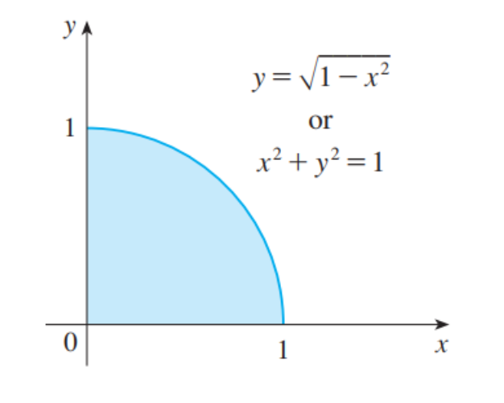
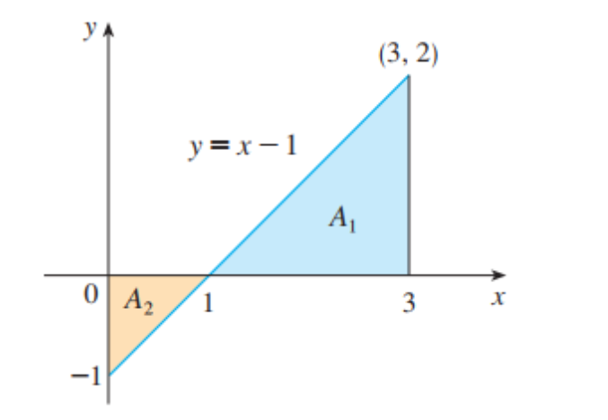

### 用黎曼和求积分

#### 正整数幂的求和公式

$$
\sum_{i = 1}^{n} i = \frac{n(n+1)}{2} \\
\sum_{i = 1}^{n} i^2 = \frac{n(n+1)(2n+1)}{6} \\
\sum_{i = 1}^{n} i^3 = [\frac{n(n+1)}{2}]^2
$$

#### 西格玛符号的简单法则

$$
\sum_{i = 1}^{n}c = nc \\
\sum_{i = 1}^{n}ca_i = c\sum_{i = 1}^{n }a_i \\
\sum_{i = 1}^{n}(a_i + b_i) = \sum_{i = 1}^{n}a_i + \sum_{i = 1}^{n}b_i \\
\sum_{i = 1}^{n}(a_i - b_i) = \sum_{i = 1}^{a_i} - \sum_{i= 1}^{n}b_i
$$

### 用面积来计算函数的定积分

#### (a) $_{\int_{0}^{1}\sqrt{1-x^2}dx}$ 

由于 $f(x) = \sqrt{1-x^2} \geq 0$, 我们可以把这个积分理解为曲线 $y = \sqrt{1-x^2}$ 在 $x \in [0, 1]$ 范围下的面积。经过变形之后可得 $x^2+y^2 = 1$ ，因此原函数是一个半斤为 $1$ 的 $\frac{1}{4}$ 圆弧，如下图所示

所以有
$$
\int_{0}^{1}\sqrt{1-x^2}dx = \frac{1}{4}\pi(1)^2 = \frac{\pi}{4}
$$

#### (b)  $\int_{0}^{3}(x-1)dx$

令 $y = x - 1$ ，它的图像为斜率为 $1$ 的倾斜直线

即该定积分为蓝色面积与黄色面积之差，即有
$$
\int_{0}^{3}(x-1)dx = A_1 - A_2 = \frac{1}{2}(2* 2) - \frac{1}{2}(1*1) = 1.5
$$

### 黎曼和的中点法则

我们知道，在对函数图像在区间内进行矩形分割时，样本点可以选择子区间内的任何数，当子区间越多时，他们对应的定积分的近似就越精确。然而他们要么把面积估大，要么把面积估小。故在求定积分的近似值时，选择子区间的中点会比选择左端点或者右端点更加精确。**我们把利用子区间中点作为费曼和基础的定积分的近似方法称为中点法则**，即

$$
\int_{a}^{b}f(x)dx \approx \sum_{i = 1}^{n}f(\overline{x_i})\Delta x = \Delta x[f(\overline{x_1})+\cdots+f(\overline{x_n})]
$$
其中,  $\Delta x = \frac{b-a}{n}$ ,且 $\overline{x_i} = \frac{1}{2}(x_{i-1}+x_i)$ ，即 $x_i$ 为第 $i$ 个子区间 $[x_{i-1},x_i]$ 的中点