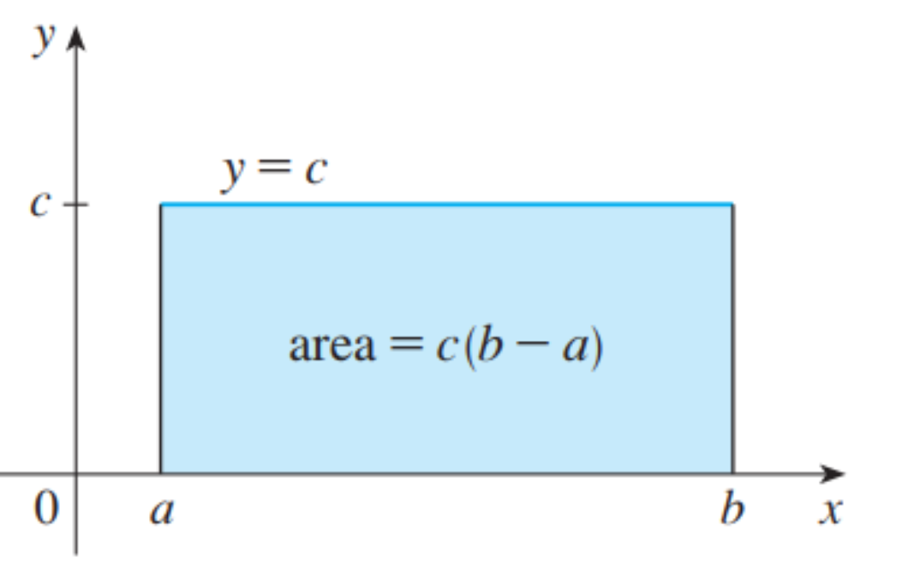
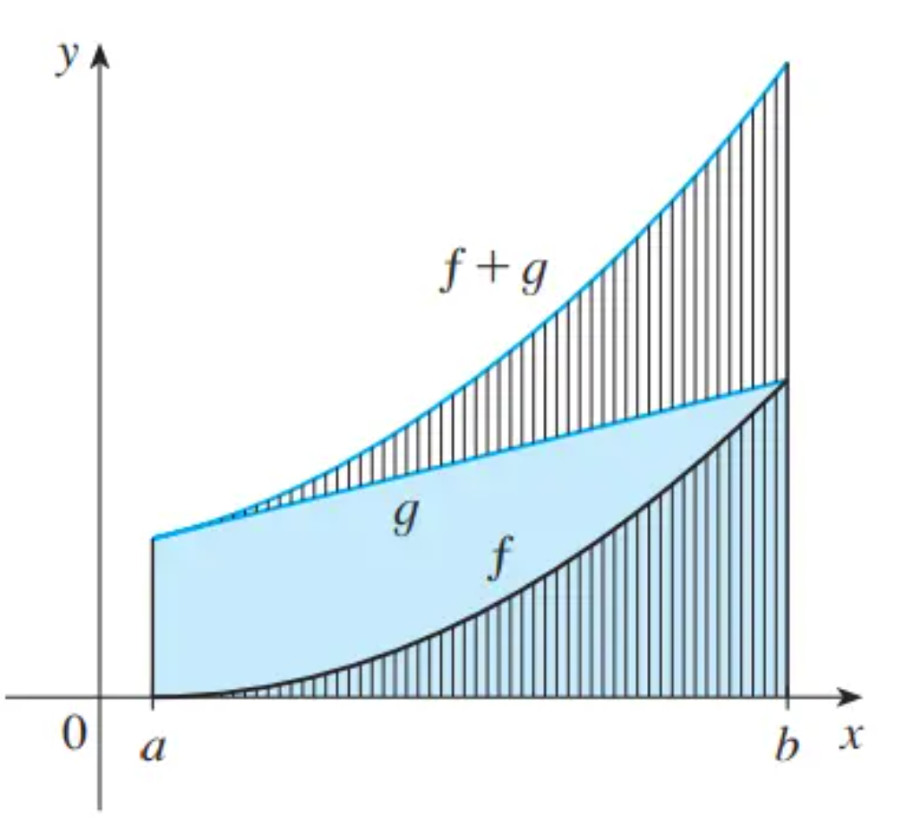
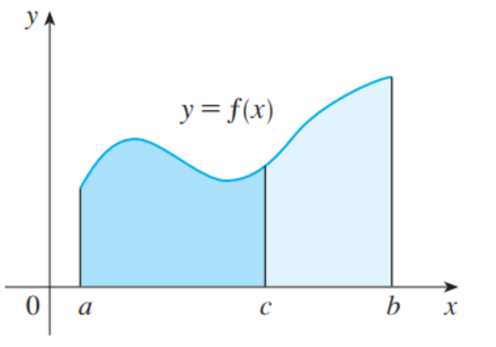

# 定积分的性质

**性质1：**  $\int_{b}^{a}f(x)dx + \int_{a}^{b}f(x)dx = 1$

或者 $\int_{b}^{a}f(x)dx = -\int_{a}^{b}f(x)dx$ 

**性质2：**  $\int_{a}^{a}f(x)dx = 0$ 

假设 $f$ 和 $g$ 都是连续函数，那么

**性质3：** 若 $c$ 为常数， $\int_{a}^{b}cdx = c(b-a)$​

性质3表明，常数函数 $f(x) = c$ 的积分是该常数乘以区间长度，若 $c > 0$ 且 $a < b$ 可以预想到， $c(b-a)$​ 是函数值与区间所围成的矩形的面积，如下图

**性质4：**  $\int_{a}^{b}[f(x) + g(x)]dx = \int_{a}^{b}f(x)dx + \int_{a}^{b}g(x)dx$​

性质4表明，和的积分等于积分的和。对于正数函数，它表明 $f + g$ 下方的面积是 $f$ 下方的面积和 $g$​ 下方的面积之和

上图中上下相应的垂直线段应具有相同的高度

此性质可以用定义证明
$$
\int_{a}^{b}[f(x)+g(x)]dx = lim_{n\rightarrow \infty}\sum_{i = 1}^{n}[f(x_i)+g(x_i)]\Delta x \\ 
= lim_{n\rightarrow \infty}[\sum_{i =1}^{n}f(x_i)\Delta x + \sum_{i =1}^{n}g(x_i)\Delta x] \\
= lim_{n\rightarrow \infty}\sum_{i =1}^{n}f(x_i)\Delta x + lim_{n\rightarrow \infty}\sum_{i =1}^{n}g(x_i)\Delta x \\
= \int_{a}^{b}f(x)dx + \int_{a}^{b}g(x)dx
$$

**性质5：** 若 $c$ 是常数，那么 $\int_{a}^{b}cf(x)dx = c\int_{a}^{b}f(x)dx$ 

**性质6：**  $\int_{a}^{b}[f(x)-g(x)]dx = \int_{a}^{b}f(x)dx - \int_{a}^{b}g(x)dx$

**性质7：**  $\int_{a}^{c}f(x)dx+\int_{c}^{b}f(x)dx = \int_{a}^{b}f(x)dx$ 

对于 $f \geq 0$ 且 $a < b$ 的情况，我们可以用图来理解，即两块的面积相加得到总面积

### 积分的比较性质

**性质1：** 若对 $a \leq x \leq b$ ,有 $f(x) \geq 0$ 那么 $\int_{a}^{b}f(x)dx\geq 0$​ 

即 $f(x)\geq 0$ 的话， $f$ 图像以下的面积是正的

**性质2：** 若对 $a \leq x \leq b$ ， 有 $f(x) \geq g(x)$ ，那么 $\int_{a}^{b}f(x)dx \geq \int_{a}^{b}g(x)dx$​ 

相同区间下，函数值越大，积分越大

**性质3：** 若对 $a \leq x \leq b$ , 有 $m \leq f(x) \leq M$ ，那么 $m(b-a)\leq\int_{a}^{b}f(x)dx \leq M(b-a)$  

如果 $f$ 是连续的，有 $m$ 和 $M$ 作为函数的最小值和最大值，那么函数 $f$ 在 $[a,b]$ 区间上有对 $m$ 的积分 $\leq$ 对 $f$ 的积分 $\leq$ 对 $M$ 的积分
