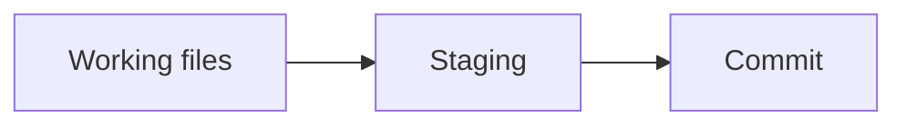

# git

### what is git

git is an open source and free source control management, can manage changes to file over time. You can switch different version at different time easily.

### download

[link](www.git-scm.com)

### terminal

officially we use git bash which you just download it. However, you can also use it on PowerShell or Command Prompt on window and terminal on Mac. Even third party terminals like hyper doc IS is ok

### zoom

make yourself suitable

`Ctrl + '+'` zoom in

`Ctrl + '-'` zoom out

### first time must do 

*don't care too much about the color of the code, just to make the comment into green that i set it*

1. **specify the name and the email of yours as your identity**

```c++
git config --global user.name "steve" //set the user name to "steve"
git config --global user.email your_email@gmail.com // set the user email to ...
// you can also change your name and email in the same way
```

2. **specify the default branch name**

```c++
git config --global init.default branch main // set the default branch to "main", we will talk about the branch later 
```

3. **get yourself help if you need**

```c++
git config -h // this is a simplify version of the help file
git help config // this is a help file located on your computer, you can check out it anytime you want
```

### small point

* clear the screen

```c++
clear
```

* cd(stands for change directory)

```c++
cd ~ // go to the very top folder
cd c: // go to disk c
cd temp // assumed that temp is the name of the folder, this order means to go into it
cd 'temp file' // if your folder contain a space or special characters, remember to use '' to enclose the folder name
cd .. // get out one layer of folder
```

* ls(stands for list)

```c++
ls // used to check the file inside a folder
```

### start your project

1. **go to the folder you want to start your project with (use cd order)**

2. **turn the folder into a git repository**

```c++
git init // it will return 'Initialized empty Git repository in (your address)'
```

3. **back to your File Explorer, you can find a hidden folder (see it through view) named .git**

it contain all the necessary file

4. **check current status**

```c++
git status // press enter
```

* you can check which **branch** you currently are in 
* any **commit** (we will talk about it later)

* **tracked file** (that means git won't care the changes done on these file)

5. ignore the unnecessary file

* go to the File Explorer, add a new file called .gitignore
* you can ignore files, folders or even entire extensions
* the following code is a demonstration of ignoring all txt file

```c++
# ignore all .txt fils // this is a comment in the file
*.txt
```

go to the [link](https://github.com/github/gitignore) to find the way you can ignore files, folders and extension


5. **track file**

```c++
git add <file> // track file
git rm --cached <file> //untrack file
git add --all // track all file
git add -A // track all file, same with above
git add . // . stands for the entire directory, which the whole part means to add the whole directory
```

you can once again use git status to check 

6. **commit**

Basically, to commit is to take a snapshot of your repository at this point in time.

It is like writing a version to a history book, so that you can come back to this version of the file at any time

```c++
git commit -m "message" // the message part stands for the comment you want to write for yourself so you can recognize when you come back
e.g. git commit -m "first commit - committing all files to the repository"
```

when you type git status again you will find that there are no longer any files to commit

7. after making changes

when you make changes to your tracked file, you type git status to check, you will find out that the git recognize the modification and remind you to make a commit.

```c++
git diff // use this statement to check the difference
//when you are fine with the modification, once again add it to the staging
git add <file>

```

8. staging

Staging is a place where your files sit until you're ready to commit them. It's like a holding pen before you add that version into the history book

9. phases of the git



the git add action is moving the file from working files to staging part

10. unstaged

```c++
git restore --staged <file> // this git restore action is moving the file from staging phase to working file
```

11. bypass staging section

```c++
git commit -a -m "message" // this action jump over the staging section from working file to the commit section
```

12. discard changes

```c++
git restore <file> // to discard changes in working directory
```

13. check for all commit

```c++
git log // you can check all your commit here
git log --oneline // a more abbreviated verison of the log info
git log -p // a more complex version of the log info
```

many other functions as well, for example check for certain date or find certain text, you can type in git help log to check for it

14. amend the commit

```c++
git commit -m "message" --amend // if you want to edit your previous messgae 
```

15. reset to a commit

```c++
git log --oneline // to obtain the yellow index in front of each commit
git reset <index> // choose the commit you want to reset to 
```

16. branch

branch is basically a copy of your main branch, and it has all the same commit in the history, it is widely used in especially fixing a bug so that you can make changes without making the changes. You can merge your testing branch with the main branch when you are fine

17. create a new branch

```c++
git branch <name>
```

18. check all the branch

```c++
git branch // you may find all your branch here, the one in green with asterisk in the front of its name is your current branch
```

19. switch branch

```c++
git switch <name> // switch to the branch name
```

you can check with git branch

20. merge branch

once you finish your test branch, you can merge it with your original branch

```c++
git merge -m "message" <name> // name refer to the branch name you want to merge
```

21. delete branch

once your branch is fine, you can 

```c++
git branch -d <name> // delete the branch
```

22. conflict between main branch and merged branch

[video](https://www.youtube.com/watch?v=tRZGeaHPoaw) at 28:40 

git bash will return conflict and you will need to delete the one version you don't want
