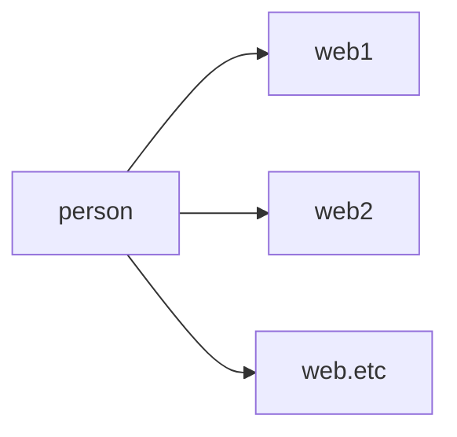
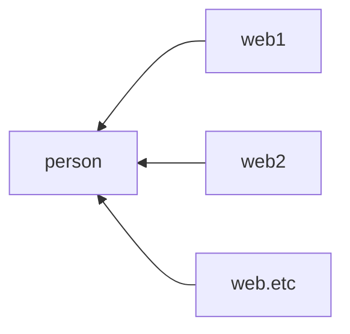

# RSS

we are living in a era with information explosion

it is important for us to manage the way we receive information

[origin](https://mp.weixin.qq.com/s/KKPO3otk5LBeLMQTtlqHvg)

## 信息获取方式

### passive

getting information one by one, giving recommendation 

### positive

controlling information given to you 

## content

### rss

>   the appearance of **RSS** is to satisfy this demand, for people who don't want to spend so much time finding information

*   RSS stands for RDF Site Summary

*   definition: RSS is a protocol to send the information you subscribe to you
*   similar app: 即刻，轻芒
*   suffix: .rss or .xml

### feed

*an export satisfies for standard constantly updated information format*

>   publisher group the information into a **RSS** file and it is called feed, it contain data in **XML** format

### xml

*   stands for extensible markup language
*   is a kind of markup language --> the signal computer can understand, in this format, computer can make process to the article

## rss reader

### analysis for current brand

#### 一览

*   support pc and moblie no web
*   high speed
*   limited feed for free user
*   too much element, not simple enough
*   ui too ugly

#### feedly

publish by Devhd

*   support chrome and firefox extension

*   support ios and android for mobile platform
*   free user can't use search function
*   slow for browsing website

#### Digg reader

*   simple
*   various hand operation on mobile platform
*   slow opening speed
*   long time no update

many many: Reeder2, RSSOwl, Miniflux, News Blur

#### InoReader(recommend)

## tutorial

>   usually blog provide rss, but bilibili, weiblog?

### rss feed generate website

*   [Feed43](https://feed43.com/)
*   [Feedex](https://feednx.net/)

*   [Fsshub](https://docs.rsshub.app/)

### rss to kindle

subscribe @kindle 精选，绑定公众号

### rss for fm casting programm

[fmweb](https://getpodcast.xyz/)

### rss for instant info

[google alert](https://www.google.com/alerts)

anything can be searched on the google, if can subscribe through this website