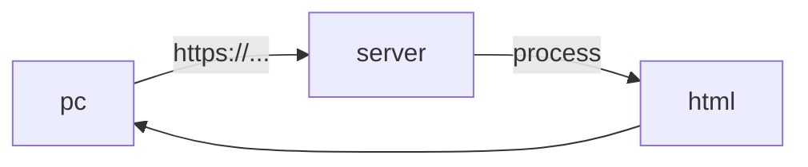
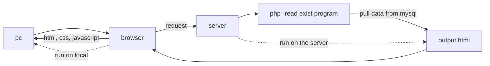

# web relation

## client & server

| client       | funtion              | server        | function                        |
| ------------ | -------------------- | ------------- | ------------------------------- |
| browser      |                      | php           | read exist data and output html |
| mobile phone |                      | mysql         |                                 |
| html         | the page             | Ruby on Rails |                                 |
| css          | decoration           | Python        |                                 |
| javascript   | movement for the web | Java          |                                 |

## language execute order 

>   notice that html, css, javascript  run on the server