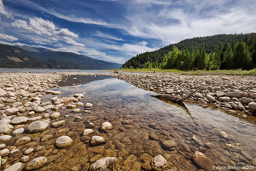
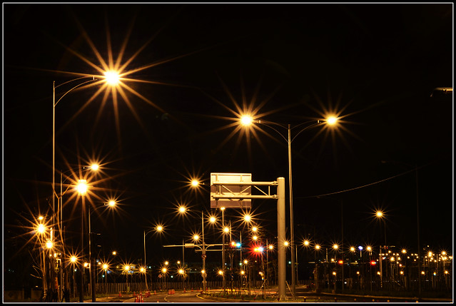
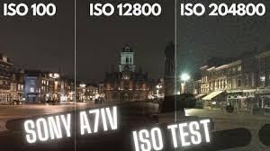
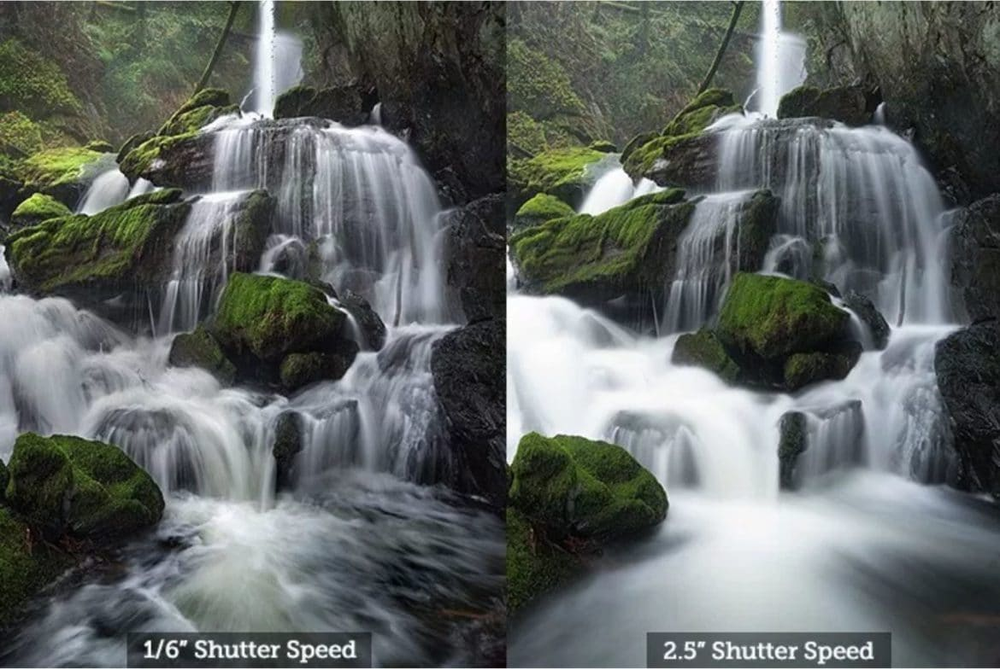

### 基本知识

* 首先我们明确几个基本知识和前提，就是我们在拍得好之前先要保证我们能够拍到，所以在手持的情况下，我们的快门速度应该有个上限，即**安全快门**，一般为光圈的倒数（我也不知道怎么来的 ， 所以机身和镜头的防抖的重要性就在这里体现了。

#### 三要素的作用

| 要素 | 作用                                                         |                                                              |
| ---- | ------------------------------------------------------------ | ------------------------------------------------------------ |
| 光圈 | 光圈大：景深浅，虚化好        | 光圈小：景深深，即整个画面都比较清晰，夜晚拍出星芒 |
| 快门 | 快门速度快：抓拍瞬间，体育赛事或者打鸟 | 快门速度慢：长曝光拍出干净的瀑布，或者夜晚拍出光弧 |

#### 景深

简单来说就是你照片的深度，如果是大光圈虚化，那么你拍摄的主体清晰，而背景模糊，就像**整个照片只有你主体一层内容**一样，所以这种情况是浅景深

而比如拍一座城市，那么从近到远的所有内容你都呈现，那么相当于**内容上有深度**，所以就是深景深

### 分析

接下来我们就以目的为导向来分析一下

#### 要虚化

**直接办法**：那就光圈拉大，快门速度一是保证被摄物不会糊，二保证你拍出来不糊，如果做不到那就拉iso

**间接办法**：如果拉iso太厉害感觉要寄，那就得想想办法改变

* 直接换了光线好的地方拍，如果是拍人啥的可以动的
* 要考虑带灯了，要么是机顶闪光灯或者很大的接电源的灯
* 要么就前期作罢，交给后期

> [!note]
>
> 换光线好的地方应该是拍摄之前就要留意，同时这里讲直接和间接办法用词不太准确

> e.g.
>
> * 如果你想拍个静物，拍个花什么的，那么就直接光圈开比较大，然后iso和快门配合一下，保证在安全快门前提下iso最低就好了
>
> * 如果是拍人物就有可能复杂些，比如会眨眼睛或者某些动作很难保持，那这样我们就优先选择捕捉人物的动作，然后再保证iso。（一般这种片子拉高一些没太大关系，也很好拍，主要就是构图，所以很多人叫这种大光圈虚化叫做糖水片

#### 要深景深

那就在保证快门速度合适的情况下，尽可能将光圈靠近F8（参见下文note）。如果说在低iso和光圈更靠近F8中间二选一，我个人觉得是iso小一点比光圈更靠近F8会好些

我还没有搜过（除非极限情况光圈太大但是快门速度又没法动，那就只能调iso了。

> [!note] 
>
> 大家一般公认光圈在F8的时候镜头画质表现最好，而且所有景都很清晰。
>
> 所以我一般拍风光肯定就是最好F8 + iso100，毕竟日光下这个参数基本没问题的

> e.g.
>
> * 比如你要拍你整个卧室的陈设，这时候重要的是你的内容而不是虚化，就需要深景深。
> * 夜晚拍星芒的时候一般光圈要小于F10，也不是越小越好，忘记了，算是另一种开小光圈的情况

#### 要高速抓拍

这个的话新机身或者运动机身会比较有优势，因为如果要抓拍运动啥的话，快门得到 $\frac{1}{400}$ 往上，那就是能有多大光圈开多大再拉iso。

所以如果机身可用iso（参见下文note）不高的话就很难出片。一般也很少用到这种场景

> [!note] 
>
> 可用iso相当于是最高能看的iso,一般是自己摸出来或者是论坛里面别人分享的（e.g.百度贴吧）
>
> 我的老机器就是基本800往上就寄了，但是像比较新的z62就是iso3200照片都可以看，技术差别还是蛮大的。
>
> 而机器有的最大iso像sony的机子可以到10万，有点夸张。

#### 要拍慢门

一般就是快门速度可能3-7s甚至往上，这个肯定要上三脚架了。

* 是白天的话，直接F8+iso100，需要注意的是，很多时候，即使是这样的配置还是会过曝，所以常常白天长曝光会搭配**nd滤镜**（参见下文note）使用
* 是晚上的话就要把光圈基本全开，iso根据情况加

* 可以考虑后期提一点，但不能指望太多

>举个例子：
>
>* 我拍烟花的慢门，我拍是5s左右，那么这时候因为烟花放的时间是固定的，所以如果发现光圈开最大还是暗那就考虑加点iso，我那时候开了400.
>
>因为是长曝光，所以噪点也还是比较少
>
>* 拍星空的话，我拍是25s左右，那么因为这个时间上除了星空五百法则之外，就没有其他限制，所以就光圈开最大，iso可以比较低。

> [!note] 
>
> nd滤镜可以理解为减光镜，有nd600，nd800，nd1000这样，分别是减6档，8档，10档光。我看推荐的话是直接上10档比较好，但没亲自用过。

> [!tip]
>
> **星空五百法则**解决的是在拍星空的时候，快门速度究竟应该用多少最合适。他计算的是**镜头焦距**与**快门速度**之间的关系。 
>
> 这个法则就一句话：用500这个数除以你当前所用的镜头焦距，得出来这个数就是在当前焦距下适合你曝光的那个最慢的那个快门速度
>
> 这里的焦距一般说的是全画幅镜头哈。因为在拍摄星空这种题材，画幅大小会显现地比较明显，而且一般残幅的镜头群对拍摄星空也不是那么友好

#### 其他

当你没有特别的拍摄目的而仅仅是记录的时候，你可以首先保证能拍到，光圈随意跟着iso互相平衡就好

### 总结

上述只是我个人的一些经验，但我认为以目的为导向是一种比较不错的方法去主导你的拍摄。正是因为这样所以我们才会有快门优先和光圈优先这样的档位来让我们专注一个参数来快速拍照。

照片仅学习使用