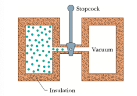
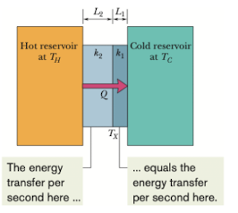

# chapter 18

## Temperature

### Temperature

measure temperature on Kelvin scale. 

* Room temperature is about 290K, $0K$​  is absolute zero

### thermoscope & thermometer(测温仪和温度计)

区别：

* 测温仪（thermoscope）没有经过校准，它所显示的数字并没有实际意义
* 温度计（thermometer）精准一些

### zeroth law of theromodynamics

这个结论是由测温仪对两个等温物体贴合后发现示数不变得出的，从这个结论我们知道温度计是可行的

when two bodies are in thermal equilibrium, their temperatures are equal

### Triple point of water(三相点)

$$
T_{3} = 273.16K
$$

* at this temperature, liquid water, solid ice and water vapor can coexist

  

### 测量未知气体的温度

由理想气体质量方程在恒容气体测温仪的条件下，我们有 $T = cp$ 其中 $c$ 为一个常数。对气体在某一个温度下的温度 $T$ 列等式，与气体在三相点时的温度 $T_{3} = 273.16K$ 的等式联立，我们有下面这个方程
$$
T = 273.16K(\lim_{gas\rightarrow 0}\frac{p}{p_{3}})
$$

 $p_{3}$​ 是温度处在三相点时的压强对

#### 问题

这个温度计的缺陷在于，用不同的气体作为仪器的填充，因为不同气体具有不同的热力学性质，会造成示数微小的偏差。我们发现当我们不断减少填充的气体时，示数趋近于一个单一的值。

可能是因为减少气体量之后，气体分子之间的相互作用减小，气体的行为越来越接近理想气体

## Celsius & Fahrenheit 

### 摄氏度和华氏度

$$
T_{C} = T - 273.15
$$

$$
T_{F} = \frac{9}{5}T_{c} + 32
$$

## thermal expansion（热膨胀）

### 线性膨胀

$$
\Delta L = L\alpha \Delta T
$$

其中 $\alpha$ 是线性膨胀系数

### 体积膨胀

$$
\Delta V = V\beta \Delta T
$$

其中 $\beta$​ 是体积膨胀系数

### 关系

通过计算我们有线性膨胀和体积膨胀之间存在一定关系
$$
\beta = 3\alpha
$$

## absorption of heat

### 热容(heat capacity)

热容 $C$ 表示单位温度储存的热量
$$
Q = C\Delta T = C(T_{f}-T_{i})
$$

### 比热容(specific heat)

单位温度，单位质量所储存的热量
$$
Q = cm \Delta T = cm(T_{f}-T_{i})
$$

### 摩尔比热容(molar specific heat)

跟比热容相比把质量改成摩尔了

### 前提

对固体和液体测量和应用比热容这个概念时，我们需要明确是在恒压还是恒容的条件下进行的。计算结果表明，用这种条件的区别只有百分之几。但对于气体来说就不是这样子的了

### 三态变化

对于物质从液体，固体，气体其中之一转化成另一态的过程所吸收的能量可以表示为
$$
Q = Lm
$$
其中 $L$ 为转化热， 细分则有熔化热 $L_{F}$ (heat of fusion)和 气化热 $L_{V}$​ (heat of vaporization)

注意它的单位一般为 $KJ/kg$

### 单位变化

$$
1 cal = 3.968 * 10^{-3}Btu = 4.1868J
$$

## 热力学

### 热功

$$
W = \int_{}^{}dW = \int_{}^{}dFx = \int_{}^{}d \ psx = \int_{v_{i}}^{v_{f}}p dV
$$

#### 图表

用图表表示热功变化，我们可以发现黄色区域的面积就是气体所做的功

(a). 恒温变化

(b). 先恒压升温，再恒容降温

(c). 先恒容降温再恒压升温

(d). 我们发现根据这个过程，我们可以通过恒压恒容的方式控制气体所做的功

(e). 气体恒温做负功

(f). 气体经过一个循环后再回到起始点整个过程的功即为 做的总正功+做的总负功，即如图所示的黄色区域

### 热力学第一定律

$$
\Delta E_{internal} = Q - W
$$

or
$$
d\Delta E = dQ - dW
$$

* 如果吸热或者气体做负功，那么内能增加
* 如果放热或者气体做正功，那么内能减少

> [!note]
>
> 注意这里做功的概念：
>
> 你对系统做正功和系统做负功是相同的

> 注意，这里内能变化量 $\Delta E$ 只与气体初末状态有关系，与路径无关

如上图，

* 内能变化量四条路径都相同
* 气体做正功大小关系 4>3>2>1
* 释放到环境中的热量 4>3>2>1

### 热力学第一定律的四种特殊情况

#### 恒温(adiabatic process)

$$
\Delta E_{int} = -W
$$

#### 恒容(constant-volume process)

$$
\Delta E_{int} = Q
$$

#### Cyclical process

$$
Q = W
$$

系统经过一系列变化又回到初状态，这时我们有 $\Delta E_{int} = 0$

#### Free expansion

$$
\Delta E_{int} = 0
$$

恒温过程且气体没做功

## 热传输

### 基本方式

* 热传导
* 热对流
* 热辐射

### 热传导率(thermal conduction rate)

$$
P_{cond} =\frac{Q}{t} = kA\frac{T_{H}-T_{C}}{L} 
$$

其中 $A$ 为面积， $L$ 为厚度,  $k$​​​ 为热导率(thermal conductivity)，只跟材料有关

> 

#### 多材料热传导重点

得到上面这个公式的来由为，同一时间内每种材料内的热传导率（即相同时间内传导的热量）是相同的

说实话，热传导率相同不是很好理解

> [!note] 
>
> 这里公式推导是根据上面这个图的情况，且默认两种复合材料的横截面积相同

> Q：如果在上图这种情况下我们假定横截面积 $A$ 是相同的，两种材料的厚度 $L_{1} = L_{2}$ , 那么就会有 $\Delta T_{1} k_{1} = \Delta T_{2}k_{2}$ 这个等式，那么如果 $k_{1} > k_{2}$ 也就有 $\Delta T_{1} < \Delta T_{2}$ ， 也就是说单位时间内温度的变化量更小，那岂不是跟我们生活中的情况不符合吗？比如说热导率良好的铜，传输热量的时候不是很快吗，那不应单位时间内的温度变化量更大才对吗？

这里我们可以将整个材料微分来看，那么就可以理解为每一小份材料的温差会更小，说明热导率高的材料能更有效地将热量传递到更大的区域，从而使得整体温度梯度更加平缓。在实际应用中，这意味着热导率高的材料可以更均匀地分布温度，使得材料内部不容易形成热点。也就是散热更好

### 热阻(thermal resistance)

$$
R = \frac{L}{k}
$$

其中 $L$ 为厚度， $k$​ 为热导率

### 热对流

气体受热膨胀上浮，其他冷气体填补位置后反复这个过程

### 热辐射

* 物体通过电磁波发射能量的速率 $P_{rad}$ 

$$
P_{rad} = \sigma \epsilon AT^{4}
$$

其中 $A$ 为表面积， $T$ 为该面积的温度（开尔文），  $\sigma$(stefan-Boltzmann constant) 是一个常数, 为5.6704*10^-8^W/m^2^*K^4^ , $\epsilon$​​ 为表面的发射率（0—1）

* 物体通过热辐射从环境吸收能量 $P_{abs}$

$$
P_{abs} = \sigma \epsilon A T^{4}_{env}
$$

* 物体合传输速率

$$
P_{net} = P_{abs}-P_{rad} = \sigma \epsilon A(T^4_{env} - T^{4})
$$

可以有正有负，正相当于物体通过电磁波吸收能量，负相当于物体通过电磁波放出能量

### 理想气体状态方程

$$
pV = nRT
$$

我们把一个常数  $k = \frac{R}{N_{A}}$ 代入这个方程，我们有
$$
pV = NkT
$$

### 等温下的功

$$
W = nRTln\frac{V_{f}}{V_{i}}
$$

### root mean square speed

$$
V_{rms} = \sqrt{\frac{3RT}{M}}
$$

注意这里的 $M$ 是指一个分子的质量

### 分子动能

$$
K_{avg} = \frac{1}{2}mv_{avg}^{2}\\
= \frac{1}{2}m(v_{rms}^{2})\\
=\frac{1}{2}m\frac{3RT}{M}
$$

对于 $\frac{m}{M}$, 我们有 $N_{A} = \frac{m}{M}$ ， 所以我们有
$$
K_{avg} = \frac{3RT}{2N_{A}}
$$
令 $k = \frac{R}{N_{A}}$, 我们有
$$
K_{avg} = \frac{3}{2}kT
$$

### 平均自由径

$$
\lambda = \frac{1}{\sqrt{2}\pi d^2N/V}
$$

### 摩尔速度分布

麦克斯韦速度分布定律
$$
P(v) = 4\pi (\frac{M}{2\pi RT})^{\frac{3}{2}}v^{2}e^{-\frac{Mv^{2}}{2RT}}
$$
这里 $M$ 为摩尔质量， $R$ 为气体常量， $T$ 为气体温度， $v$ 是摩尔速度

### 单原子理想气体内能

$$
E_{int} = (nN_{A})K_{avg} = (nN_{A})K_{avg} = (nN_{A})\frac{3}{2}kT\\
=\frac{3}{2}nRT
$$

### 恒容摩尔比热容

我们有
$$
Q = C_{v}n \Delta T
$$
这里 $n$ 为物质的量， $C_{v}$ 为摩尔比热容

将它代入热力学第一定律我们有
$$
\Delta E_{int} = Q-W \\
\Delta E_{int} = C_{v}n\Delta T - W
$$
因为恒容， $W = 0$ 那么摩尔比热容可以表示为
$$
C_{v} = \frac{\Delta E_{int}}{n\Delta T}
$$
由上面我们知道单原子理想气体的内能 $\Delta E_{int} = \frac{3}{2}nRT$ ,代入我们有
$$
C_{v} = \frac{3}{2}R
$$

## 

### 熵的变化量

$$
\Delta S = S_{f}-S_{i} = \int_{i}^{f}\frac{dQ}{T}
$$

