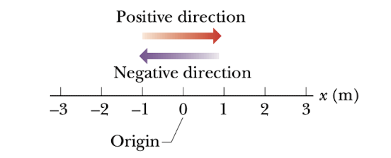
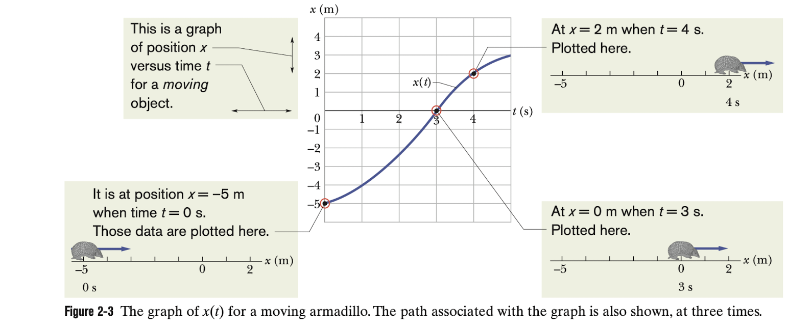
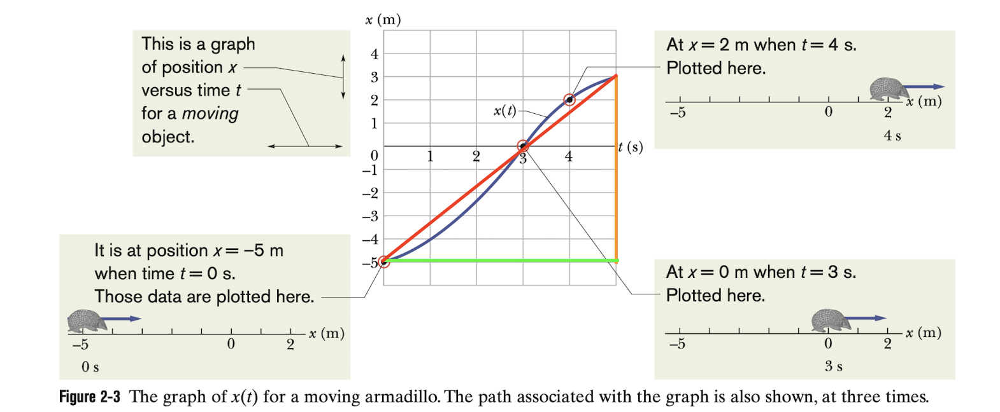
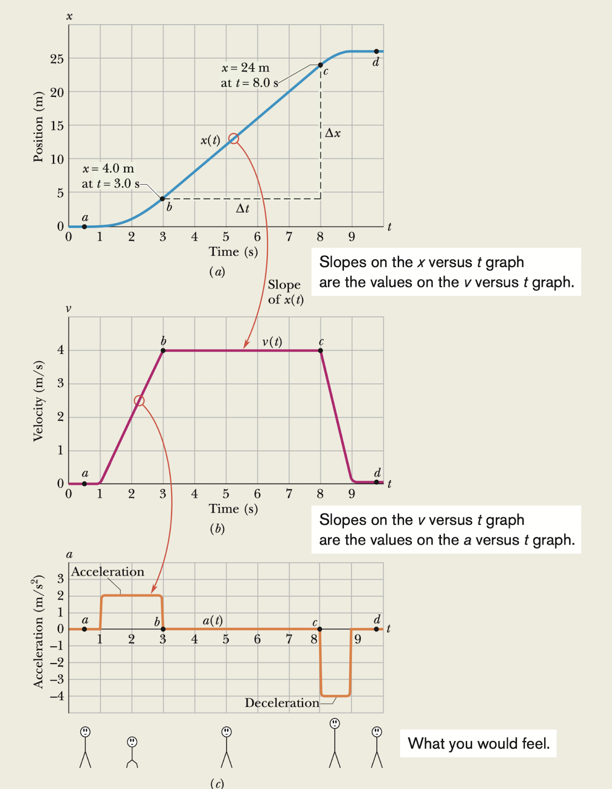
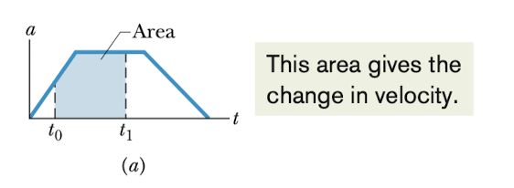
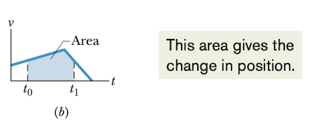

# 2. Motion Along a Straight Line

物理的一个研究方向和目的是学习物体的运动。它们可以运动多快，在给定的时间内可以运动多远。这些研究对工程师，地理学家等有着不可估量的作用。那么在这章节我们就来学习一下物体在一维直线的运动。

## 位置，位置的变化量，平均速度(position displacement and average velocity)

### 运动(motion)

我们周围的世界一直在运动，运动也有各种各样的分类，那么在研究运动之前，在这里我们明确一下我们接下来讨论的范围。

1. 我们目前只讨论沿着直线的运动，不论直线是沿着什么方向的
2. 我们目前不讨论引发物体运动的原因，只关心物体是如何运动的。
3. 我们目前讨论的运动物体要么是像电子一样的粒子，要么是有着电子一样的运动特性的物体（即物体的各个部分的运动方向是相同的）

### 位置和位移(position and displacement)

#### 位置

找到物体的位置，即是找到物体相对于某个位置的距离。为了方便我们研究，我们引入数轴的概念。与数学中的数轴相同，它有原点(origin)，正方向，反方向，单位长度。

正方向的位置前我们通常用+号在前表示，比如+2，也可以省略；负方向的位置前我们用-号在前表示，但与数学中的数轴不同的是这个+-符号仅仅表示正负方向，不表示位置的大小。在表示位置时我们并没有 2 > -3 这样的说法。

#### 位移

为了知道物体位置的变化，我们引入了位移的概念。

> 对于位移，也可以说是位置的变化量，我们将它定义为从位置 $x_{1}$ 到位置 $x_{2}$ 的变化,有
> $$
> \Delta x = x_{2} - x_{1}
> $$

其中 $x_{1}$ 是初始位置， $x_{2}$ 是终点位置 $\Delta$符号常用来表示一个物理量的变化量。

> [!caution]
>
> 位置的变化量是一个**矢量**(vector)，有方向和大小(magnitude)，正方向表示往坐标轴正方向变化，负方向同理可得。我们会在后面讲到。位置的变化量的大小即去掉符号之后的数字本身。

### 平均速度和平均速率(average velocity and average speed)

#### 平均速度

对于日常生活中运动的物体，为了比较它们整体运动的快慢，我们引入了平均速度这个概念。

> 它被定义为位移的变化量与时间的变化量之比。
> $$
> v_{avg} = \frac{\Delta x}{\Delta t} = \frac{x_{2}-x_{1}}{t_{2}-t_{1}}
> $$
> 其中 $x_{1},x_{2}$ 分别是物体在 $t_{1}, t_{2}$ 所处的位置。

> [!caution]
>
> 由于 $\Delta x$ 是一个矢量； $\Delta t$ 是一个标量，也就是有大小，没有方向的物理量，它们的比值得出平均速度也是一个矢量，其方向与位移的方向相同。

#### 平均速率

与平均速度的引入相同，**平均速率**也能反映出物体整个过程中运动的快慢，但是不同的是，它没有正负之分。

> 它被定义为位移的大小的变化量的绝对值
> $$
> S_{avg} = \frac{|\Delta x|}{\Delta t}
> $$

因为这里位移的大小并没有方向，所以平均速率是一个标量。

#### 图像

在实验中，我们通常需要记录很多的数据来帮助我们理解和研究运动的特性。为了更加直观地看出它的规律和变化，我们常常将运动和图像结合起来。下面是一个位移速度图像，横坐标为时间t，纵坐标为位移x。它表示的是一只犰狳的运动轨迹。

那么按照我们刚刚引入的概念---平均速度，我们也可以将它与图像结合起来。我们根据定义，位移的变化量可以表示为下图中橙色的线段，时间的变化量可以表示为下图中绿色的线段，再将两个单独的点连接起来。我们就得到了红色的直线。那平均速度刚好就是这条红色的直线的斜率。很神奇吧！

也就是说我们可以将比较平均速度的大小直接换成直线的斜率大小。这样，如果同时存在多个平均速度，我们也能很直观地比较出来它们的区别。

## 瞬时速度和瞬时速率(instantaneous velocity and speed)

### 瞬时速度

我们在前面学习了平均速度和平均速率，它们都和运动所运动所用的时间 $\Delta t$​ 有关系，指的是一段时间内的整体速度。但是现实中，我们更常说的速度的快慢通常指的是物体速度在一瞬间的速度，也就是**瞬时速度**(instantaneous velocity)。

为了获得准确的瞬时速度，我们可以从平均速度和时间 $\Delta t$ 下手。如果我们将 $\Delta t$ 不断减小逼近0，那么我们就会发现平均速度的大小逐渐逼近一个极限值，也就是那一瞬间的瞬时速度。

> 所以我们将瞬时速度定义为运动时间逼近0时的平均速度
> $$
> v = \lim_{\Delta t \rightarrow 0}\frac{\Delta x}{\Delta t} =\frac{dx}{dt}
> $$

* 我们从这个定义式子还可以理解到，速度 $v$ 是位置 $x$ 的变化率。如果在x-t图像中表示的话，也就是位移x所对应的点的切线。
* 由于位移是一个矢量，那么除以 $\Delta t$ 这个标量，我们有瞬时速度 $v$​ 还是一个矢量

### 瞬时速率

瞬时速率表示的是瞬时速度的大小，只有大小没有方向

## 加速度(acceleration)

在汽车行业中，我们经常会比较百米加速这一个参数，也就是汽车从静止到运动了100m之后的瞬时速度。那么其实这一个参数体现的就是速度变化的快慢，也就是我们学习的物理量---加速度。

再者，在游乐场上的机动游戏上，我们会在突然加速和减速的过程中感觉到刺激，这就是加速度。我们常常会将比较大的加速度用g来表示，也就是重力加速度的大小，我们会在后面介绍它。

### 平均加速度

加速度可以描述成物体速度变化的快慢，所以由这个定义我们有

> 对于在直线上运动的物体，它的加速度可以表示成
> $$
> a_{avg} = \frac{v_{2}-v_{1}}{t_{2}-t_{1}} = \frac{\Delta v}{\Delta t}
> $$
>
> 其中 $v_{1},v_{2}$ 分别是 $t_{1},t_{2}$ 时刻对应的速度 

* 由于 $\Delta v$ 是一个矢量， $\Delta t$ 是一个标量，所以我们可以知道平均加速度也是一个矢量，有方向。它的方向与速度变化量的方向相同。

### 瞬时加速度

跟速度有瞬时速度同理，当我们将时间 $\Delta t$ 不断减小逼近到0，我们就可以得到瞬时加速度

>$$
>a = \frac{dv}{dt}
>$$

* 如果我们将 $v = \frac{dx}{dt}$ 代入上面的 $v$ 中，我们可以有 $a = \frac{d^{2}x}{dt^{2}}$， 也就是说瞬时加速度可以理解为 $x(t)$ 关于 $t$ 的二阶导数，其中 $x(t)$是 $x$ 关于时间 $t$ 的函数
* 如果我们画出一段运动的v-t图，与x-t图相同，我们可以将加速度理解为速度v的所对应点的切线。可以看着下面的图标变换理解一下

### 图表变换

## 恒定加速度(constant acceleration)

在生活中，我们经常会遇到物体以恒定加速度，或者可以近似为恒定加速度做直线运动的情况，比如汽车的加速和刹车。于是我们可以研究这种特殊情况的运动的规律。

### 公式1

对于恒定的加速度，我们从它的定义出发，我们有
$$
a = a_{avg} = \frac{v-v_{0}}{t-0}
$$

> 变化一下形式，我们得到了第一个公式
> $$
> v = v_{0} + at
> $$
> 其中 $v_{0}$ 表示初状态的速度， $v$ 表示末状态的速度。

### 公式2

同样地，我们从平均速度的定义出发，我们有
$$
v_{avg} = \frac{x-x_{0}}{t-0}\\
x = x_{0} + v_{avg}t
$$
我们还知道平均速度的另一种表示
$$
v_{avg} = \frac{v_{0}+v}{2}
$$
其中 $v_{0}$ 表示初状态的速度， $v$ 表示末状态的速度。代入式子(9)，我们有
$$
x = x_{0}+\frac{v_{0}+v}{2}t
$$

> 将规律1中的结论式子(8)代入，我们可以得到规律2
> $$
> x -x_{0}= v_{0}t + \frac{1}{2}at^{2}
> $$
> 其中 $x_{0}$ 为初状态的位置， $x$ 为末状态的位置

### 其他

以上两个式子是基本的公式，可以在任何情况下使用。但是很多时候会出现某一个物理量是未知的情况，这时候我们就需要几个更加强大的公式了。注意不用死记硬背，用多了自然就记住了

#### t未知

我们利用式子(8)和式子(12)，得出关于 $t$ 的函数，这样我们就可以将时间 $t$ 抵消。得到

>$$
>v^2 = v_{0}^2 + 2a(x-x_{0})
>$$
>
>其中 $v$ 为末状态的速度

#### a未知

同样地，我们利用式子(8)和式子(12)，得出关于 $a$ 的函数并代入之后，我们就可以将 $a$ 抵消，得到

>$$
>x-x_{0} = \frac{v_{0}+v_{t}}{2}t
>$$
>
>相当于是位移 = 平均速度 x 时间。只是平均速度用另一种形式来表示

####  $v_{0}$ 未知

同样地，我们利用式子(8)和式子(12)，得出关于 $v_{0}$ 的函数之后，我们代入到式子(12)之中，我们可以得到

>$$
>x-x_{0} = vt - \frac{1}{2}at^{2}
>$$
>
>其中 $v$ 为末状态的速度

### 再看恒定加速度

刚刚我们的式子(8)和式子(12)，我们是通过定义来推导的。其实，如果我们从微积分的角度来推导这两个式子，也是可行的。

#### 公式1

1. 我们首先从微积分的角度重新定义加速度。我们可以把速度写成是加速度 $a$ 与微小时间单元 $dt$ 的乘积。
   $$
   dv = adt
   $$

2. 接着我们对式子的两边用不定积分，得到
   $$
   \int_{}^{}dv = a\int_{}^{}dt
   $$
   这里因为 $a$ 是一个常数，所以我们可以直接将它放到积分符号的外面。接着变化，我们有
   $$
   v = at + C
   $$

3. 为了找到这个常数 $C$， 我们令时间 $t = 0$， 就有 $C = v_{0}$， 于是我们得到了
   $$
   v = at + v_{0}
   $$

> [!note] 
>
> 第三步中我们可以把 $v$ 理解成一个关于时间 $t$ 的函数

#### 公式2

1. 同样，我们从微积分的角度重新定义位移。我们可以把位移写成是速度 $v$ 与微小时间单元 $dt$ 的乘积。
   $$
   dx = v \ dt
   $$

2. 接着我们对式子的两边用不定积分，得到
   $$
   \int_{}^{}dx = \int_{}^{}vdt
   $$

3. 我们把从公式1的结论代入到这里来，就有
   $$
   \int_{}^{}dx = \int_{}^{}(v_{0}+at)dt \\
   \int_{}^{}dx = \int_{}^{}v_{0}dt + \int_{}^{}at \ dt
   $$
   通过微积分基本定理，我们得到了
   $$
   x = v_{0}t + \frac{1}{2}at^{2} + C
   $$

4. 为了找到这个常数 $C$， 我们令 $t = 0$， 于是我们得到了 $C = x_{0}$, 所以有
   $$
   x-x_{0} = v_{0}t + \frac{1}{2}at^{2}
   $$

> [!note] 
>
> 第四步中我们可以把 $x$ 理解成一个关于时间 $t$ 的函数

## 重力加速度(free-fall acceleration)

在生活中，我们将物体抛出，它总会经过一段时间之后落回地面。这是因为物体受到了地球给它的重力，使它有大小恒定，且竖直向下的加速度。在物理中，我们把它称为重力加速度(free-fall accelertion，用小写 $g$​​ 来表示。

### 重力加速度

重力加速度有着两个性质：

* 重力加速度的大小与物体本身的性质无关，著名的铁球和羽毛在真空中竖直下落的实验可以证明这一点
* 重力加速度的大小随着纬度和海拔有着些许的区别。在中纬度的海平面上它的大小约为 $9.8m/s^{2}$， 我们计算题目时一般采用这个数值。

由于重力加速度是一个定值，因此我们在前面所介绍的恒定加速度的公式在重力加速度的场景下也是适用的，只不过要注意：

1. 运用在重力加速度上，物体的运动方向变成了竖直平面，沿着 $y$ 轴
2. 由于我们约定俗成地认为竖直向上为 $y$ 轴正方向，所以我们在套用公式的时候要注意重力加速度的方向。如果认定竖直向上为正方向，那么加速度就是 $-g$ 了

## 积分在图像中的分析(graphical integration in motion analysis)

我们在恒定加速度那一章节中学习的公式可以帮助我们计算想要的物理量。如果将物体的运动用x-t等图像来表示，这些公式可以等效为求解部分图像的面积。在学习了基本的微积分知识后，我们可以将求解面积这个任务与积分结合起来帮助我们简化运算。

### 积加速度

当我们画出了一个物体运动的a-t图像，而想要知道物体运动的速度时，我们可以用积分来求解物体的速度。因为加速度可以被定义为 $a = \frac{dv}{dt}$， 所以对它运用定积分，我们可以得到

>$$
>\int_{t_{0}}^{t_{1}}dv = \int_{t_{0}}^{t_{1}}adt\\v_{1}-v_{0} = \int_{t_{0}}^{t_1}adt
>$$
>
>其中 $v_{0},v_{1}$ 是物体在 $t_{0}, t_{1}$ 时刻对应的速度。 $\int_{t_{0}}^{t_{1}}adt$ 可以被理解为时间 $t_{0}$ 到 $t_{1}$ 加速度图像和时间轴所围成的面积，如下图蓝色区域

### 积速度

同样的，当我们画出来一个物体运动的v-t图像，而想要知道物体运动的位移时，我们可以用积分来求解。因为速度可以被定义为 $v = \frac{dx}{dt}$ ，所以对它运用定积分，我们可以得到

>$$
>\int_{t_{0}}^{t_{1}}dx = \int_{t_{0}}^{t_{1}}vdt\\
>x_{1} - x_{0} = \int_{t_{0}}^{t_{1}}v \ dt
>$$
>
>其中 $x_{0}, x_{1}$ 是物体在 $t_{0}, t_{1}$ 时刻对应的位置。 $\int_{t_{0}}^{t_1} v \ dt$ 可以被理解为时间 $t_{0}$ 到 $t_{1}$ 速度图像和时间所围成的面积，如下图所示蓝色区域

