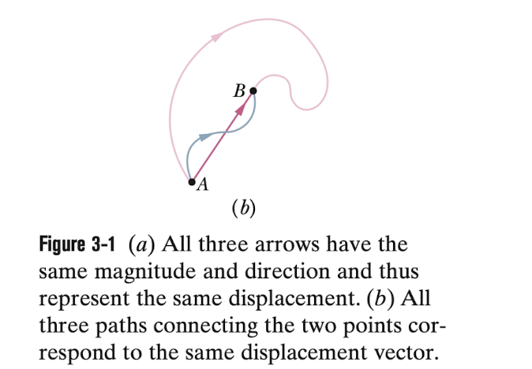
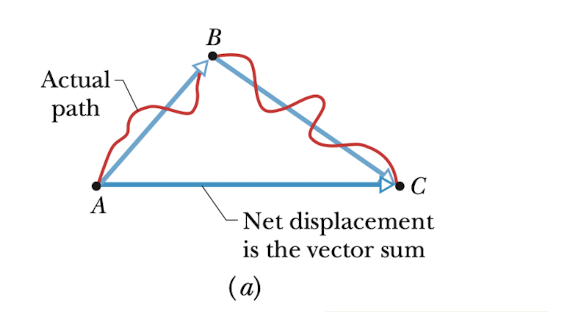
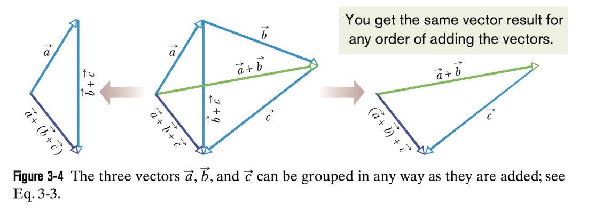
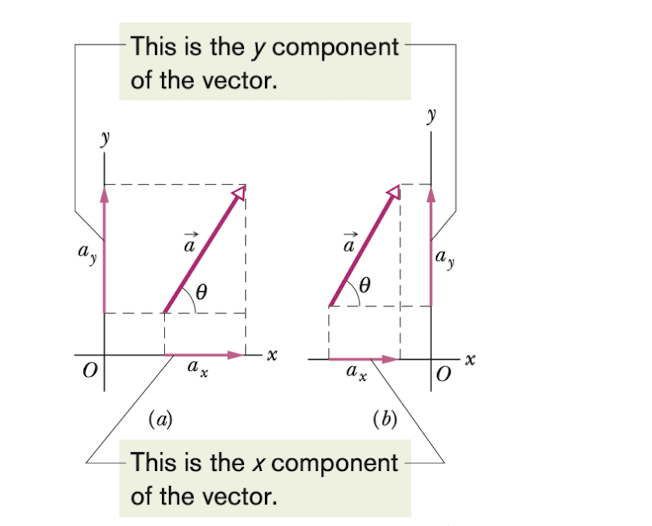
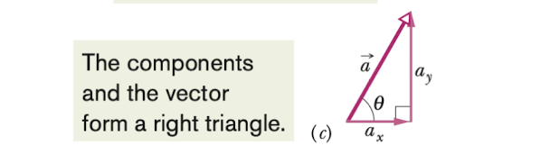

# Vectors

物理中我们经常会遇到既有方向又有大小的物理量，为了将它们统一起来与只有大小没有方向的物理量进行区分，我们给它们起了一个名字---矢量(vector)。它与数学中的向量是基本一致的。在这一章节我们会专注于它的基本运用。

## 矢量及其分量(vectors and their components)

### 矢量和标量

对于在一维直线运动的物体，它只有两个运动方向，我们可以直接用正负符号来表示它们。但当我们的运动从一维延伸到二维，三维，这种正负符号就不好使了。那么该怎么比较好地表示它们呢？于是我们引入了矢量。

> 一个矢量同时具有大小和方向，并符合特定的矢量结合运算

常见的矢量：速度，加速度，位移

常见的标量：时间，质量，速率

[知乎回答传送门](https://zhuanlan.zhihu.com/p/626773564) 不知道正确性怎么样，之后再来看看吧

#### 表示方法

我们通常在字母上标一个箭头来表示向量，比如 $\vec{a}$ ；或者我们用可以一条有向线段来表示它，比如 $\vec{AB}$ 其中A是起点，B是终点

#### 性质

矢量不考虑运动的具体路径，仅仅取决于起点和终点的位置。如下图，这三条不同路径的有向线段都表示同一个矢量，即矢量 $\vec{AB}$

### 矢量加法

对于矢量的运算，我们先来介绍一下矢量的加法。如果我们有一个粒子先从点A运动到点B，之后从点B运动到点C。与它们的实际路径无关，我们可以把这段运动在图中表示出来，有如下：

> 我们将 $\vec{AB},\vec{BC},\vec{AC}$ 分别表示为 $\vec{a}, \vec{b},\vec{c}$​ 就得到了我们的矢量加法公式
> $$
> \vec{c} = \vec{a} + \vec{b}
> $$

从这幅图我们得到了矢量加法的一般方法：将两个有向线段首尾相接，保证它们的方向和长度与原本的一致，之后再将仅剩的头尾连接起来得到我们所求的矢量。

#### 交换律(commutative law)

> 对于矢量的加法，满足交换律，我们有
> $$
> \vec{a} + \vec{b} = \vec{b} + \vec{a}
> $$

不过为啥矢量的交换律是合法的呢？不是很明白

#### 结合律(associative law)

> 当我们有大于两个矢量相加时，我们可以将它们以任意顺序组合，结果不变，即
> $$
> (\vec{a} + \vec{b}) + \vec{c} = \vec{a} + (\vec{b} + \vec{c})
> $$

 我们可以通过图像来更好地理解这一点

### 矢量减法(vector subtraction)

从矢量加法的定义中我们可以找出矢量减法的规律。我们从定义出发可以知道一个物体从点A开始运动到点B，最后回到点A，它的位移大小为0。我们把向量AB表示为 $\vec{b}$ ，即有 $\vec{b} + (-\vec{b}) = 0$。 其中 $0$ 代表零向量，即大小为0，没有方向。

所以我们有加上一个 $-\vec{b}$ 与减 $\vec{b}$ 等效。对于 $\vec{d} = \vec{a} - \vec{b}$​

> $$
> \vec{d} = \vec{a} - \vec{b} = \vec{a} +(-\vec{b})
> $$

> [!note] 
>
> 这里的矢量加减法并不只针对位移这个物理量，而是对所有具有矢量特性的量

### 矢量的分量(components of vectors)

#### 分解

上面的介绍的矢量加法原理虽然有效，但是如果每次计算矢量的加法都需要画图来解决就变的很繁琐了。于是我们下面介绍一种非常天才的方法，可以将矢量在直角坐标系中用不同的方式表现出来。我们先来看看矢量的分量的定义

> 矢量的分量被定义为矢量在某个坐标轴上的投影。

矢量的分量的大小可以通过向坐标轴做垂线并运用三角函数计算出来。在习惯上，我们把计算矢量的分量的操作叫做分解(resolving the vector)。比如下面的这幅图的矢量 $\vec{a}$ ，它在 $x$ 轴和 $y$ 轴的分量分别是 $a_{x}$ 和 $a_{y}$。

> 由三角函数关系我们可以得到
> $$
> a_{x} = a \ cos\theta  \ \ \ \ and \ \ \ \ a_{y} = a \ sin\theta
> $$
> 其中 $\theta$ 是图中向量 $\vec{a}$ 与 $x$ 轴正方向的夹角。
>
> 两个分量的方向为沿着坐标轴的方向，这里都是正的。如果向量 $\vec{a}$ 由原点指向第三象限，那么两个分量都是负的。

> [!note]
>
> 这里我们暂时只讨论二维平面的矢量及其分量。如果考虑 $z$ 轴，我们可以认为现在 $z$ 轴的分量大小为0

#### 合并

作为矢量的分解的逆运算，我们从矢量的分量可以很轻松地将原本的矢量合并出来。

我们将两个分量首尾相连，由于他们的方向为坐标轴的方向。因此，组合起来就自然形成了一个直角三角形，而斜边正是我们要找的矢量

#### 转化

前面我们挖了一个坑，说到将矢量分解成一个个分量这个想法很genius，为什么呢？

这里我们可以这么理解，将矢量分解相当于把他们化成了标准形式，只有固定的几个方向（二维4个，三维6个）而每个轴可以理解成一维直线。一维直线的加减法大大简化了我们的运算，减小了抽象的部分。

再者，通过分量，我们有了对矢量不同的表达方式，如下

>$$
>a = \sqrt{a_{x}^{2} + a_{y}^{2}}  \ \ \ \ and \ \ \ \ tan\theta = \frac{a_{y}}{a_{x}}
>$$

可以在我们之后解决其他问题的时候帮到我们

La
