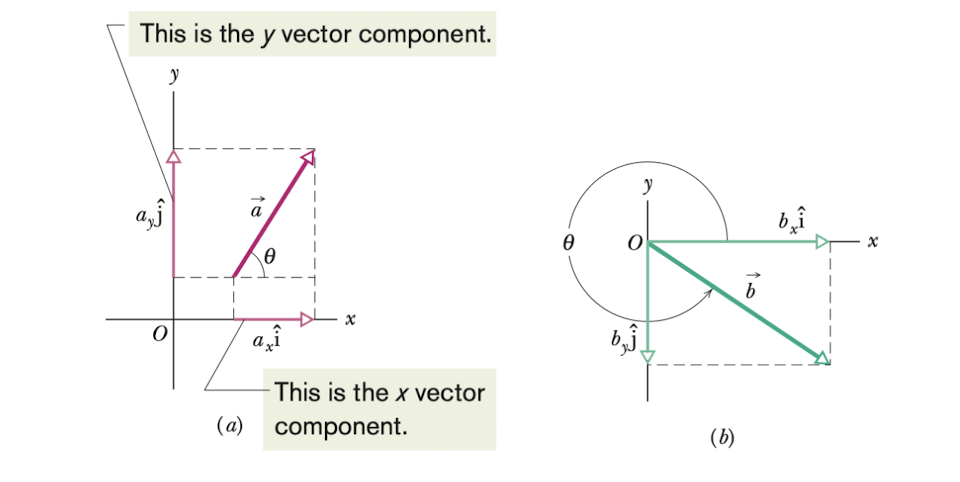
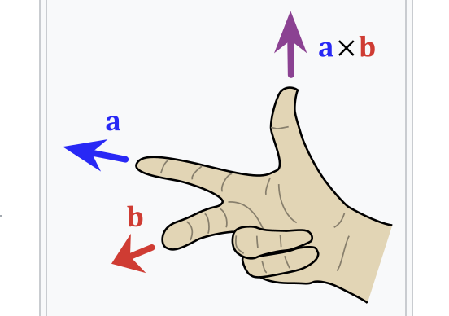
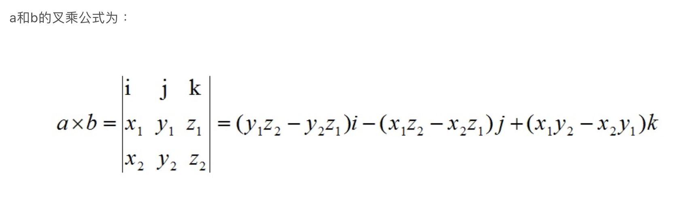

# Vectors

物理中我们经常会遇到既有方向又有大小的物理量，为了将它们统一起来与只有大小没有方向的物理量进行区分，我们给它们起了一个名字---矢量(vector)。它与数学中的向量是基本一致的。在这一章节我们会专注于它的基本运用。

## 矢量及其分量(vectors and their components)

### 矢量和标量

对于在一维直线运动的物体，它只有两个运动方向，我们可以直接用正负符号来表示它们。但当我们的运动从一维延伸到二维，三维，这种正负符号就不好使了。那么该怎么比较好地表示它们呢？于是我们引入了矢量。

> 一个矢量同时具有大小和方向，并符合特定的矢量结合运算

常见的矢量：速度，加速度，位移

常见的标量：时间，质量，速率

[知乎回答传送门](https://zhuanlan.zhihu.com/p/626773564) 不知道正确性怎么样，之后再来看看吧

#### 表示方法

我们通常在字母上标一个箭头来表示向量，比如 $\vec{a}$ ；或者我们用可以一条有向线段来表示它，比如 $\vec{AB}$ 其中A是起点，B是终点

#### 性质

矢量不考虑运动的具体路径，仅仅取决于起点和终点的位置。如下图，这三条不同路径的有向线段都表示同一个矢量，即矢量 $\vec{AB}$

### 矢量加法

对于矢量的运算，我们先来介绍一下矢量的加法。如果我们有一个粒子先从点A运动到点B，之后从点B运动到点C。与它们的实际路径无关，我们可以把这段运动在图中表示出来，有如下：

> 我们将 $\vec{AB},\vec{BC},\vec{AC}$ 分别表示为 $\vec{a}, \vec{b},\vec{c}$​ 就得到了我们的矢量加法公式
> $$
> \vec{c} = \vec{a} + \vec{b}
> $$

从这幅图我们得到了矢量加法的一般方法：将两个有向线段首尾相接，保证它们的方向和长度与原本的一致，之后再将仅剩的头尾连接起来得到我们所求的矢量。

#### 交换律(commutative law)

> 对于矢量的加法，满足交换律，我们有
> $$
> \vec{a} + \vec{b} = \vec{b} + \vec{a}
> $$

不过为啥矢量的交换律是合法的呢？不是很明白

#### 结合律(associative law)

> 当我们有大于两个矢量相加时，我们可以将它们以任意顺序组合，结果不变，即
> $$
> (\vec{a} + \vec{b}) + \vec{c} = \vec{a} + (\vec{b} + \vec{c})
> $$

 我们可以通过图像来更好地理解这一点

### 矢量减法(vector subtraction)

从矢量加法的定义中我们可以找出矢量减法的规律。我们从定义出发可以知道一个物体从点A开始运动到点B，最后回到点A，它的位移大小为0。我们把向量AB表示为 $\vec{b}$ ，即有 $\vec{b} + (-\vec{b}) = 0$。 其中 $0$ 代表零向量，即大小为0，没有方向。

所以我们有加上一个 $-\vec{b}$ 与减 $\vec{b}$ 等效。对于 $\vec{d} = \vec{a} - \vec{b}$​

> $$
> \vec{d} = \vec{a} - \vec{b} = \vec{a} +(-\vec{b})
> $$

> [!note] 
>
> 这里的矢量加减法并不只针对位移这个物理量，而是对所有具有矢量特性的量

### 矢量的分量(components of vectors)

#### 分解

上面的介绍的矢量加法原理虽然有效，但是如果每次计算矢量的加法都需要画图来解决就变的很繁琐了。于是我们下面介绍一种非常天才的方法，可以将矢量在直角坐标系中用不同的方式表现出来。我们先来看看矢量的分量的定义

> 矢量的分量被定义为矢量在某个坐标轴上的投影大小。所以矢量的分量都是标量

矢量的分量的大小可以通过向坐标轴做垂线并运用三角函数计算出来。在习惯上，我们把计算矢量的分量的操作叫做分解(resolving the vector)。比如下面的这幅图的矢量 $\vec{a}$ ，它在 $x$ 轴和 $y$ 轴的分量分别是 $a_{x}$ 和 $a_{y}$。

> 由三角函数关系我们可以得到
> $$
> a_{x} = a \ cos\theta  \ \ \ \ and \ \ \ \ a_{y} = a \ sin\theta
> $$
> 其中 $\theta$ 是图中向量 $\vec{a}$ 与 $x$ 轴正方向的夹角，a 为向量 $\vec{a}$ 的大小（膜长）。
>
> 两个分量的方向为沿着坐标轴的方向，这里都是正的。如果向量 $\vec{a}$ 由原点指向第三象限，那么两个分量都是负的。

> [!note]
>
> 这里我们暂时只讨论二维平面的矢量及其分量。如果考虑 $z$ 轴，我们可以认为现在 $z$ 轴的分量大小为0

#### 合并

作为矢量的分解的逆运算，我们从矢量的分量可以很轻松地将原本的矢量合并出来。

我们将两个分量首尾相连，由于他们的方向为坐标轴的方向。因此，组合起来就自然形成了一个直角三角形，而斜边正是我们要找的矢量

#### 转化

前面我们挖了一个坑，说到将矢量分解成一个个分量这个想法很genius，为什么呢？

这里我们可以这么理解，将矢量分解相当于把他们化成了标准形式，只有固定的几个方向（二维4个，三维6个）而每个轴可以理解成一维直线。一维直线的加减法大大简化了我们的运算，减小了抽象的部分。

再者，通过分量，我们有了对矢量不同的表达方式，如下

>$$
>a = \sqrt{a_{x}^{2} + a_{y}^{2}}  \ \ \ \ and \ \ \ \ tan\theta = \frac{a_{y}}{a_{x}}
>$$

可以在我们之后解决其他问题的时候帮到我们

## 单位向量，矢量的分量的加法(unit vectors, adding vectors by components)

### 单位向量(unit vectors)

> 单位向量是一个大小为1，方向特定的向量。

它的作用就是为我们指明方向。我们常常将x轴正方向，y轴正方向和z轴正方向分别用 $\hat{i},\hat{j},\hat{k}$ 来表示。

有了单位向量的帮助，我们可以用它来表示任何的其他矢量。如
$$
\vec{a} = a_{x}\hat{i} + a_{y}\hat{j} \\
\vec{b} = b_{x}\hat{i} + b_{y}\hat{j}
$$
其中 $a_{x},a_{y},b_{x},b_{y} $ 是标量，是矢量的分量的大小。而 $a_{x}\hat{i},a_{y}\hat{j},b_{x}\hat{i},b_{y}\hat{j}$ 是矢量，可以理解为另一种矢量的分量的表示方法。如下图

### 矢量的分量的加法

前面我们介绍了几何法计算向量。除此之外，我们也可以利用向量计算器或者一些在线的网站来帮助我们计算。这里我们将介绍第三种方法，即用不同轴对应的矢量的分量相加。

首先我们有这样一个式子
$$
\vec{r} = \vec{a} + \vec{b}
$$
也就是说我们有向量r 等效于向量a 与向量b 的和。

那么由此我们必然有向量r的分量与向量a+b的分量等效，即
$$
r_{x} = a_{x} + b_{x}\\
r_{y} = a_{y} + b_{y}\\
r_{z} = a_{z} + b_{z}
$$

> [!note]
>
> 这里式子(9)中的参数都是标量

也就是说，我们将向量的加法分割成各个轴的标量的加法运算得出目标向量的分量，最后拼接成向量就得到了我们想要的答案。

> 总结一下这种方法的步骤
>
> 1. 将原始矢量分解成一个个分量
> 2. 对同一个轴上的分量进行运算，得到最终结果的分量
> 3. 将最终的分量组合成向量，就得到了想要的向量

对于减法来说也是相同的。因为我们可以把减法看成加上一个负矢量。

将单位向量与分量结合，我们可以将一个矢量转化为各个轴分量与单位矢量的乘积之和
$$
\vec{d} = d_{x}\hat{i} + d_{y}\hat{j} + d_{z}\hat{k}
$$

## 矢量的乘积(multiplying vectors)

### 矢量的乘积(Multiply vectors)

对于矢量的乘积，一共有三种情况。

#### 矢量乘以标量

如果我们将一个矢量与一个标量相乘，因为标量没有方向，所以我们还会得到一个矢量，且这个矢量的方向与原矢量的方向保持一致。而对于新矢量的大小，我们会得到原矢量的大小与标量的乘积。

如果有些绕，可以从乘法的定义出发。将矢量与标量相乘看成是多个矢量的和，我们从几何法可以很容易地知道它的结果。

#### 矢量乘以矢量

矢量乘以矢量会有两种结果。

1. 他们会产生一个标量，叫做矢量的点乘(scalar product/dot product)。
2. 他们会产生一个新的矢量，叫做叉乘(vector product/cross product)。

#### 点乘(scalar product)

> 矢量 $\vec{a},\vec{b}$​ 的点乘写作 $\vec{a}\cdot\vec{b}$， 其大小由下面的公式可以得到
> $$
> \vec{a}\cdot \vec{b} = ab \ cos\phi
> $$
> 其中 $a, b$ 为两个矢量的大小， $\phi$ 为两个矢量之间的夹角

这里我们发现点乘的结果是一个标量，并且用数学的角度可以将这个式子理解为是矢量一的大小乘以矢量二在矢量一的方向上的投影。即
$$
\vec{a}\cdot \vec{b} = (a \ cos\phi)(b) = (a)(b \ cos\phi)
$$
**特性：**由于点乘的结果带有一个cos，我们有

* 如果两个矢量共线，点乘的大小有最大值
* 如果两个矢量垂直，点乘的大小为0

如果我们将这两个矢量用分量的形式表示，我们有
$$
\vec{a}\cdot \vec{b} = (a_{x}\hat{i}+a_{y}\hat{j} + a_{z}\hat{k})\cdot(b_{x}\hat{i} + b_{y}\hat{j}+b_{z}\hat{k})
$$
因为x,y,z三个轴两两垂直，所以单位向量的点乘为0。而共线的单位向量的点乘为1，所以我们最终得到
$$
\vec{a}\cdot \vec{b} = a_{x}b_{x} + a_{y}b_{y} + a_{z}b_{z}
$$

#### 叉乘(vector product)

> 矢量 $\vec{a},\vec{b}$ 的叉乘记作 $\vec{a}\times \vec{b}$， 其得到的新矢量 $\vec{c}$​ 的大小由下面的公式可以得到
> $$
> c = ab \ sin \ \phi
> $$
> 其中 $\phi$ 是矢量 $\vec{a},\vec{b}$ 之间较小的夹角。

> [!caution] 
>
> 注意，一定是较小的夹角。因为 $sin \ \phi $ 和 $sin \ (2\pi - \phi)$ 的结果是相反数。

**特性：**由于叉乘的大小带sin值，所以有

* 如果两个矢量共线，点乘的大小为0
* 如果两个矢量垂直，点乘的大小有最大值

叉乘的方向被定义为垂直于向量a和向量b所组成的平面，我们通常用右手定则来找到它。

> [!caution]
>
> 注意，叉乘并不适用于交换律。如果我们交换矢量a和矢量b的位置，我们用右手定则可以发现。叉乘的结果的方向是相反的

如果我们用单位向量来表示叉乘，我们有
$$
\vec{a}\times \vec{b} = (a_{x}\hat{i}+a_{y}\hat{j} + a_{z}\hat{k})\times(b_{x}\hat{i} + b_{y}\hat{j}+b_{z}\hat{k})
$$
通过特性介绍的方法与右手定则判断方向，我们有
$$
\vec{a}\times \vec{b} = (a_{y}b_{z}-b_{y}a_{z})\hat{i} + (a_{z}b_{x}-b_{z}a_{x})\hat{j} + (a_{x}b_{y}-b_{x}a_{y})\hat{k}
$$

这里有比较好的计算技巧，一时之间想不到，之后再看

> [!tip]
>
> 想确认任何xyz坐标轴是不是一个右手坐标系，我们只需要看看它是否满足 $\hat{i}\times\hat{j} = \hat{k}$
