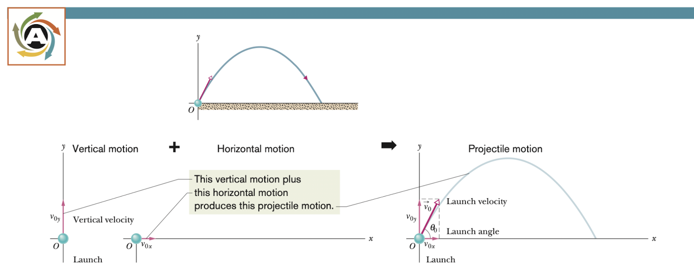
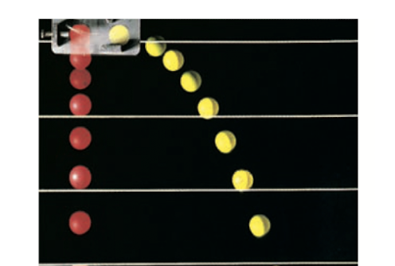
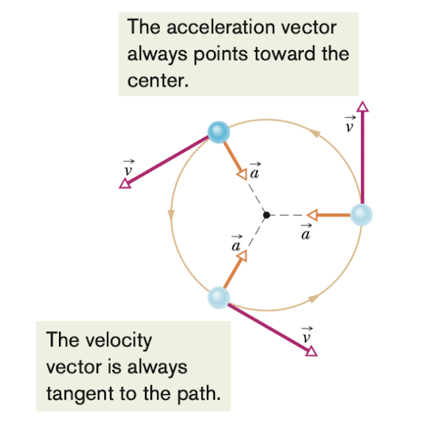

# Motion in Two and Three Dimensions

### 引入

我们前面分析了一维直线的运动，但在生活中，除了一维运动，还有二维和三维。比如飞行员在空中控制战斗机转弯，篮球运动的投篮，以及民航飞机常有的起飞和降落。同样地，我们从位置和位移开始

## 位置和位移

### 位置和位移(position and displacement)

#### 位置

我们在前面的章节介绍了向量。对于二维和三维的坐标系，我们通常用向量来表示一个点相对参考点（通常为坐标原点）的位置。如果将它用单位向量来表示，我们有

> $$
> \vec{r} = x\vec{i}+y\vec{j}+z\vec{k}
> $$
>
> 其中， $x\vec{i},y\vec{j},z\hat{k}$  是 $\vec{r}$ 的向量分量，  $x, y, z$ 这几个系数是 $\vec{r}$ 的标量分量

因为 $\vec{i},\vec{j},\vec{k}$ 是单位向量，仅表示方向。所以我们可以用这个向量的标量分量来表示它的位置，即 $(x,y,z)$ 

#### 位移

一个点在一段时间间隔内相对于参考点所发生的位置变化叫做位移。我们可以表示为

>$$
>\Delta \vec{r} = \vec{r_{2}}- \vec{r_{1}}
>$$

如果用单位向量来表示的话，可以有

> $$
> \Delta \vec{r} = (x_{2}\hat{i} +y_{2}\hat{j}+z_{2}\hat{k}) - (x_{1}\hat{i}+y_{1}\hat{j}+z_{1}\hat{k})
> $$
>
> 或
> $$
> \Delta \vec{r} = (x_{2}-x_{1})\hat{i}+(y_{2}-y_{1})\hat{j}+(z_{2}-z_{1})\hat{k}
> $$

其中 $\vec{r_{2}} = (x_{2}\hat{i} +y_{2}\hat{j}+z_{2}\hat{k})$,  $\vec{r_{1}} = (x_{1}\hat{i}+y_{1}\hat{j}+z_{1}\hat{k})$

## 平均速度和瞬时速度

### 平均速度和瞬时速度

#### 平均速度

在前面的第二章节，我们介绍了平均速度和瞬时速度这两个物理量来形容物体运动得多快，这里我们稍作改变，将他们变成向量形式。

> 如果一个粒子在 $\Delta \vec{t}$ 内的位移为 $\Delta \vec{r}$ ，那么我们可以将它的平均速度表示为
> $$
> 平均速度 = \frac{位移}{时间间隔} \\
> \vec{v}_{avg} = \frac{\Delta \vec{r}}{\Delta t}
> $$
> 也就是说位移和平均速度的方向是相同的

如果我们将平均速度用 $x,y,z$ 三轴来表示，那么我们可以有
$$
\vec{v}_{avg} = \frac{\Delta x\hat{i}+\Delta y\hat{j}+\Delta z\hat{k}}{\Delta t} = \frac{\Delta x}{\Delta t}\hat{i}+\frac{\Delta y}{\Delta t}\hat{j}+\frac{\Delta z}{\Delta t}\hat{k}
$$

或者简单一点，我们有
$$
\vec{v} = v_{x}\hat{i} + v_{y}\hat{j}+v_{z}\hat{k}
$$

#### 瞬时速度

当我们将平均速度的时间间隔逼近0时，我们会发现平均速度也会逼近一个准确的值，我们把这个值称为瞬时速度。

> 用微分的知识来表示，我们有
> $$
> \vec{v} = \frac{d \vec{r}}{dt}
> $$
> 可以理解为粒子的瞬时速度的方向是粒子运动路径的切线方向

## 平均加速度和瞬时加速度

### 平均加速度和瞬时加速度

加速度可以理解为物体速度变化的快慢。

> 当一个粒子在时间间隔 $\Delta t$ 内速度从 $\vec{v_{1}}$ 变成 $\vec{v}_{2}$ 它的平均加速度可以表示为
> $$
> 平均加速度 = \frac{速度变化量}{时间间隔} \\
> \vec{a}_{avg} = \frac{\vec{v}_{2}-\vec{v}_{1}}{\Delta t} = \frac{\Delta \vec{v}}{\Delta t}
> $$
> 我们可以留意到，加速度和速度的变化量的方向是相同的

#### 瞬时加速度

如果我们我们将这个时间间隔逼近0时，我们会发现平均加速度也会逼近一个准确的值，我们把这个值称之为瞬时加速度。

>用微积分的知识，我们有
>$$
>\vec{a} = \frac{d\vec{v}}{dt}
>$$
>可以理解为粒子的瞬时加速度的方向是粒子速度变化的切线方向

如果我们将加速度用 $x,y,z$ 三轴来表示的话，我们有
$$
\vec{a}_{avg} = \frac{d}{dt}(v_{x}\hat{i}+v_{y}\hat{j}+v_{z}\hat{k})\\
=\frac{d}{dt}v_{x}\hat{i}+\frac{d}{dt}v_{y}\hat{j}+\frac{d}{dt}v_{z}\hat{k}
$$
或者简单点我们有
$$
\vec{a} = a_{x}\hat{i}+a_{y}\hat{j}+a_{z}\hat{k}
$$

## 抛体运动

前面我们介绍了一些加速度和速度的基本情况，接下来我们将会把他们与生活中的运动结合起来。

### 抛体运动

抛体运动是一种特殊的二维运动，当一个粒子以一定的初速度运动，同时受到一个恒定大小，方向竖直向下的加速度，重力加速度g的作用，我们称这个粒子在做抛体运动。我们打篮球投篮就是一个典型的例子。我们接下来将会着重分析。

我们假设运动过程中粒子没有受到空气阻力的影响，由二维坐标系，我们可以把速度记做如下
$$
\vec{v_{0}} = v_{0x}\hat{i} + v_{0y}\hat{j}
$$
如果我们知道这个初速度 $\vec{v_{0}}$ 和 $x$ 轴正半轴的夹角 $\theta$ 我们就可以将 $v_{0x}$ 和  $v_{0y}$ 表示成如下
$$
v_{0x} = v_{0}cos\theta_{0} \ \ \ \ v_{0y} = v_{0}sin\theta_{0}
$$
我们从抛体运动的定义知道粒子在运动中受到一个大小恒定的，方向为竖直向下的重力加速度 $g$ 的作用。那么也就是说粒子在水平方向加速度的大小为0。

因此我们可以得出这样的结论:

> 在抛体运动中，水平方向的运动和竖直方向的运动是相互独立的，它们互相之间不影响

这个结论可以让我们把一个复杂的二维运动分解成水平和竖直两个一维的运动来分析，大大减小了它的复杂程度。一个是水平的匀速直线运动，另一个是竖直方向上的匀变速直线运动。

#### 验证

为了验证我们的理论是否正确，我们有实验来证明

##### 两个高尔夫球

我们把两个不同颜色高尔夫球放在同一高度的装置上，黄色高尔夫球用装置提供一个水平方向的初速度，红色高尔夫球无水平方向的初速度。把它们同时松开，我们通过高速摄影机逐帧回放可以看到即使黄色高尔夫球有水平加速度，但是两个高尔夫球在竖直方向上同一个时间间隔内下落的距离近乎相等，这就证明了水平和竖直方向的运动是相互独立的。

#### 分析

##### 水平方向

在水平方向上，对于任意的时间间隔 $t$， 我们可以将粒子的位移表示为 $x-x_{0}$ ，因为加速度为0，所以我们有
$$
x-x_{0} = v_{0x}t \\
$$
当我们用物体初速度与坐标轴 $x$ 轴所形成的角度来表示 $v_{0x}$ 时，我们有
$$
x-x_{0} = v_{0}cos\theta_{0} t
$$

##### 竖直方向

在竖直方向上，我们可以把它当作是有一定初速度的自由落体运动。同样地，对于任意的时间间隔 $t$， 我们可以将粒子的位移表示为 $y-y_{0}$，因为加速度的方向与y轴正半轴方向相反，大小为 $g$，所以加速度为 $-g$。

我们有
$$
y - y_{0} = v_{0y}t - \frac{1}{2}gt^{2}
$$
当我们用物体初速度与坐标轴 $x$ 轴所形成的角度来表示 $v_{0y}$ 时，我们有 
$$
y - y_{0} = v_{0}sin\theta_{0}t - \frac{1}{2}gt^{2}
$$
同样的，利用运动学的其他公式，我们有
$$
v_{y} = v_{0} sin\theta_{0} - gt \\ 
v_{y}^{2} = (v_{0}sin\theta_{0})^{2}-2g(y-y_{0})
$$
就像篮球经过一个最高点之后会下落，我们现在可以知道，当竖直方向的速度 $v_{y} = 0$ 时，我们有抛体运动的最高点。

##### 路径的表达式(the equation of the path)

当我们把公式16和公式17联立消掉未知数 $t$ 之后，我们可以获得一个 $y$ 关于 $x$ 的表达式
$$
y = (tan\theta_{0})x - \frac{gx^{2}}{2(v_{0}cos\theta_{0})^{2}}
$$
因为这里 $tan\theta_{0},v_{0},g$ 都是已知数，所以这个表达式符合 $y = ax+bx^{2}$ 的形式，可以发现它是一个抛物线，符合二次函数的图形。

##### 水平范围(horizontal range)

抛体运动的水平范围物体从抛出到回到初始高度时所跨越的水平距离。从定义我们知道 $y = y_{0}$， 所以我们有
$$
y-y_{0} = v_{0}sin\theta_{0}t - \frac{1}{2}gt^2 = 0
$$
我们知道物体在水平方向做匀速直线运动，所以我们有
$$
x = v_{0}cos\theta_{0}t
$$
所以利用式子21求解出关于 $t$ 的关系式带入式子22之后我们有水平范围 $R$
$$
R = \frac{v_{0}^{2}}{g}sin2\theta_{0}
$$
我们可以得知当 $\theta_{0} = 45$ 度时有最大的水平范围，所以理论上我们投篮以45度抛出能够射最远。但是生活中因为有空气阻力的因素，所以和理论有一定的差距

## 匀速圆周运动(uniform circular motion)

### 定义

如果一个粒子绕着一个定点以相等的速度大小做周期运动，那么它在做匀速圆周运动。

虽然它的速度大小没有变化，但是因为粒子在做圆周运动时每一时刻的运动方向是它所在点与圆的切线方向，所以速度方向发生了变化，速度是变化的。

而做匀速圆周运动的物体的加速度是恒指向圆心的。

因此我们也把这个加速度叫做向心加速度(centripetal acceleration)。

我们从匀速圆周运动可以推导出它的速度和加速度之间的公式

>$$
>a = \frac{v^{2}}{r}
>$$
>
>其中 $r$ 是粒子运动的半径， $v$ 为粒子运动的速度

同时，由于速度大小相同，我们有

>$$
>T = \frac{2\pi r}{v}
>$$
>
>其中 $T$ 叫做周期(period)，是粒子运动一周所用的时间

### 推导
