# chapter 18

## Temperature

### Temperature

measure temperature on Kelvin scale. 

* Room temperature is about 290K, $0K$​  is absolute zero

### thermoscope & thermometer(测温仪和温度计)

区别：

* 测温仪（thermoscope）没有经过校准，它所显示的数字并没有实际意义
* 温度计（thermometer）精准一些

### zeroth law of theromodynamics

这个结论是由测温仪对两个等温物体贴合后发现示数不变得出的，从这个结论我们知道温度计是可行的

when two bodies are in thermal equilibrium, their temperatures are equal

### Triple point of water(三相点)

$$
T_{3} = 273.16K
$$

* at this temperature, liquid water, solid ice and water vapor can coexist

  

### 测量未知气体的温度

由理想气体质量方程在恒容气体测温仪的条件下，我们有 $T = cp$ 其中 $c$ 为一个常数。对气体在某一个温度下的温度 $T$ 列等式，与气体在三相点时的温度 $T_{3} = 273.16K$ 的等式联立，我们有下面这个方程
$$
T = 273.16K(\lim_{gas\rightarrow 0}\frac{p}{p_{3}})
$$

 $p_{3}$​ 是温度处在三相点时的压强对

#### 问题

这个温度计的缺陷在于，用不同的气体作为仪器的填充，因为不同气体具有不同的热力学性质，会造成示数微小的偏差。我们发现当我们不断减少填充的气体时，示数趋近于一个单一的值。

可能是因为减少气体量之后，气体分子之间的相互作用减小，气体的行为越来越接近理想气体

## Celsius & Fahrenheit 

### 摄氏度和华氏度

$$
T_{C} = T - 273.15
$$

$$
T_{F} = \frac{9}{5}T_{c} + 32
$$

比例记忆方法：

* 100摄氏度 = 212 华氏度
* 0摄氏度 = 32 华氏度

## thermal expansion（热膨胀）

### 线性膨胀

$$
\Delta L = L\alpha \Delta T
$$

其中 $\alpha$ 是线性膨胀系数

### 体积膨胀

$$
\Delta V = V\beta \Delta T
$$

其中 $\beta$​ 是体积膨胀系数

### 关系

通过计算我们有线性膨胀和体积膨胀之间存在一定关系
$$
\beta = 3\alpha
$$

## absorption of heat

### 热容(heat capacity)

热容 $C$ 表示单位温度储存的热量
$$
Q = C\Delta T = C(T_{f}-T_{i})
$$

### 比热容(specific heat)

单位温度，单位质量所储存的热量
$$
Q = cm \Delta T = cm(T_{f}-T_{i})
$$

### 摩尔比热容(molar specific heat)

跟比热容相比把质量改成摩尔了

### 前提

对固体和液体测量和应用比热容这个概念时，我们需要明确是在恒压还是恒容的条件下进行的。计算结果表明，用这种条件的区别只有百分之几。但对于气体来说就不是这样子的了

### 三态变化

对于物质从液体，固体，气体其中之一转化成另一态的过程所吸收的能量可以表示为
$$
Q = Lm
$$
其中 $L$ 为转化热， 细分则有熔化热 $L_{F}$ (heat of fusion)和 气化热 $L_{V}$​ (heat of vaporization)

注意它的单位一般为 $KJ/kg$

### 单位变化

$$
1 cal = 3.968 * 10^{-3}Btu = 4.1868J\\
1 btu = 1055J\\
1 gal = 3.79 L
$$

## 热力学

### 热功

$$
W = \int_{}^{}dW = \int_{}^{}dFx = \int_{}^{}d \ psx = \int_{v_{i}}^{v_{f}}p dV
$$

#### 图表

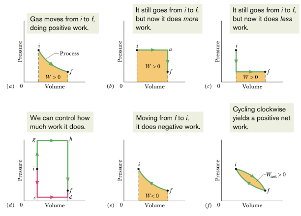

用图表表示热功变化，我们可以发现黄色区域的面积就是气体所做的功

(a). 恒温变化

(b). 先恒压升温，再恒容降温

(c). 先恒容降温再恒压升温

(d). 我们发现根据这个过程，我们可以通过恒压恒容的方式控制气体所做的功

(e). 气体恒温做负功

(f). 气体经过一个循环后再回到起始点整个过程的功即为 做的总正功+做的总负功，即如图所示的黄色区域

### 热力学第一定律

$$
\Delta E_{internal} = Q - W
$$

or
$$
d\Delta E = dQ - dW
$$

* 如果吸热或者气体做负功，那么内能增加
* 如果放热或者气体做正功，那么内能减少

> [!note]
>
> 注意这里做功的概念：
>
> 你对系统做正功和系统做负功是相同的

> 注意，这里内能变化量 $\Delta E$ 只与气体初末状态有关系，与路径无关

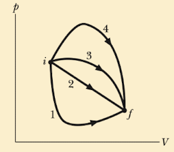

如上图，

* 内能变化量四条路径都相同
* 气体做正功大小关系 4>3>2>1
* 释放到环境中的热量 4>3>2>1

### 热力学第一定律的四种特殊情况

#### 恒温(adiabatic process)

$$
\Delta E_{int} = -W
$$

#### 恒容(constant-volume process)

$$
\Delta E_{int} = Q
$$

#### Cyclical process

$$
Q = W
$$

系统经过一系列变化又回到初状态，这时我们有 $\Delta E_{int} = 0$

#### Free expansion

$$
\Delta E_{int} = 0
$$

绝热过程且气体没做功

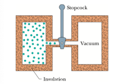

## 热传输

### 基本方式

* 热传导
* 热对流
* 热辐射

### 热传导率(thermal conduction rate)

$$
P_{cond} =\frac{Q}{t} = kA\frac{T_{H}-T_{C}}{L} 
$$

其中 $A$ 为面积， $L$ 为厚度,  $k$​​​ 为热导率(thermal conductivity)，只跟材料有关

> 

#### 多材料热传导重点

得到上面这个公式的来由为，同一时间内每种材料内的热传导率（即相同时间内传导的热量）是相同的

说实话，热传导率相同不是很好理解

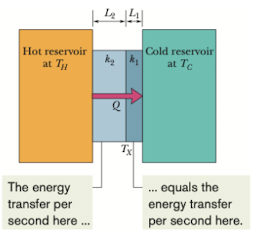
$$
P_{cond} = \frac{A(T_{H}-T_{C})}{\sum_{}^{}(\frac{L}{k})}
$$

> [!note] 
>
> 这里公式推导是根据上面这个图的情况，且默认两种复合材料的横截面积相同

> Q：如果在上图这种情况下我们假定横截面积 $A$ 是相同的，两种材料的厚度 $L_{1} = L_{2}$ , 那么就会有 $\Delta T_{1} k_{1} = \Delta T_{2}k_{2}$ 这个等式，那么如果 $k_{1} > k_{2}$ 也就有 $\Delta T_{1} < \Delta T_{2}$ ， 也就是说单位时间内温度的变化量更小，那岂不是跟我们生活中的情况不符合吗？比如说热导率良好的铜，传输热量的时候不是很快吗，那不应单位时间内的温度变化量更大才对吗？

这里我们可以将整个材料微分来看，那么就可以理解为每一小份材料的温差会更小，说明热导率高的材料能更有效地将热量传递到更大的区域，从而使得整体温度梯度更加平缓。在实际应用中，这意味着热导率高的材料可以更均匀地分布温度，使得材料内部不容易形成热点。也就是散热更好

### 热阻(thermal resistance)

$$
R = \frac{L}{k}
$$

其中 $L$ 为厚度， $k$​ 为热导率

### 热对流

气体受热膨胀上浮，其他冷气体填补位置后反复这个过程

### 热辐射

* 物体通过电磁波发射能量的速率 $P_{rad}$ 

$$
P_{rad} = \sigma \epsilon AT^{4}
$$

其中 $A$ 为表面积， $T$ 为该面积的温度（开尔文），  $\sigma$(stefan-Boltzmann constant) 是一个常数, 为5.6704*10^-8^W/m^2^*K^4^ , $\epsilon$ 为表面的发射率（0—1）

* 物体通过热辐射从环境吸收能量 $P_{abs}$

$$
P_{abs} = \sigma \epsilon A T^{4}_{env}
$$

* 物体合传输速率

$$
P_{net} = P_{abs}-P_{rad} = \sigma \epsilon A(T^4_{env} - T^{4})
$$

可以有正有负

1. 正相当于物体通过电磁波吸收能量
2. 负相当于物体通过电磁波放出能量

# chapter 19

## 阿伏伽德罗常数

### 阿伏伽德罗常数(avogadro's number)

$$
N_{A} = 6.02 * 10^{23} mol^{-1}
$$

单位是个

### 物质的量(the number of moles)

$$
n = \frac{N}{N_{A}}
$$

 $N$ 是粒子的总数

### 质量

$$
n = \frac{M_{sam}}{M}
$$

 $M_{sam}$ 是样本总质量, $M$ 是摩尔质量
$$
M = mN_{A}
$$
其中 $m$​ 为一个粒子的质量，别搞混了

## 理想气体

### 理想气体状态方程

$$
pV = nRT
$$

其中 $n$ 为气体的物质的量， $R$ 为气体常数(8.31J/mol*k)，注意温度还是开尔文。

我们把一个常数  $k = \frac{R}{N_{A}}$​ 代入这个方程，我们有
$$
pV = nkT
$$

### 等温下的功

$$
p = nkT \frac{1}{V}
$$

因为我们处在等温条件下，所以 $NkT$ 相当于常数，我们把 $p$ 代回到气体功的公式
$$
W = p\int_{i}^{f}dv = nkT\int_{i}^{f}\frac{1}{V}dv = nkT \ ln\frac{V_{f}}{V_{i}}
$$

$$
W = nRT \ ln\frac{V_{f}}{V_{i}}
$$

### 恒压下的功

$$
W = p\int_{i}^{f}dv \\
 = p \Delta V
$$

## 压强，温度和 RMS 速度

### root mean square(RMS) speed

$$
V_{rms} = \sqrt{\frac{3RT}{M}}
$$

注意这里的 $M$​ 是指一个分子的质量

#### 推导

首先对于一个包含 $n$ mol 理想气体， 边长为 $L$ 的立方体，对于一个粒子从墙壁一端碰到另一端再回来，我们有它的动量的变化量
$$
\Delta p_{x} = mv - (-mv) = 2mv
$$
其中 $m$ 为一个粒子的质量。那么它动量的变化量则为
$$
\frac{\Delta p_{x}}{\Delta t} = \frac{2mv}{\frac{2L}{v}} = \frac{mv^{2}}{L}
$$
由 $\vec{F} = \frac{d\vec{p}}{dt}$ ( $p$ 为动量), 和 $p = \frac{F}{s}$ 其中这个 $p$ 为压强。刚刚我们只计算了一个粒子的，对于所有的粒子，我们有
$$
p = \frac{F_{x}}{s} = \frac{d\vec{p}}{dt * s} =\frac{\frac{mv_{x1}^2}{L}+\frac{mv^{2}_{x2}}{L}+\cdots+\frac{mv^{2}_{xn}}{L}}{L^{2}} \\
 = \frac{m}{L^{3}}(v^{2}_{x1}+v^2_{x2}+\cdots+v^{2}_{xn})
$$
其中 $(v^{2}_{x1}+v^2_{x2}+\cdots+v^{2}_{xn}) = nN_{A}(v^2_{x})_{avg}$ 
$$
p = \frac{nmN_{A}}{L^{3}}(v^{2}_{x})_{avg}
$$
对于 $mN_{A}$, 由前一小节我们有 $M = mN_{A}$， 其中 $M$ 为摩尔质量。 $L^{3} = V$, 且 $v^2 = v^{2}_{x} + v^2_{y}+v^{2}_{z}$,  $v^{2}_{x} = \frac{1}{3}v^{2}$
$$
p = \frac{nM}{3V}(v^{2})_{avg}
$$
这里我们得到压强之后，我们就可以代入理想气体质量方程
$$
pV = nRT \\
\frac{nM}{3V}(v^{2})_{avg} * V = nRT \\
(v^{2})_{avg} = \sqrt{\frac{3RT}{M}}
$$

## 可转化的动能(translational kinetic energy)

### 分子动能

$$
K_{avg} = (\frac{1}{2}mv^{2})_{avg} = \frac{1}{2}mv_{avg}^{2}= \frac{1}{2}m(v_{rms}^{2})\\ 

=\frac{1}{2}m\frac{3RT}{M}
$$

对于 $\frac{m}{M}$, 我们有 $N_{A} = \frac{m}{M}$ ， 所以我们有
$$
K_{avg} = \frac{3RT}{2N_{A}}
$$
令 $k = \frac{R}{N_{A}}$, 我们有
$$
K_{avg} = \frac{3}{2}kT
$$

* 所以分子的平均动能与质量无关

### 平均自由径(mean free path)

平均自由径是指分子两次碰撞间移动的距离的平均值
$$
\lambda = \frac{1}{\sqrt{2}\pi d^2N/V}
$$

我们认为

* 该区域的 $\frac{N}{V}$ (即分子密度)越大，那么 $\lambda$​ 越小
* 分子的直径 $d$ 越大， 那么 $\lambda$ 越小。而这里因为是碰撞，球体的截面决定了它的有效目标区域，所以我们可以把 $d^{2}$ 理解为球体的截面

#### 推导

我们假设分子是直径为 $d$ 的球体。如果两个分子的球心之间的距离小于 $d$， 那么我们认为这两个分子之间发生了碰撞。

由定义出发，我们知道平均自由径可以表示为 $\frac{在一段时间内的移动路径长度}{在一段时间内发生的碰撞次数}$ 

那么移动路径好表示，即 $v\Delta t$。

那碰撞次数怎么办？这里我们这么看。把分子所移动的三维空间的体积表示出来，乘上这个空间的分子密度，就可以得到在圆柱体里的分子数量 = 在一段时间内的碰撞次数

用公式表示为：对于一个由两个直径为 $d$ 的球体组成的分子而言，它的截面为 $2d$, 所走过的路程为 $v\Delta t$, 那么圆柱体的体积为 $\pi d^2 v\Delta t$ 。最后乘上 $\frac{N}{V}$ 我们可以的到一段时间内的碰撞次数
$$
\lambda = \frac{在一段时间内的移动路径长度}{在一段时间内发生的碰撞次数}\\
= \frac{v\Delta t}{\pi d^2 v\Delta t \frac{N}{V}} \\
= \frac{1}{\pi d^{2}\frac{N}{V}}
$$
 因为在这里我们的计算是基于假设所有其他分子是静止的。事实上，当我们把这个因素考虑进去之后我们需要再乘上一个系数 $\frac{1}{\sqrt{2}}$ 就完美了
$$
\lambda = \frac{1}{\sqrt{2}\pi d^2 \frac{N}{V}}
$$

## 摩尔速度分布

### 摩尔速度分布

由 $v_{rms}$ 我们知道了分子的移动速度，我们还想知道它们速度的分布是怎样的，有百分之多少粒子高于或低于某个速度。类似概率里的 PDF 和 distribution。e.g. 正态分布

麦克斯韦速度分布定律
$$
P(v) = 4\pi (\frac{M}{2\pi RT})^{\frac{3}{2}}v^{2}e^{-\frac{Mv^{2}}{2RT}}
$$
这里 $M$ 为摩尔质量， $R$ 为气体常量， $T$ 为气体温度， $v$​​ 是分子速度

#### 平均速度

由此我们可以知道平均速度了，用概率里的数学期望
$$
v_{avg} = \int_{0}^{\infty} vP(v) dv \\
= \sqrt{\frac{8RT}{\pi M}}
$$

#### rms速度

同样的，我们可以再用这种方法再算一次 $v_{rms}$ 
$$
(v^{2})_{avg} = \int_{0}^{\infty}v^2P(v)dv \\
=\frac{3RT}{M}
$$

$$
v_{rms} = \sqrt{(v^2)_{avg}} = \sqrt{\frac{3RT}{M}}
$$

#### 最可能速度

当 $P(v)$ 有最大值时，我们有最可能速度 $v_{p}$。 令导数为零我们可以计算出它
$$
v_{p} = \sqrt{\frac{2RT}{M}}
$$

## 理想气体摩尔比热容

### 单原子理想气体内能

$$
E_{int} = (nN_{A})K_{avg} = (nN_{A})K_{avg}\\
= (nN_{A})\frac{3}{2}kT\\
=\frac{3}{2}nRT
$$

这代表 理想气体的内能只与温度有关系

### 恒容摩尔比热容

对于有 $n$ mol 单原子 理想气体的恒容容器我们有
$$
Q =n C_{v} \Delta T
$$
这里 $n$ 为物质的量， $C_{v}$ 为恒容下的摩尔比热容。

> [!note]
>
>  这里单原子的理论 $Q$ 与实际的很符合，但是双原子分子和多原子分子就不合适了。我们后面讲

将它代入热力学第一定律我们有
$$
\Delta E_{int} = Q-W \\
\Delta E_{int} = C_{v}n\Delta T - W
$$
因为恒容， $W = 0$ 那么摩尔比热容可以表示为
$$
C_{v} = \frac{\Delta E_{int}}{n\Delta T}
$$
由上面我们知道单原子理想气体的内能 $\Delta E_{int} = \frac{3}{2}nRT$ ,代入我们有
$$
C_{v} = \frac{3}{2}R
$$

代回去 $E_{int} = \frac{3}{2}nRT$, 我们有
$$
E_{int} = nC_{v}T
$$

> [!note]
>
> 这里我们的内能用到 $C_{v}$ 也会受到单原子，双原子分子或者多原子分子的影响

### 恒压摩尔比热容

假设对于一恒压状态下理想气体，我们使它升高一定的温度 $\Delta T$, 我们有它需要吸收的热量 $Q$ 为
$$
Q = nC_{p}\Delta T
$$
这里同样的 $n$ 为物质的量， $C_{p}$ 为恒压下的摩尔比热容。我们可以通过分析知道 $C_{p} > C_{v}$， 因为恒压下温度升高，气体体积变化，有部分的热量 $Q$ 需要拿去做功用。由 $p\Delta V= nR\Delta T$
$$
W = p\Delta V = n R \Delta T
$$
将以上式子联立我们有
$$
C_{v} = C_{p} - R\\
$$
对于单原子， $C_{v}= \frac{3}{2}R$, 我们有
$$
C_{p} = \frac{5}{2}R
$$

## 自由度和摩尔比热容

对于前面提到的双原子分子和多原子分子的情况，我们提出了假设。即提供的热量不全部拿来变成xyz的速度了，还有旋转。

自由度便是这种假设中引出的，我们自由度不仅包括了移动，还有旋转。

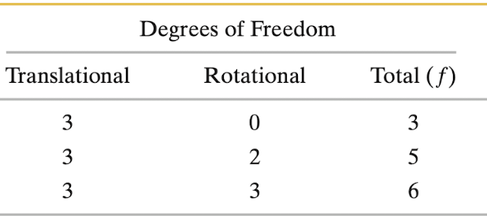

* 对于单原子分子，我们没有粒子运动中的旋转（不是说没有自旋哈，看下面两种理解意思）。

* 对于双原子分子如 $O_{2}$, 我们有yaw轴和roll轴旋转，便有两个自由度。总共有五个自由度
* 对于多原子分子如 $CH_{4}$​, 我们三个轴都有自由度。总共有6个自由度

对于每个自由度，我们平均每个分子有 $\frac{1}{2}kT$ 的能量。

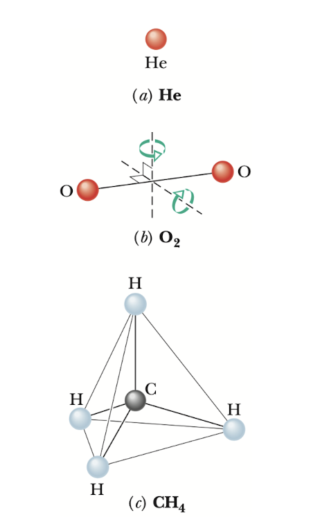

于是我们重新定义我们的 $C_{v}$​,一个分子的总内能为
$$
E_{int} = (\frac{f}{2})kT
$$
其中 $f$ 为分子的自由度，那么对一摩尔的物质，我们有
$$
E_{int} = n N_{A}(\frac{f}{2})kT = (\frac{f}{2})nRT
$$
代入热力学第一定律，我们有
$$
C_{v} = (\frac{f}{2})R  \ \ J/mol*K
$$

## 理想气体绝热膨胀(adiabatic expansion of an ideal gas)

### 理想气体绝热膨胀

$$
pV^{\gamma} = a \ constant
$$

其中 $\gamma$ 为比热比，定义为 $\frac{C_{p}}{C_{v}}$​
$$
TV^{\gamma - 1} = a \ constant
$$

#### 推导

由绝热，我们有 $Q = 0$, 那么由热力学第一定律，我们有
$$
\Delta E_{int} = -W
$$
对于 $\Delta E_{int}$, 我们有
$$
\Delta E_{int} = nC_{v}\Delta T
$$
对于微小时间 $dt$,  $\Delta E_{int} = nC_{v}dt$  $W = pdV$ 
$$
nC_{v}dt = -pdV
$$
对 $p$ ,代入理想气体状态方程
$$
nC_{v}dt = -\frac{nRT}{V}dV
$$
化简一下
$$
\frac{dt}{T} = -\frac{R}{C_{v}}\frac{dV}{V}
$$
积分一下
$$
ln^{T} = -\frac{R}{C_{v}}ln^{V} + C
$$
对于这里的 $\frac{R}{C_v}$, 我们引入一个新的概念比热比 $\gamma$ ,定义为 $\frac{C_{p}}{C_{v}}$。

前面推导的式子 $C_{p} = C_{v} + R$, 我们同除 $C_{v}$ 可以得到 $\frac{R}{C_{v}} = \gamma - 1$, 代入前面的式子，我们有
$$
ln^T = -(\gamma -1)ln^{V} + C
$$
变化可以得到
$$
ln^{TV^{\gamma -1}} = C
$$
所以 $TV^{\gamma -1} = a \ constant$, 至于 $PV^{\gamma} = a \ constant$, 用理想气体状态方程就可以证明了

### 自由膨胀

自由膨胀是一种特别的绝热过程。它特别在没有总功为0。因此 $\Delta E_{int} = 0$, 我们有
$$
T_{i} = T_{f}
$$
如果我们假设是理想气体的话，那么由理想气体状态方程我们有
$$
p_{i}V_{i} = p_{f}V_{f}
$$

# 熵和热力学第二定律

## 熵的变化

### 不可逆变化

我们把混乱程度定义为熵

熵的变化不遵守守恒定律，对于不可逆的过程，系统的熵不断增加。

那么对于熵的变化量我们怎么定义呢？

1. 用系统的温度和系统以热量方式获得或者失去的能量
2. 

### 熵的变化量

用第一种方法来定义，我们有
$$
\Delta S = S_{f}-S_{i} = \int_{i}^{f}\frac{dQ}{T}
$$

这里 $Q$ 为过程中从系统中以热量的方式获得或失去的能量， $T$ 为系统温度

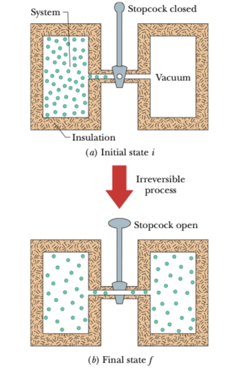

对我们之前的free expansion引用熵的变化量，我们发现因为在free expansion发生的过程中系统无法做到平衡，无法精确追踪气体的压力和体积的每一点变化，也就无法画出它的p-V图，也就无法得出 $p$ 和 $V$ 的关系来求出熵的变化量。

为了解决这个问题，如果我们用一个虚构的可逆过程来代替实际的不可逆过程，过程中保证初始和最终状态两者是相同的，那么我们就可以计算熵的变化了

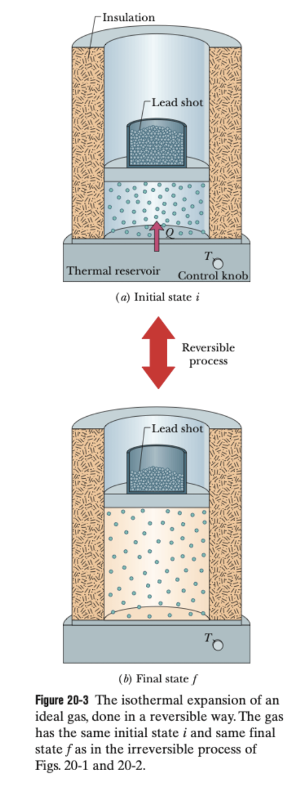

对于free expansion, 如果假设它是可逆的，那么我们通过知道free expansion  $T_{i} = T_{f} = T$, 得出每一个点都在等温线上。
$$
\Delta S = S_{f} - S_{i} = \frac{1}{T}\int_{i}^{f}dQ = \frac{Q}{T}
$$
 $\Delta E_{int} = 0$, $Q = W = \int_{}^{}PdV$ 所以系统吸热，这时候我们重新定义一下熵的变化量
$$
\Delta S = S_{f} - S_{i} = \int_{i}^{f}\frac{dQ_{rev}}{T}
$$

> [!caution]
>
> 只有可逆反应的熵的变化量可以这样计算

总的来说，对于可逆反应的熵的变化量我们可以有以下公式
$$
\Delta S = \int_{i}^{f}\frac{dQ}{T} = nR\int_{i}^{f}\frac{dV}{V}+nC_{v}\int_{i}^{f}\frac{dT}{T}\\
= nR ln^{\frac{V_{f}}{V_{i}}} + nC_{v}ln^{\frac{T_{f}}{T_{i}}}
$$

#### 推导

$$
dE_{int} = dQ - dW \\
dQ = dW + dE_{int} \\
= pdV + nC_{v}dT
$$

$$
\frac{dQ}{T} = nR\frac{dV}{V}+nC_{v}\frac{dT}{T}
$$

### 热力学第二定律

我们再回想一下刚刚的free expansion，如果气体膨胀， $Q > 0$, 吸热，熵增，但是相反气体压缩， $Q < 0$, 放热，熵减？这是合理的吗？

其实我们忽略了一点就是那个热源。如果我们把它加上整个装置看作一个系统我们就会发现
$$
\Delta S_{gas} = -\frac{|Q|}{T}\\
\Delta S_{res} = \frac{|Q|}{T}
$$
这里 $|Q|$ 热量的大小，我们把两者加起来发现整个过程的熵变为0，由此引出我们的热力学第二定律

------

$$
\Delta S \geq 0
$$

热力学第二定律指出，系统的熵变不小于0

### 因熵而来的力

对于一块橡皮，我们想知道为什么它被拉伸时有阻力,我们有
$$
dE = dQ - dW
$$
对微小的形变量 $dx$, 因为阻力 $F$ 与运动方向相反, 我们有 $dW = -Fdx$ 

由熵的定义式， $\Delta S = \frac{Q}{T}$,  $dQ = T dS$ , 代入有
$$
dE = TdS + Fdx
$$
对于比较小的拉伸，我们有 $dE = 0$, 由此我们得到了有关 $F$ 的表达式
$$
F = -T\frac{dS}{dx}
$$
也就是说物体越混乱，它的阻力越强。对于一个橡皮而言，本身分子结构是混在一起的（大概想象一下就差不多了，你对它拉伸，就会让它的结构变得没那么混乱，由此它就会有向更混乱方向的趋势。所以F就变大了。

## 热机 

### 卡诺引擎

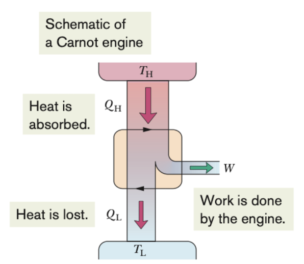

工作物质从 $T_{H}$ 热源处吸热，从 $T_{L}$ 热源处放热

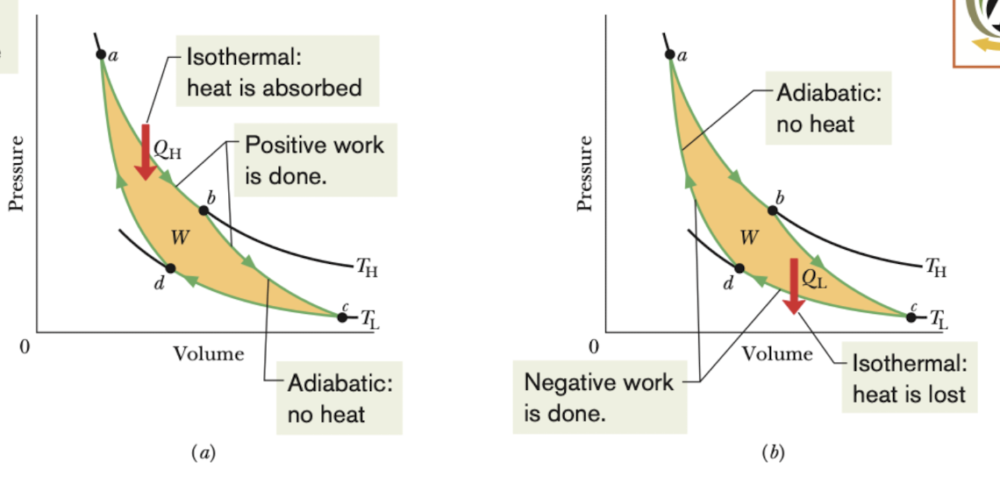

这是一个卡诺引擎的p-V图

* a-b,c-d为恒温变化，b-c, d-a为绝热变化。
* 黄色区域的面积为一次冲程所做的功

由 $\Delta E_{int} = Q - W$, 我们知道

a-b 恒温变化， $\Delta E_{int} = 0$, 做正功，那么 $Q = W$, 吸热

b-c 绝热变化， $Q = 0$, 做正功，那么 $\Delta E_{int} = -W$, 内能减小

c-d 恒温变化， $\Delta E_{int} = 0$, 做负功，那么 $Q = W$, 放热

d-a 绝热变化， $Q = 0$, 做负功，那么 $\Delta E_{int} = -W$, 内能增加

#### T-S 图

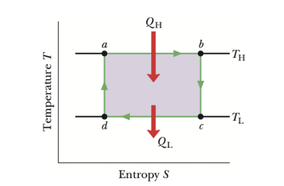

对应上面的每个阶段，我们可以用T-S图来表示，其中 $T_{H}$ 和 $T_{L}$ 是表示恒温变化， b-c 和 d-a 是 绝热变化

#### 计算功

由热力学第一定律我们有
$$
W = |Q_{H}| - |Q_{L}|
$$
其中 $|Q_{H}|$$|Q_{L}|$ 表示的是相对值

对于熵变，我们一次冲程中我们有两次（可逆）熵变，那么总熵变还是不算很清楚为什么这里是直接一个热量的值而不是一个相对值为
$$
\Delta S = \Delta S_{H} - \Delta S_{L} = \frac{|Q_{H}|}{T_{H}} - \frac{|Q_{L}|}{T_{L}}
$$
这里，因为 $Q_{H}$ 吸热， $Q_{L}$ 放热，所以有个符号。 对于一个冲程，我们有 $\Delta S = 0$, 那么
$$
\frac{|Q_{H}|}{T_{H}} = \frac{|Q_{L}|}{T_{L}}
$$
但是 $T_{H} > T_{L}$, 所以 $|Q_{H}| > |Q_{L}|$ 所以从高温热源吸收的热量大于向低温热源放出的热量

#### 效率

引擎的目的就是尽可能转化多的吸收的热量变成功。我们引入热效率 $\epsilon$ 
$$
\varepsilon = \frac{energy \ we \ get}{energy \ we \ pay \ for } = \frac{|W|}{|Q_{H}|}
$$
我们把 $W$ 代入公式，有
$$
\varepsilon = \frac{|Q_{H}|-|Q_{C}|}{|Q_{H}|} = 1 - \frac{|Q_{C}|}{|Q_{H}|}
$$
所以结合式子（91），卡诺引擎的效率我们可以表示为
$$
\varepsilon_{C} = 1 - \frac{T_{L}}{T_{H}}
$$
这里 $T_{L}$， $T_{C}$ 是开尔文单位

### 斯特林引擎

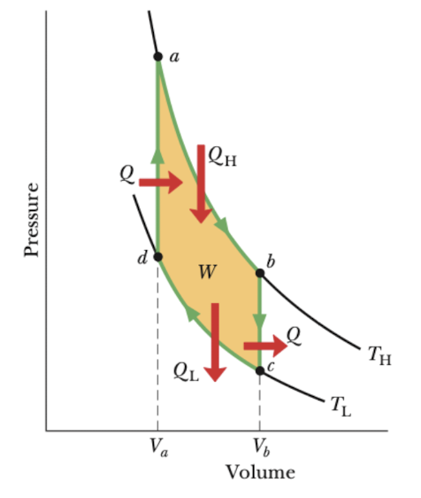

这个引擎有两个恒温变化和两个恒容变化

## 冰箱

### 冰箱

冰箱在运作上可以认为与卡诺引擎完全相反，想要尽可能地以最低的功从低温热源吸收能量。我们用 $K$ 来表示它的效率
$$
K = \frac{what \ we \ want}{what \ we \ pay \ for} = \frac{|Q_{L}|}{|W|}
$$
其中 $K$ 又被叫做表现效率。对于冰箱所做的功， 我们有
$$
|W| = |Q_{H}| - |Q_{L}|
$$
其中 $|Q_{H}|$ 是传输給高温热源的热量， $|Q_{L}|$ 是传输給低温热源的热量。那么代入到原式子我们有
$$
K = \frac{Q_{L}}{Q_{H}-Q_{L}}\\
$$
类似卡诺引擎那样子 $\Delta S = 0$, 我们有
$$
K_{C}= \frac{T_{L}}{T_{H}-T_{L}}
$$
对于常规家庭来讲， $K \approx 5$。  一般来讲，$K$ 值越大越好，可以理解为相比之下，$K$​ 值越大的冰箱每单位的功下能吸收更多的热量，更加节能。

## 从统计学看熵

### 从统计学看熵

我们有这样一个模型，一个盒子里面有 $N$个相同的分子。我们把这个盒子分成左半边和右半边，那么这六个分子有很多不同的分布选择，比如左边 $N$ 个，右边没有.etc。我们把每一种这样的分布选择叫做一个配置(configuration)。每一种配置又可以有不同的方法。那么总共的微观状态有
$$
W = \frac{N!}{n_{1}!n_{2}!}
$$
其中 $n_{1}，n_{2}$, 分别为左右两边的分子个数， $N$​ 为分子总数。

#### 举例来说

对装有六个相同的分子的盒子来说，我们可以有这样的配置，左边6个，右边没有｜或者左边4个，右边两个，这里就有两种配置了。那么对左边4个右边2个这样的配置而言，我们可以选择哪4个在左边，哪2个在右边。也就是 $C_{6}^{2}$, 那么这里算出来的15就是微观状态 $W_{42}$ 了,

微观状态 $W$ 是对应某中配置而言的

其实很简单的东西，讲的比较复杂

### 概率和熵

$$
S = kln^{W}
$$

这里 $S$ 是某种气体配置的熵， $W$ 为该配置的微观状态， $k$ 为一个常数

