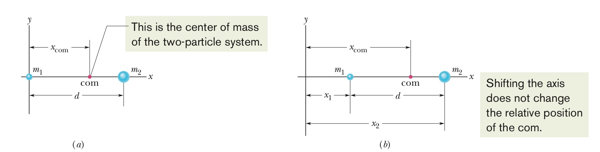
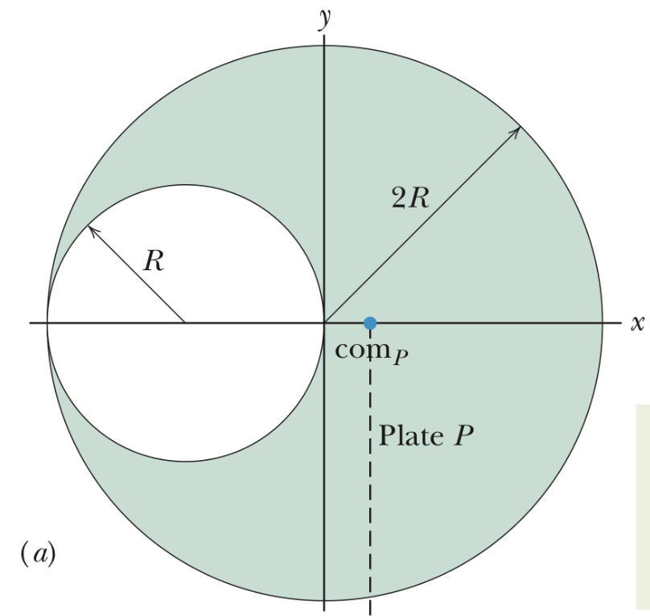
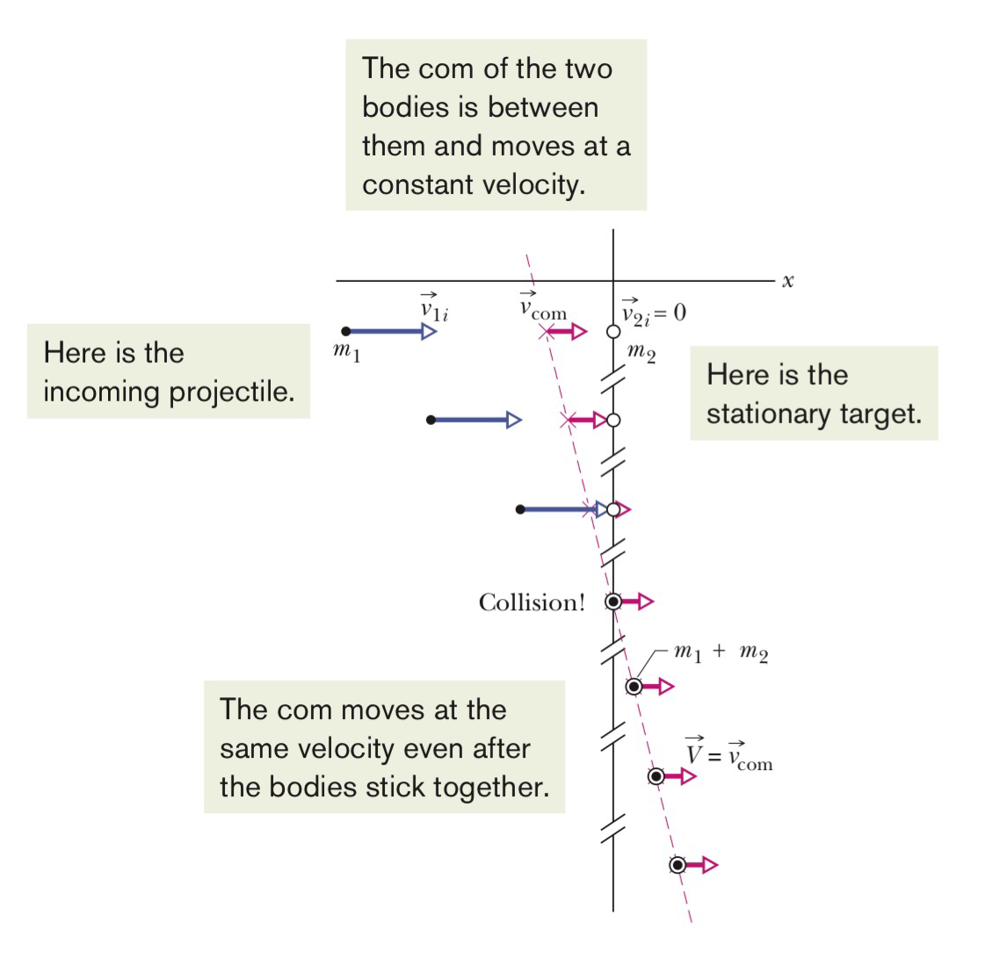
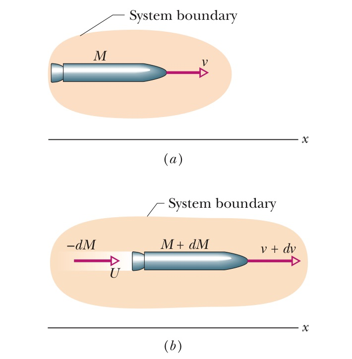

## 9.center of mass and linear momentum

### Definition

We define the center of mass of a system of particles in order to predict the possible motion of the system. It is a position

### formula

#### system of 2

for a system of 2, we defined it to be
$$
x_{com} = \frac{m_1x_1+m_2x_2}{m_1+m_2}
$$

> [!note]
>
> If we put $x_1 = 0$ it is the formula for $x$ in the origin of $x$ axis 相当于 $x_1$​ 在原点

if we use $M$ to represent the total mass of these 2 particles, we have
$$
x_{com}= \frac{m_1x_1+m_2x_2}{M}
$$
where $M=m_1+m_2$

 $(a)$ represent the graph when $x_1=0$ 

#### many particles

by extending the above formula, we have 
$$
x_{com} = \frac{m_1x_1+m_2x_2\cdots+m_nx_n}{M}\\
 = \frac{1}{M}\sum_{i = 1}^{n}m_ix_i
$$

#### three dimensions

if the particles are distributed in three dimensions, the center of mass can be express in 3 coordinates
$$
x_{com} = \frac{1}{M}\sum_{i = 1}^{n}m_ix_i  \ \ \ \ y_{com} = \frac{1}{M}\sum_{i = 1}^{n}m_iy_i \ \ \ \ z_{com} = \frac{1}{M}\sum_{i = 1}^{n}m_iz_i
$$
for vector notations, we have
$$
\vec{r_i} = x_i\hat{i}+y_i\hat{j}+z_i\hat{k}
$$
Similarly we can denote a the position of the com of a system of particles by
$$
\vec{r_{com}}=x_{com}\hat{i}+y_{com}\hat{j}+z_{com}\hat{k}
$$
combining formula (5) and (6) we have 
$$
\vec{r_{com}} = \frac{1}{M}\sum_{i = 1}^{n}m_i\vec{r_i}
$$

#### solid bodies

for an ordinary object it contains so many particles we can treat it as a continuous distribution of matter. The particles then become differential mass elements $dm$ and the sums of formula (4) become integrals instead of summation, the coordinate of the com are defined as
$$
x_{com} = \frac{1}{M}\int_{}^{}x \ dm \ \ \ \ y_{com} = \frac{1}{M}\int_{}^{}y \ dm \ \ \ \ z_{com} = \frac{1}{M}\int_{}^{} z \ dm
$$
因为这不能很好地表示密度不均匀的物体，所以我们只用它来表示均匀的东西，即物体的密度处处相等

所以我们有
$$
\rho = \frac{dm}{dv} = \frac{M}{V}
$$
将由这个式子演变而来的 $dm = \frac{M}{V}dv$ 代入formula (8)我们可以得到
$$
x_{com} = \frac{1}{V}\int_{}^{}x dV \ \ \ \ y_{com} = \frac{1}{V}\int_{}^{}y \ dV \ \ \ \ z_{com} = \frac{1}{V}\int_{}^{}z \ dV
$$
 $dV$ 是每个质量元 $dm$ 所占的体积

> [!caution]
>
> 质心不一定在物体的内部

### 题型解析-求质心

**题型解剖**，假如给出这样的截面的圆盘要你去计算，你可以试着这样子做。

首先对他进行分析，这是一个实体，所以我们不能用求和而是要用积分公式，因为这是一个圆盘，所以在厚度的维度可以直接用对称解决就先不考虑，但对于xy轴我们如果要积分的话需要找到它在xy轴分别对应的函数，which can be challenging. 所以我们可以认定质量均匀分布的物体的质量集中在物体的质心这一个点上。这样我们就只需要进行求和而非积分计算了。

**计算** 我们将图中半径为 $R$ 的小圆定义为 $S$ 将半径为 $2R$ 的圆盘定义为 $P$ ,将圆盘 $S$ 补完，我们将小圆 $S$ 和圆盘 $P$ 两个物体加起来的总和定义为圆 $C$ ，直观地看我们知道圆 $C$ 的质心为原点，根据对称，那么我们也知道小圆 $S$ 的质心在 $-R$ ，根据分析的我们可以将小圆和圆盘视为两个质点，因为两个质点加在一起组成了圆 $C$ 那么这两个质点的质心应该在原点处。再根据对称我们可以有圆盘 $S$ 的质心处在 $x$ 轴上，我们就很清晰地可以求 $com_p$了

### newton's second law for a system of particles

我们现在研究外力对质心的影响

#### motion of a system's com

我们可以把整个球的运动看成是一个质心带着整个球的质量的运动，所以我们有
$$
\vec{F_{net}} = M\vec{a_{com}}
$$
需要注意以下三点

*  $\vec{F_{net}}$ 是系统所受所有外力的合力，内力不考虑
*  $M$ 是系统的总质量，我们假定系统是封闭的，没有质量损失
*  $\vec{a_{com}}$ 是系统质心的加速度

我们也可以将这个公式分解到三个轴，有
$$
F_{net,x} = Ma_{com,x} \ \ \ \ F_{net,y} = Ma_{com,y} \ \ \ \ F_{net,z} = Ma_{com,z}
$$

> e.g.
>
> * 对于两个球相撞，我们发现只受到系统内力，所以外力为0，所以加速度为0，那么质心就会一直延原来的方向以原来的速度继续移动
> * 对于向上抛一个棒球棍，我们发现质心受到重力，那么质心所受的加速度就是重力加速度，我们就可以把这个棒球棍的运动看作是一个粒子延质心轨迹运动
> * 对于放烟花，因为爆炸只是内力，所以忽略空气阻力我们可以认为只受重力
> * 对于芭蕾舞演员在空中跳起，分析来只受外力，所以质心在做抛物线运动只不过演员通过动作改变了质心的位置使得头和身体看起来在平移

严格推导一下（11），我们从质心的推导到多个物体有如下定义
$$
\vec{r_{com}} = \frac{1}{M}\sum_{i = 1}^{n}m_i\vec{r_i}\\
M\vec{r_{com}} = \sum_{i = 1}^{n}m_i\vec{r_i}
$$
对上面的这个式子关于时间 $t$ 求导，即 $\vec{v_{com}} = \frac{d\vec{r_{com}}}{dt}$ 我们有
$$
M\vec{v_{com}} = \sum_{i = 1}^{n}m_i\vec{v_i}
$$
再求一次关于时间的导数，我们有 $\vec{a_{com}} = \frac{d\vec{v_{com}}}{dt}$ 
$$
M\vec{a_{com}}=\sum_{i = 1}^{n}m_i\vec{a_i}
$$
我们发现 $\sum_{i = 1}^{n}m_i\vec{a_i} = m_1a_1+m_2a_2+\cdots+m_na_n = \vec{F_{net}}$  代入上面的式子，我们有
$$
\vec{F_{net}} = M\vec{a_{com}}
$$

### 动量(linear momentum)

#### 一个粒子

线性动量为
$$
\vec{p} = m\vec{v}
$$
 $m$ 是粒子的质量，$\vec{v}$ 则是速度, linear只是用来和角动量区分开来

对它求导我们有
$$
\vec{F_{net}}=\frac{d\vec{p}}{dt}
$$

* **合外力**改变物体的动量，相反动量只能被合外力改变，如果没有合外力，那么动量就不会改变

#### 系统动量

对于很多粒子一起，我们有系统动量等于小动量之和
$$
\vec{P}=\vec{p_{1}}+\vec{p_{2}}+\cdots+\vec{p_{n}}\\
=m_{1}\vec{v_{1}}+m_{2}\vec{v_{2}}+\cdots+m_n\vec{v_{n}}
$$
结合上面质心的求导，我们有
$$
\vec{P} = M\vec{v_{com}}
$$
同样的我们对系统动量也有（18）

#### 冲量

对于一段时间的运动的某个瞬间，我们可以将那一瞬间的动量表示为
$$
d\vec{p}=\vec{F(t)}dt
$$
假定我们有很短的一段时间，从 $t_{i}$ 到 $t_{f}$ ,那么这一段时间的动量的变化量可以通过积分来得到
$$
\int_{t_{i}}^{t_{f}}d\vec{p} = \int_{t_{i}}^{t_{f}}\vec{F(t)}dt
$$
那么通过微积分的基本定理我们可以发现左边的这一块等价于 $\vec{p_{j}}-\vec{p_{i}} = \Delta \vec{p}$

右边的这一块则被定义为冲量  $\vec{J}$ 
$$
\vec{J} = \int_{t_{i}}^{t_{f}}\vec{F(t)}dt
$$
式子（22）也被叫做动量定理

如果我们知道平均合外力和时间 $t$ ,我们可以有
$$
J=F_{avg}\Delta t
$$
对于一连串的碰撞，我们有
$$
J = -n\Delta p\\
F_{avg} = \frac{J}{\Delta t} = \frac{-n\Delta p}{\Delta t} = \frac{-n m\Delta v}{\Delta t}\\
= \frac{-\Delta m}{\Delta t}\Delta v
$$

#### 动量守恒

在没有合外力，只有内力的情况下，我们可以有初动量等于末动量

#### 非弹性碰撞

由于此时没有外力，所以我们利用质心与合外力的公式可以推出，此时质心加速度为0，所以质心在碰撞过程中一直以恒定速度在运动

#### 弹性碰撞

$$
v_{1f} = \frac{m_{1}-m_{2}}{m_{1}+m_{2}}v_{1i} \ \ \ \ v_{2f} = \frac{2m_{1}}{m_{1}+m_{2}}v_{1i}
$$

由动量守恒和能量守恒搞出来的
$$
m_{1}(v_{1i}-v_{1f}) = -m_{2}(v_{2i}-v_{2f})\\
m_{1}(v_{1i}-v_{1f})(v_{1i}+v_{1f}) = -m_{2}(v_{2i}-v_{2f})(v_{2i}+v_{2f})
$$
互相除掉之后代入动量守恒换算一下就有了，如果物体有初速度为0则好算很多

#### 变质量问题-火箭

对于火箭来说，它因为有油耗质量不断在下降，那么又该怎么分析呢

我们可以把它消耗地质量也一起算进来从而保持这个系统的质量不变

对于某个小dt时间段之后，我们可以将有速度 $v+dv$ 和质量 $M+dM$ 因为质量的变化是负的，而消耗的质量则有质量 $-dM$ 和速度 $U$ 

根据动量相等，我们有
$$
Mv = (M+dM)(v+dv) + (-dM)U
$$
如果我们用相对速度来表示的话就有 $v+dv = U+v_{rel}$ , $U = dv+v+v_{rel}$ ,将它代入（28）我们有
$$
-dMv_{rel} = M dv
$$

两边同除 $dt$ 我们有
$$
\frac{-dMv_{rel}}{dt} = \frac{Mdv}{dt}
$$
我们将 $\frac{dM}{dt}$ 定义为 $-R$， $R$ 是燃料消耗的质量比,这个只由发动机的引擎决定，我们就有
$$
Rv_{rel} = Ma
$$
其中要注意的是，左边这部分的单位是N，所以我们可以将它定义为 $T$ ，叫他the thrust of rocket engine,这样就类似牛顿第二定律了。a是当火箭质量为M时的加速度

##### 找速度

对于式子（29），我们变换一下再积分就可以得到
$$
v_{f}-v_{i} = v_{rel}ln^{\frac{M_{i}}{M_{f}}}
$$
所以设置多节火箭的原因就是为了减少 $M_{f}$ 

## 10.rotation

### 转动动能

#### 引入

我们求快速转动的物体的动能应该怎么求呢？比如一根转动的木棍。

> [!note] 
>
> 注意这里我们不能用普通的 $K=\frac{1}{2}mv^2$ 来求因为这相当于是把整个木棍看作质点，或者说求的是质心的动能那肯定为0了

那么我们应该把它分散成粒子来看，求每个粒子的动能
$$
K = \frac{1}{2}m_{1}v_{1}^2+\frac{1}{2}m_{2}v_{2}^2+\cdots\\
=\sum_{i = 1}^{n}\frac{1}{2}m_{i}v_{i}^2
$$
问题是每个粒子的速度是不同的，但角速度是相同的

所以将 $v = \omega r$ 代入我们有
$$
K = \frac{1}{2}\sum_{i = 1}^{n}m_{i}(\omega r_{i})^2\\
=\frac{1}{2}\sum_{i = 1}^{n}(m_{i}r_{i}^2)\omega^2
$$
其中等式右边括号中的内容告诉我们沿着转动的轴的方向物体的质量是如何分布的，我们把这个特性称之为转动惯量(rotational inertia or moment of inertia)
$$
I = \sum_{}^{}m_{i}r_{i}^2
$$
将它代入到我们的动能之中，我们就有 $K = \frac{1}{2}I\omega ^2$

### 计算转动惯量

对于有数不清的粒子的实体，我们可以将求和符号替换为积分符号，所以我们有
$$
I = \int_{}^{}r^2 dm
$$
[求常见题型的转动惯量知乎专栏传送门](https://zhuanlan.zhihu.com/p/466928586)

#### 平行轴定则

$$
I = I_{com}+Mh^2
$$

