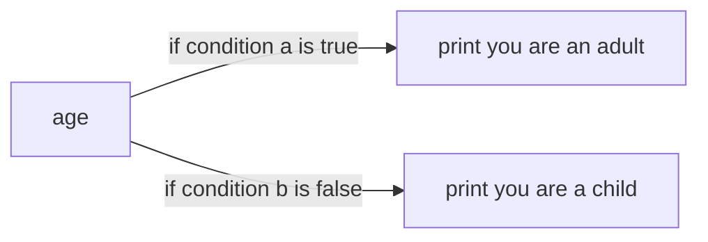

# statement & loop

## if else statement

### what is a if else statement

if else statement is condition choose function to 


### basic example

```python
# if else statement
age = int(input("enter your age: "))

#use if-else statement to check the condition

# if age > 17 is true
if age > 17:
    print("you are an adult")

# if age < 17 is true
else:
    print("you are a child")
```



### condition can be expression

```python
age = int(input("Enter your age: "))

jugdement = age >= 18

if jugdement:
    print("You are an adult")
else:
    print("You are not an adult")
```


### empty condition

```python
if 2:
    print("You are an adult")
else:
    print("You are not an adult")
    
# output: oyou are an adult
```

*   any non-zero value or no empty sring --> True
*   0, 0.0, empty string, None --> False

## while loop

### what is a while loop

a statement which iterate until the condition is false


### basic example

```python
count = 10

while count > 0:
    print(count, end=' ')
    count -= 1
# 10 9 8 7 6 5 4 3 2 1
```

`count > 0` stands for the condition


### common error -- infinite loop

```python
count = 10

while count > 0:
    print(count, end=' ')
#10 10 10 10 10 10 10 ......
```

>   remember the condition 


## for loop

*a loop run for a range of time*

### basic example

```python
for i in range(5):
    print(i) 
# 0
# 1
# 2
# 3
# 4
```

start from 0 to 1 before 5

### full use of for loop

```python
for i in range(0,3,1):
	print(i)
# 0
# 1
# 2
for i in range(3):
	print(i)
# 0
# 1
# 2
```

`0` stands for **start**, default 0

`3` stands for **end**

`1` stands for **step**, default 1

>   the for loop ends before the **end**

```python
for i in range(1,5,2):
	print(i)
 	# 1
  # 3
for i in range(10,0,-2):
  print(i)
	# 10
  # 8
  # 6
  # 4
  # 2
```

all **start**, **end**, **step** can be negative


### priority between loops

#### parellel loop

```python
for i in range(3):
  print(i)
for j in range(4,7,1):
  print(j)

# 0
# 1
# 2
# 4
# 5
# 6


```

#### nested loop

```python
for i in range(3):
  	for j in range(4,7,1):
      print(i,j)
# 0 4
# 0 5
# 0 6
# 1 4
# 1 5
# 1 6
# 2 4
# 2 5
# 2 6
```

the outer loop iterate 1 time with the inner loop iterate 3 times 


### bonus 

#### time bar

```python
from tqdm import tqdm
import time


for i in tqdm(range(10)):
  time.sleep(0.2)
```

>   need to use pip to install tqdm

`tqdm` stands for taqaddum an arabic word mean progress
