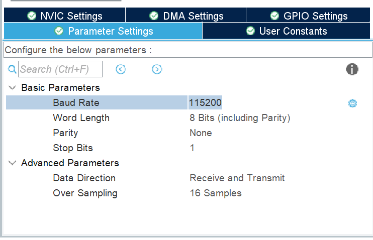
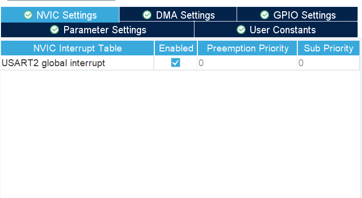
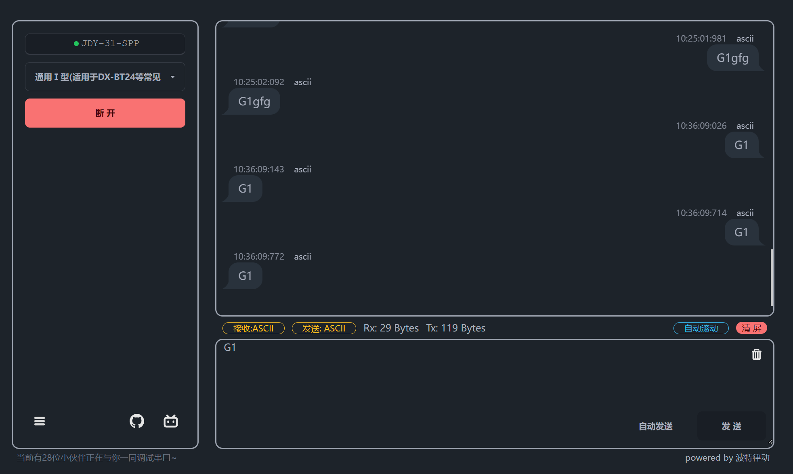

# 蓝牙模块

### 蓝牙基本信息

常见的无线通讯协议

#### 2类： 经典蓝牙 & 低功耗蓝牙

* 经典蓝牙： 常用在持续传输数据的设备 e.g. 蓝牙耳机
* 低功耗蓝牙(BLE)： 常用在间歇性同步数据的设备 e.g. 运动手环


#### 通信

2类：主机与从机

* 主机

手机等终端，

* 从机

stm32


#### 连接

进行数据广播，后按照约定的协议进行数据传输


#### 用到的通信协议

GAP广播协议

GATT协议

Service 

Characteristic

#### 串口透传

接收来自主机的数据通过串口转发给stm32，接收来自stm32的数据转发给主机

### 实战

1. 新建工程，打开对应的USART口的异步模式，并修改一下连接的波特率，因为蓝牙模块的默认波特率为9600



2. 为USART开启中断，以及DMA通道



3. 按照上节课内容，在user pv处定义一个接收容器
4. 开启不定长接收，并关闭接收一半中断
5. 重新定义callback函数

6. 打开波特律动网站，切换到蓝牙串口，选择蓝牙模块，如果等很久就reset一下或者看看串口有无接反，实在确认过代码没问题就试一下串口反接，说不定就行了



### 进阶任务

用蓝牙控制led小灯的亮灭

* 红灯用0x01, 绿灯用0x02
* 0xFF代表小灯亮起，0x00代表小灯熄灭
* 可以同时对多个小灯亮灭

#### 数据包形式

通常发送数据都有包头，此处规定包头为0xAA

包头后往往有一个数据包长度，再是内容或者数据

最后会有一个校验和，用来校验数据传递过程中是否出错，校验和的计算方式为将前面的数据依次相加，取最后一字节数据

接收到数据时，自行计算一遍收到数据的校验和，与数据包中的校验和进行比较，如果相等，则证明数据在传输过程中大概率没有出错，如果不等，那传输过程中某个数据传错了，就按照实际情况忽略此数据包或者要求对方重新发送数据包

```c++
if(huart == &huart2)
	{
		HAL_UART_Transmit_DMA(&huart2, receiveData, Size);
		if(receiveData[0] == 0xAA)
		{
			if(receiveData[1] == Size)
			{
				uint8_t sum = 0;
				for(int i = 0; i < Size -1; i++)
				{
					sum += receiveData[i];
				}

				if(sum == receiveData[Size - 1])
				{
					for(int i = 2; i < Size - 1; i += 2)
					{
						GPIO_PinState defaul = GPIO_PIN_SET;
						GPIO_PinState state = GPIO_PIN_SET;
						uint8_t success[] = "success!";
						    if(receiveData[i + 1] == 0xFF)
						    {
							    state = GPIO_PIN_RESET;
						    }
						    if(receiveData[i] == 0x01)
						    {
							    HAL_GPIO_WritePin(LED_RED_GPIO_Port, LED_RED_Pin, state);
						//		    HAL_Delay(1000);
						//		    HAL_GPIO_WritePin(GPIOE, GPIO_PIN_5, defaul);
							    HAL_UART_Transmit_DMA(&huart2, success, 8);
						    }else if(receiveData[i] == 0x02)
						    {
							    HAL_GPIO_WritePin(LED_GREEN_GPIO_Port, LED_GREEN_Pin, state);
						//		    HAL_Delay(1000);
						//		    HAL_GPIO_WritePin(GPIOE, GPIO_PIN_6, defaul);
							    HAL_UART_Transmit_DMA(&huart2, success, 8);
						    }else
						    {

						    }

					}
				}
			}
		}else if(receiveData[0] == 0xBB)
		{
			if(receiveData[1] == Size)
			{
				uint8_t sum = 0;
				for(int i = 0; i < Size -1; i++)
				{
					sum += receiveData[i];
				}

				if(sum == receiveData[Size - 1])
				{
					  HAL_GPIO_TogglePin(LED_RED_GPIO_Port, LED_RED_Pin);
						HAL_Delay(2000);
						HAL_GPIO_TogglePin(LED_RED_GPIO_Port, LED_RED_Pin);

						HAL_Delay(1000);

						HAL_GPIO_TogglePin(LED_GREEN_GPIO_Port, LED_GREEN_Pin);
						HAL_Delay(2000);
						HAL_GPIO_TogglePin(LED_GREEN_GPIO_Port, LED_GREEN_Pin);
				}
			}

		}else if(receiveData[0] == 0xCC)
		{
			if(receiveData[1] == Size)
			{
				uint8_t sum = 0;
				for(int i = 0; i < Size -1; i++)
				{
					sum += receiveData[i];
				}

				if(sum == receiveData[Size - 1])
				{

				}
			}


		}else
		{

		}

		HAL_UARTEx_ReceiveToIdle_DMA(&huart2, receiveData, 50);
		__HAL_DMA_DISABLE_IT(&hdma_usart2_rx, DMA_IT_HT);

	}
```

