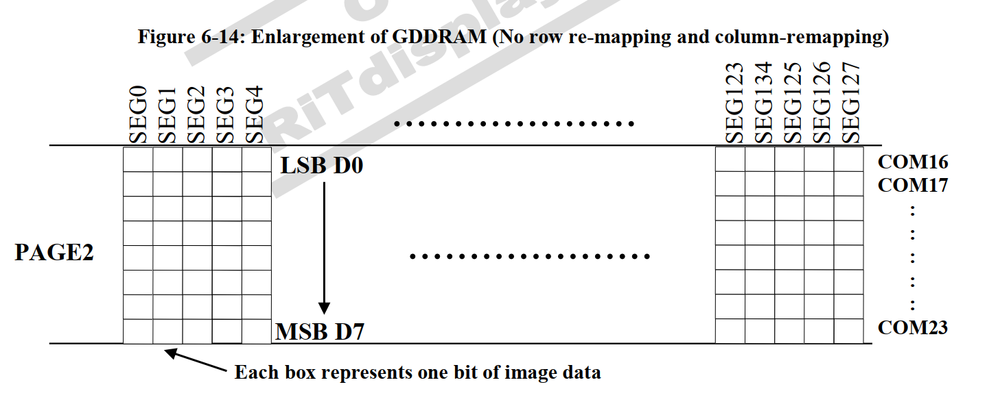
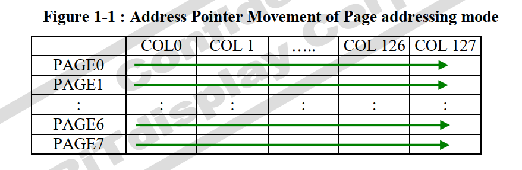
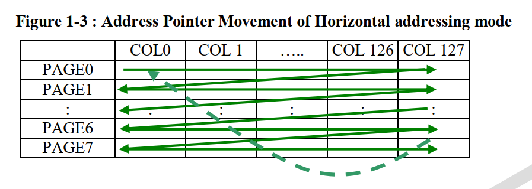
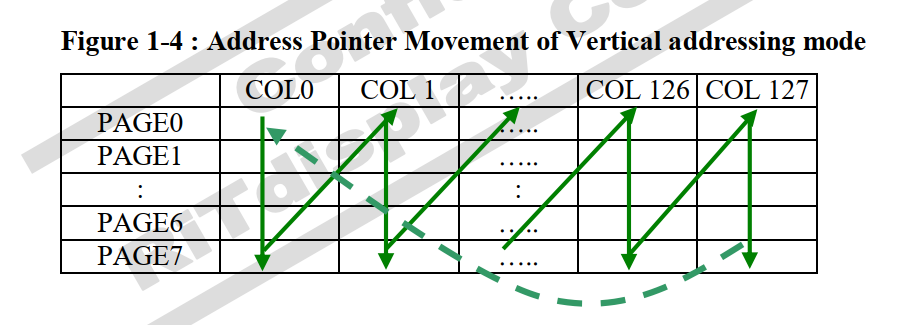

# OLED

为了更加方便地操控屏幕上几千盏小灯的亮灭，引入了驱动芯片来控制

### 常用的芯片

CH1116， SSD1306， SSD1506

* 操作逻辑

芯片将整块屏幕划分为了8个页（page），每一页共有128列，8行，一个字节的刚好为8位，，这样就可以用一个字节的数据控制某一页的某一列8个像素的亮灭

* 操作
	* 指令，设置页地址，列地址
	* 

### 零碎知识点

D/C# act as data and command

R/W# act as read and write

ACK refer to acknowledgement

NACK refer to no acknowledgement

GDDRAM refer to graphic display data ram

A[2:0] refer to A2 A1 A0

D[7:0] refer to data 7 to data 0

0-7d used to denote decimal representation, it denote that numbers 0 through 7 are represented in decimal form

7dh the "h" at the end denote that the number is in hex form, 0x is also common

0010b the "b" at the end denote that the number is in binary form

> ACK is the bit that the slave address reply to the master to reply if the transmission is fine, if do, it reply ack, if don't, it reply nack

D/C# act as SA0

D/C#pin is HIGH(1), D[7:0] is display data

D/C# pin is LOW(0), D[7:0] is a command

R/W is 0, it is in write mode

R/W is 1, it is in read mode

0x78 01111001 command read

0x79 01111000 command write

0x7B 01111011 display read

0x7A 01111010 display write

D0 is written into the top row while D7 is written into bottom row

### fundamental mode

#### set page address(vertical & horizontal)

for horizontal or vertical addressing mode only

0x22 00100010b //set up page start and end address

00000xyz //set up page start address range [0, 7]

00000xyz //set up page end address range [0, 7]

#### set page address(page address mode)

for page address mode

0xB0-0xB7

10110xyz //set up page start address range [0, 7]

#### set column address

seperate to 2 part

lower nibble of the 8bit 0x00-0x0F [0, F]

higher nibble of the 8bit 0x10-0x17h [0, 7] //0x7F = 127 

e.g. you want to send the position of 0x5A

you first transmit 0x0A

then 0x15

#### set memory address mode

all 3 mode, the column address pointer is increased automatically by 1 when the display RAM is read/write

to set memory address mode 0x20 00100000b

000000xy

xy = 00b horizontal addressing mode 0x00

xy = 01b vertical addressing mode 0x01

xy = 10b page addressing mode (reset) 0x02

##### page addressing mode

when finish 1 page, you need to reset the page start address

##### horizontal addressing mode

when finish 1 page, it will automatically turn to the next page at the column start address

##### vertical addressing mode

when finish 1 column, the page address pointer will automatically increase by 1

