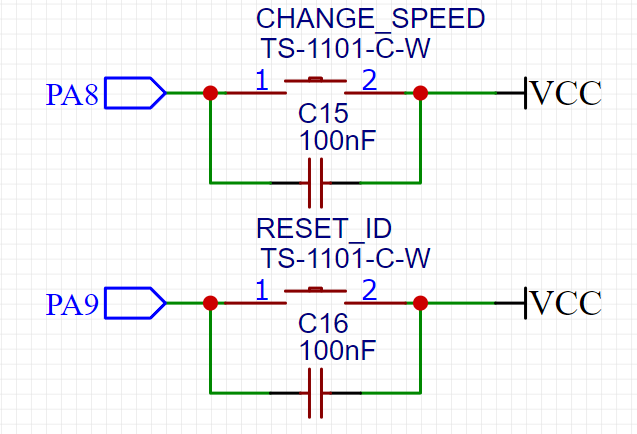

用按键控制小灯

**未按下按键时**


---

### 浮空输入模式

* GPIO口八大模式之一

* 此时GPIO口内部处于高阻态，根据阻值越大分压越多，即PB12处基本为3.3V，即此时读取到的为高电平

* 即既不上拉也不下拉模式，看完下面内容再理解

### 上拉

*使用电源将GPIO口处电平拉高的操作称为上拉*

* 通常需要搭配一个电阻使用，也常被称为“加个上拉电阻”

* 此电阻作用为限流，防止电源与GND直接相连而短路

[更多可以阅读](https://blog.csdn.net/m0_46152804/article/details/123397704)

---

**按下按键后**


* PB12直接与GND相连，相当于导线，此时PB12读取到的电平为GND的电平，也就是0V的低电平

---


将电源和GND的位置互换就得到**下拉电路**

---

### **快捷键**

`ctrl + click` 转到函数或者变量的定义

`alt + /` 打开快捷补全

### 内上下拉和外上下拉

* GPIO的另外两大模式

从原理图中，我们可以看到清晰上下拉的就是外上下拉，当原理图中为直线时，可开启内上下拉模式


### 新代码

```c++
HAL_GPIO_ReadPin(GPIOA, GPIO_PIN_0) //读取此时高低电平
HAL_GPIO_TogglePin(GPIOE, GPIO_PIN_5) //反转输出电平
```

### 消抖

* 硬件消抖

电容

* 软件消抖

加10ms的delay(抖动通常在10ms内jie'shu)

```c++
HAL_Delay(10);
```

### 上下拉在实际电路中的作用猜想未认证


当我们设置为上拉电路时，默认未高电平，而当输入为低电平时，相当于没有按物理按键一样没动，所以还是高电平也就是GPIO_PIN_SET也就是1，而当输入为高电平时，相当于按了物理按键，所以电路触发，变成GPIO_PIN_RESET,也就是0。

下拉电路就相反

#### 2024.6.26补充---警钟长鸣



上图为两个按键的原理图，我们可以发现如果没有按下按键时，PA8和PA9引脚是没有接到任何东西上的，也就是说它现在并不是接地，也不是接VCC。这种时候这个引脚的输入是浮动的，可能会在高低之间变化也可能不会，因为它是在空气中拾取噪音。

所以如果你以现在这种状况去写代码，用HAL_GPIO_ReadPin()或者外部中断EXTI写关于开关的代码，比如说一个if语句，你是得不到你想要的情况的，它只会一直卡在某个条件。

所以这时候就用到了内部的上下拉电阻，因为我们的设计是按下按键时我们通高电平，所以我们要将平时没有按下按键的时候设置为低电平。所以就要在CubeMX中将这个引脚先下拉使它接到GND上，之后才能正常工作。

（花了几个小时才发现。。）

