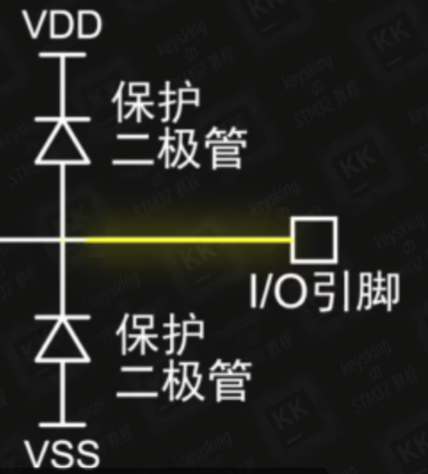
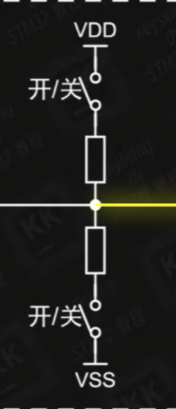
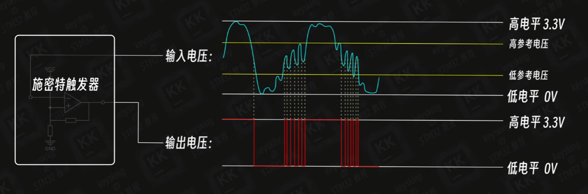

## GPIO剩余的八大输出

开漏输出，复用推挽输出，复用开漏输出，模拟输入

---

* 当有静电等瞬间电压波动进入I/O引脚时，若此电压大于VDD 3.3V，则上方的二极管导通，将电压引入电源，由电源网络吸收

* 当波动电压小于VSS 0V时，则下方的二极管导通，将电压引入GND吸收

### 5V容忍

*可以承受5V电压作为高电平输入*

* 可在IDE中查询芯片手册，在I/O level一列为FT的引脚即为5V容忍引脚

### 寄存器

*寄存器为许多具有特定功能的内存单元，按照功能被叫做XXX寄存器*

* 寄存器的内存单元是程序与硬件电路连接的桥梁

* 按照每32位二进制0/1数据为一组，存储着芯片中特定功能电路的开关信息

> 用程序控制单片机实质上就是控制寄存器，从而用软件控制硬件

* 通过寄存器改变芯片中某功能电路的开关（如上图将某个数值调整0或是1
* 通过程序对寄存器数据进行读取获取芯片中某段功能电路的当前状态 

## 输出驱动器

* PMOS, NMOS 可简化为两个被控制的开关

* VDD -> 3.3V高电平
* VSS -> 0V 低电平
* 输出驱动模块有两个控制指令来源
	* 输出数据寄存器，用HAL_GPIO_WritePin函数控制
	* 片上外设，串口模块，IIC模块

### 推挽输出

#### 特点

* 具有一定的电压和电流的驱动能力，可以直接驱动一些合适的元件工作
* 只能驱动特定元件

#### 原理

* 输出高电平

P-MOS开启， N-MOS关闭

* 输出低电平

P-MOS关闭， N-MOS开启

### 开漏输出

#### 特点

* 驱动不与VDD直接适配的元件

* 开漏输出没有电压电源驱动能力，只能依靠外部电压驱动

#### 原理

**开漏模式下只有N-MOS工作， P-MOS一直处于断开状态**

> **假设小灯的工作电压为5V**
>
> * 输出高电平
>
> N-MOS关闭，断路
>
> * 输出低电平
>
> N-MOS开启，0V不亮
>
> **若将GND改为5V**
>
> 则输出低电平的时候小灯亮起，输出高电平断开不亮
>
> **注意这里需要使用5V容忍的I/O口**

开漏输出没有电压电源驱动能力，只能依靠外部电压驱动

|        | 推挽输出                 | 开漏输出                           |
| ------ | ------------------------ | ---------------------------------- |
| 高电平 | P-MOS激活 N-MOS断开 3.3V | P-MOS断开 N-MOS断开 由外部电路决定 |
| 低电平 | P-MOS断开 N-MOS激活 0V   | P-MOS断开 N-MOS激活 0V             |
| 优点   | 可以直接输出3.3V         | 配合外部电路 更加灵活              |
| 缺点   | 只能输出3.3V             | 高电平实际上是高阻态 无法输出电流  |

### 复用推挽输出 & 复用开漏输出

由于输出驱动模块有两个指令来源，为了区分它们即设立了`复用推挽输出`和`复用开漏输出`

## 输入驱动器

### 上拉下拉电阻

* 上拉电阻

上方为上拉电阻， 设置上拉输入时，上拉电阻启用

* 下拉电阻

下方为下拉电阻， 设置下拉输入时，下拉电阻启用

* 浮空输入

两个电阻都不会启用

### TTL肖特基触发器（施密特触发器）

#### 作用

波形变换，脉冲整形，脉冲鉴幅，简单来说稳定电平

#### 原理

外部输入电压可能不太稳定，并不总能达到3.3V或者0V，规定一个标准电压，高于此电压的为高电平，低于此电压为低电平，用比较器就可以达到这个效果

当电压中有太多噪声，徘徊于标准电压时，误差较大，则将比较器改造成施密特触发器，产生两个参考电压，高于高参考电压为高电平，低于低参考电压为低电平，在两者中间则维持不变

最后存入输入寄存器等待HAL_GPIO_ReadPin函数对寄存器读取

### 模拟输入

* 浮空，上拉，下拉仅读取了高低电平，也就是数字信号，因此统称为数字信号

* **模拟输入读取输入电压的具体数值**，因此在TTL之前就产生了分支

* 复用功能输入用于串口模块等外设的数字输入的片上外设
* 输入部分的不同分支可以同时读取TTL的输出，也就没有多余的模式