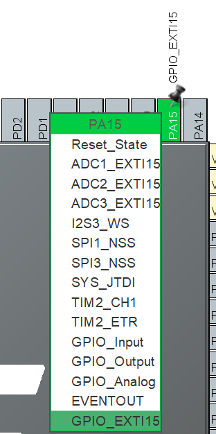
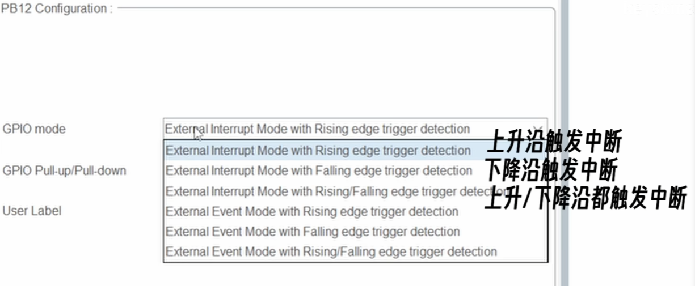
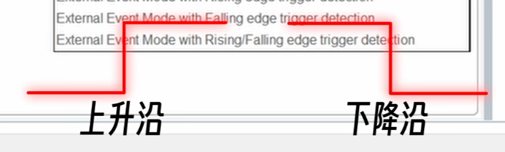
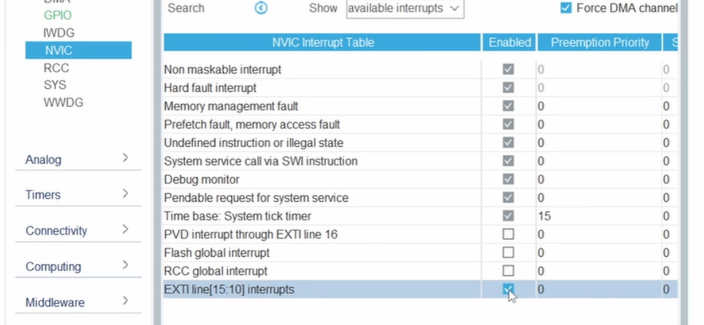
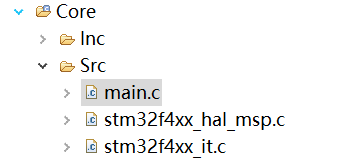
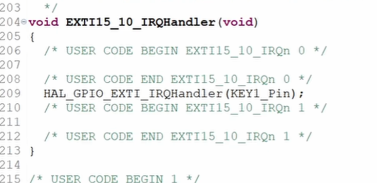

# stm32中断

打断正常流程，处理突发事件后，再回到正常工作流程的行为称为**中断**

e.g.指令出错，定时器结束，串口接收数据，GPIO电平发生变化

## GPIO电平中断（外部中断（EXTI））

*EXTernal Interrupt*

*来自外部的中断*

* GPIO_EXTI为中断线

### GPIO_EXTI模式

选中GPIO_EXTI在system core中选择模式即会出现如下选项

* 前三个与中断有关

### 上升下降沿

* 上升沿

从低电平变到高电平

* 下降沿

从高电平变为低电平

### 中断处理函数

1.选中模式后，在特定沿时就会触发中断，执行为之设定的中断处理函数

2.还需在NVIC（中断控制器）中勾选上新的中断向量，如图的EXTI15

3.在文件中找到it.c结尾的文件，后缀it代表与中断有关

4.在文件底部找到程序帮我们生成的函数，如图的Handler，即为按下按键后触发中断会执行的中断处理函数

###  Q:抖动时程序会运行很多次吗

### 中断中delay

* HAL_Delay函数依靠一个System tick timer（系统滴答）的中断，这个中断为其提供1ms的时钟基准
* **此中断优先级比我们触发的中断的优先级低一些**
* 会卡死

在这个界面更改System tick timer和EXTI的优先级

**数字越小，优先级越高**

### 注意

正规项目中在中断中实现按键逻辑，调用HAL_Delay函数是不被接受的，因为我们希望中断任务尽快完成，有其他妙法

* 原理在下一期