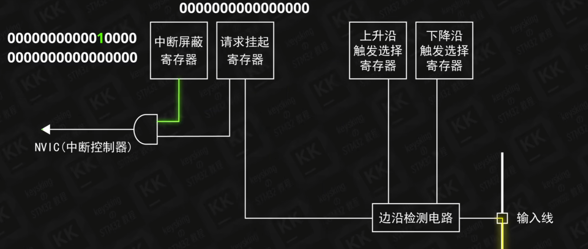
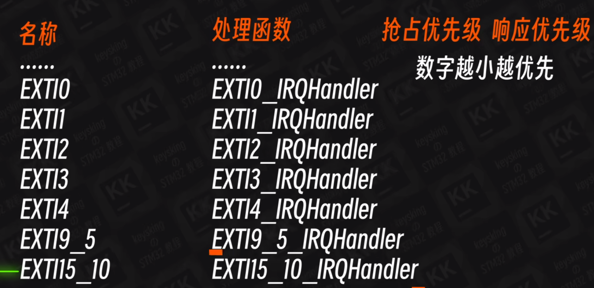

# 深入中断

[视频原地址](https://www.bilibili.com/video/BV1M24y1473t/?p=8&spm_id_from=pageDriver)

不懂建议再看一次

经过输入驱动器的电平信号会进入边沿检测电路

数字相同的会公用一条中断线

如PA5中的数字为5，PB5，PC5也共用一条中断线

引脚类型大体上 A-E 0-15

1. 经过选择的上下沿触发在请求挂起寄存器中写入1或0

2. 中断屏蔽寄存器由CubeMX中打钉子写入1
3. 上面两者经过and gate最后到NVIC

4. NVIC找到此中断线对应的中断向量，执行对应的中断函数
5. 最后把请求挂起寄存器的1改为0防止重复执行函数，cubemx帮我们自动完成
6. 遇到2个中断并行的情况，可以使用中断优先级来规定执行的顺序，数字越小越优先
7. 抢占优先级更重要