# 认识串口通信

### TTL串口

* 2根数据线，一去一来，同一条线一边为TX，一边为RX

* TX代表发送，RX代表接收

* 通常还需要一根线供地GND，确定高低电平，因为电压为相对值，需要基准值，一般按照习惯称为**地**

### USART


打开connectivity，可以看到由几个USART，根据不同的芯片数量不同,**需要在原理图中查找对应的**

*USART-> Universal Synchronous/Asynchronous Receiver&Transmitter*

*通用同步或异步接收器和发射器*

**TTL用异步发射器和接收器即Asynchronous**，所以也有UART的缩写

### 实战


1. 在原理图中找到RX和TX对应的引脚

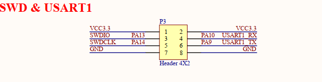

2. 打开对应的USART， 按照原理图为1

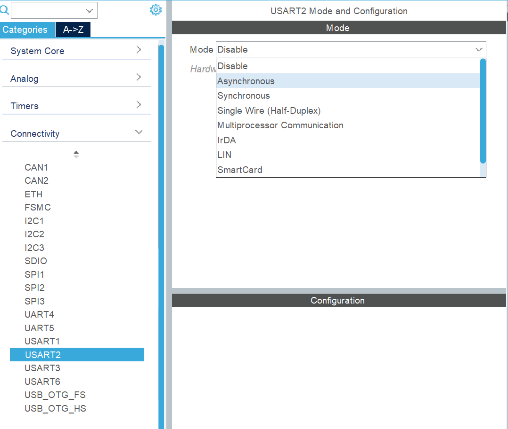

3. 在USART2中模式找到Asynchronous即TTL串口模式

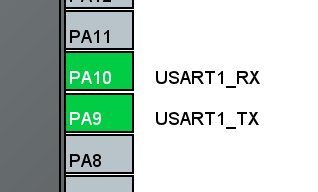

4. 可以看到已经被设置了

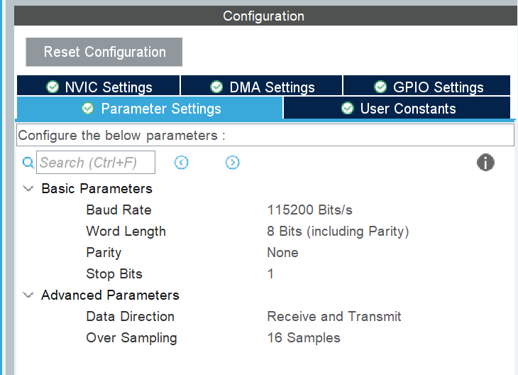

5. 留意左边的参数
	1. 波特率（baud rate）表示每秒传输的码元数量，这里每个码元只包含1bit的信息
	2. 在二进制系统中，信息速率（比特率）=信号速率（波特率）
	3. 更多相关[链接](https://blog.csdn.net/xiaoyue_/article/details/105494828)
	4. 默认情况下TTL每传送一个字节，8bit再加上起始位和停止位共10bit，即每传送1byte需要10bit，就是11520 byte/s

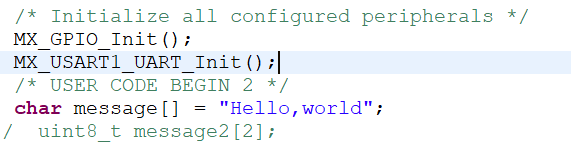

6.在main中看到这个函数是初始化串口和设置波特率

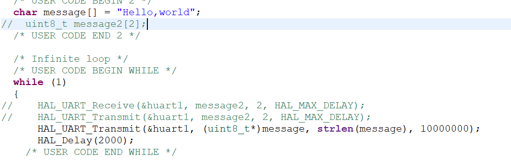

7. 在外面定义cstring，在while里用函数向电脑每隔2s发送message
	1. `&huart2` --> 要操作的串口的地址（指针）
	2. `message` --> 要传输的内容的地址（指针）,函数中需要uint8_t类型的地址（指针），和char一样都是8位的，可以用强制转化`(uint8_t)message`
	3. `strlen（message）`--> 要发送的信息的长度 保险可以在private include中 `#include string.h`
	4. `100` --> 超时时间，多久之后还没完成的话就停止发送，单位发送，如果填写最大值HAL_MAX_DELAY(0xFFFFFFFF)则代表不设超时时间，可以无限等待到发送完成

```c
#include "string.h"
char message[] = "hello, world";
HAL_UART_Transmit(&huart2, (uint8_t)message, strlen(message), 100);
```

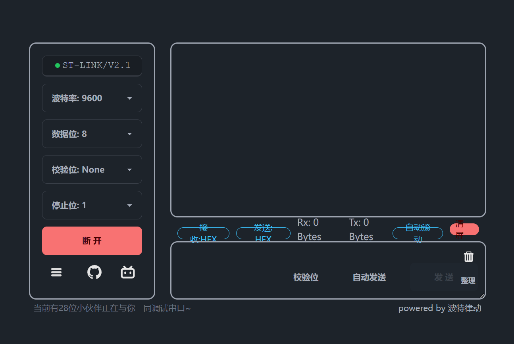

8. 下载后连接串口使用[网站](www.serial.keysking.com)

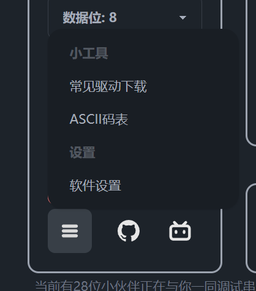

9. 在网站上下载对应驱动，我们为CH340

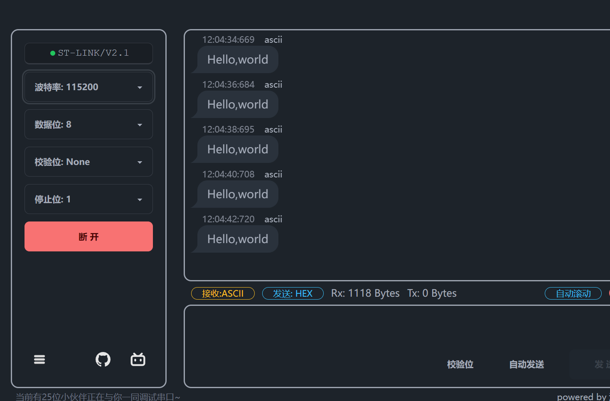

10. 可以实现接受串口数据

### 接收数据

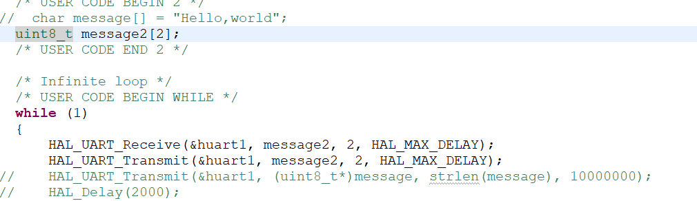

`HAL_UART_Receive`函数和`HAL_UART_Transmit`函数形式一样，此处在实现电脑发送2个字符给单片机后，单片机返还这两个值

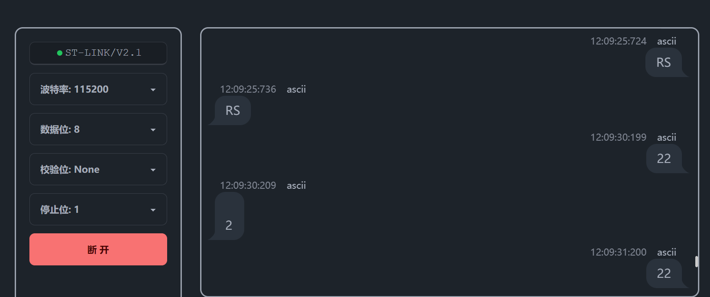

### 接收数据进阶

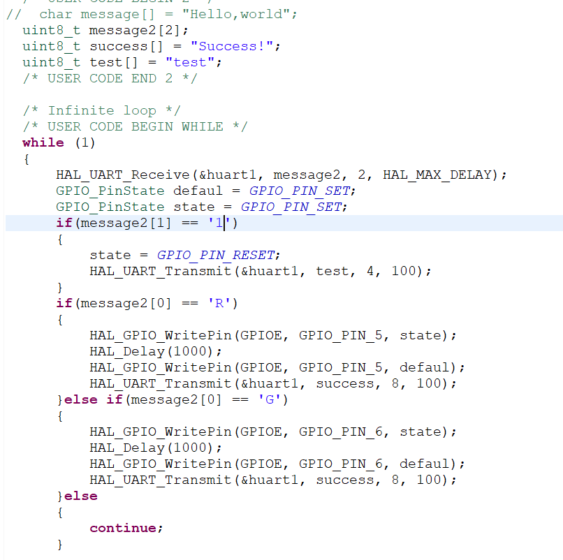

* 发送R1，红灯亮
* 发送G1，绿灯亮

### 串口的三大模式之一 轮询模式

* 必须要阻塞住程序的执行，直到完成发送或者接收
* 等待超时
* 接收时需要固定长度的数据