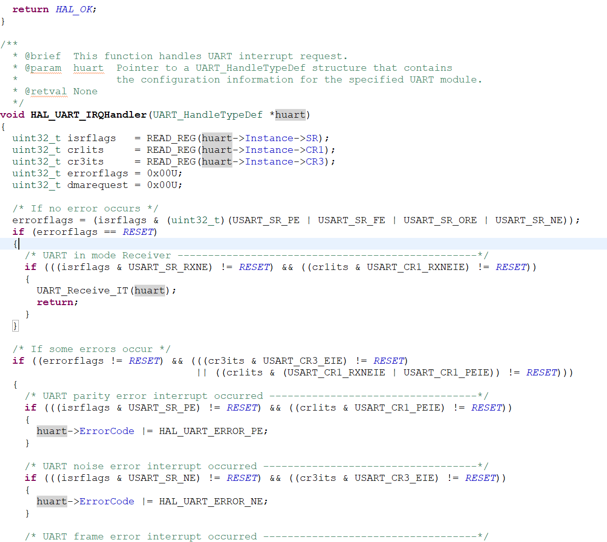

# 串口的中断模式

### 轮询模式的底层逻辑


当我们调用`HAL_UART_Transmit`函数时，底层有两个寄存器，**发送数据寄存器**和**发送移位寄存器**。

STM32的CPU会依次将数据传入这两个寄存器中。在**发送移位寄存器**中，按照我们设定的波特率转化成高低电平从TX口发送我们的数据。

当一个数据发送完成后，CPU会将**发送数据寄存器**中的数据传给**发送移位寄存器**。此时**发送数据寄存器**就空拉

那么CPU怎么知道什么时候要传下一个数据进入**发送数据寄存器**呢？

因此诞生了2种串口的模式，轮询和中断

* 轮询

CPU通过不断地查询**发送数据寄存器**是否为空，或者超出超时时间来确认，接收时地情况也同样如此，有**接收数据寄存器**和**接收移位寄存器**

缺陷： 一直占用CPU，在发送或者接收完成之前无法执行其他任务

* 中断

通过在发送移位寄存器发送数据后会触发中断，把CPU叫回来执行传输数据的任务的形式，解放CPU

堵塞：一直等待使程序暂时无法向下执行地状态称为**堵塞**

### 中断处理函数

将UART设置成中断模式后，在接收数据的同时就不会发生堵塞现象，也就会继续向下执行，那么如果直接在main函数中写下处理接收数据的代码，可能此时并未完成接收数据，那么怎么知道什么时候数据接收完成了并处理他们呢？

中断处理函数就是为此而设计的。cubemx为我们设计好了全部接收完成后的中断处理函数或者是接收完成一半后的中断处理函数等等具体使用看实战部分

### 实战

1. 打开USART中断功能


2. 发送和接收的函数在中断模式下改为

```c++
HAL_UART_Transmit_IT(&huart2, message, 2);
HAL_UART_Receive_IT(&huart2, message2, 8);
//参数未变,不需要第四个参数
```

3. 与GPIO中断模式相同，在it.c后缀的文件中，在文件的末端，找到名为`void USART_IRQHandler(void)`的函数
	* 由于接收中断，发送中断等情况都会调用此函数，因此不能直接将我们的代码写在这个函数里，那么该如何知道是哪个条件触发了中断呢，cubemx已经帮我们写好了，继续往下走


4. 对函数中`HAL_UART_IRQHandler(&huart1)`按下`ctrl + 鼠标右键`进入此函数的定义页面



5. 可以看到页面中全是判断语句，将页面往下翻到`__weak void HAL_UART_RxCpltCallback`函数，
	* `__weak`--> 可以在别处重新定义此函数， 此处则规定重写此类函数要在用户文件中重写
	* `Cplt`--> complete的缩写
	* `callback` --> 回调函数
	* 此函数意为在接收信号完毕后触发


6. 通常来说，应将此类重写函数单独放在另一文件中，为了更加简洁，我们将他放在`main.c`中，放在上面系统定义的函数下，此时我们将之前的操作复制粘贴到函数里。


7. 为了能够在函数中使用我们之前定义的变量， 我们将之前的变量直接作为全局变量来使用，放置在`user code begin pv`, `pv` 代表private variable


8. 此时我们为了在开始的时候能够读取数据，在main函数中防置一个`HAL_UART_Receive` 函数，并且为了能够一直读取数据，在6.的函数末尾再加上一个`HAL_UART_Receive` 函数


至此，就ok啦