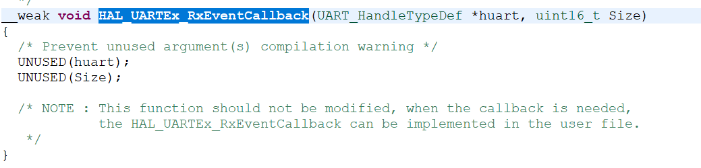

# DMA

### Q:串口模式弊端

屡屡被打断

* 解决方案--DMA

### DMA

*direct memory access*

* 作用

通过创建一条DMA通道，设定源地址和目标地址，DMA就会在合适的时机帮我们进行内存搬运，等全部搬运完成再通过中断提醒我们

* 例子

为串口的发送和接收创建两条DMA通道，专门负责处理从内存到寄存器这一部分任务


### DMA操作

1. 建立DMA通道。来到USART设置界面，找到DMA Settings


2. 点击左下角的add键，即可添加一个DMA通道


3. 选择DMA通道的功能
	* USART1_TX指的是此DMA用于USART1的串口发送
	* USART1_RX指的是从DMA用于USART1的串口接收


4. 选择后可以看到，在Stream栏中，DMA2 Stream2是专门为USART1的接收提供服务的，传输方向为从外设到内存，也就是从接收数据寄存器到内存变量，优先级默认为低，可以选择，一般默认就好


5. 
	* 对于Increment Address数据地址的自增，对于寄存器来说只有一字节的长度，地址就不需要发生变化；而从内存变量中搬运时每个字符依次搬运，而不是只从一个地方取数据，所以选中
	* 对于数据长度Data Width，我们每次发送都是1字节，所以就是默认的1字节就好啦
	* 模式也暂时用normal就好啦，循环模式之后再探索


### DMA函数

```
HAL_UART_Transmit_DMA(&huart1, message, 2);
HAL_UART_Receive_DMA(&huart2, message, 2);
```

* 将中断模式的后缀IT改为DMA，其他参数不变

### 串口接收不定长数据

* 串口空闲中断函数

只有当RX引脚上无后续数据进入才会触发，可以将空闲理解为数据包发完了，之后对数据进行分析处理就行

```
HAL_UARTEx_ReceiveTOIdle_DMA(&huart1, message, size)
```

 `Ex` --> 拓展

`Idle` --> 空闲中断

`size` --> 一次能接收的最大数据长度，一般就是数组长度

有三个版本，这里选中DMA，size因为是补丁长，可以写大点

* 回调函数，不同于之前的cpltCallBack

	1. 打开it.c结尾的文件

	2. 找到 `void USART1_IRQHandler(void)` 函数

	3. `ctrl + 鼠标右键`点击`HAL_UART_IRQHandler(&huart1)`进入定义

	4. 在新文件中找到 `__weak void HAL_UARTEx_RxEventCallBack`函数, 并在main.c文件中重新定义它

		

	5. 这个函数多了一个size的变量，因为我们是接收不定长数据，所以需要通过size入参来得知本次到底接收了几字节的数据

	6. 虽然本项目只用了一个串口，不过还是先确认进入此callback函数的是否为huart1

	

	7. 然后就返回输入值并进入下一次等待输入

	

	8. 可以发现灯光并没有亮起，也返回了输入值，有个问题就是当你输入很长的时候返回并不完全

	9. 细节

	> 在HAL_UARTEx_ReceiveToIdle_IT和HAL_UARTEx_ReceiveToIdle即普通模式和中断模式都不会出现这个问题，但DMA中**传输过半**也会触发RxEventCallback函数，就是说如果接收的数据量达到我们设置的最大值的一半的时候，就会进入这个函数

	10. 关闭DMA过半传输中断

	```c++
	__HAL_DMA_DISABLE_IT(&hdma_usart1_rx, DMA_IT_HT);
	```

	* 第一个参数是DMA通道的指针地址
	* 第二个参数是我们要关闭的中断函数
	* 记得在中断函数中和程序开始时都加上这个语句

