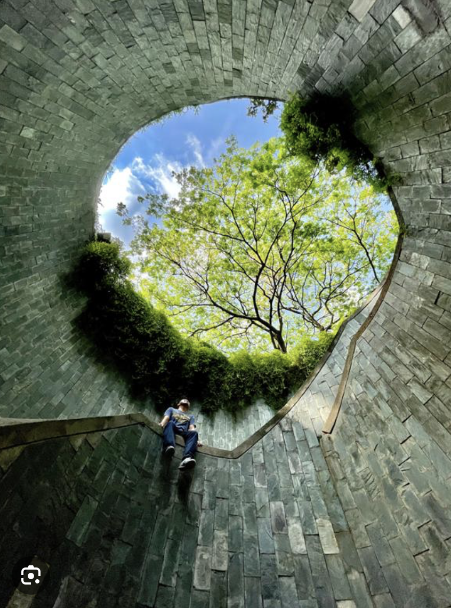

### 事前准备

* 换钱（记得零钱）/ visa
* 手机卡 淘宝/当地买
* 新加坡用英标插座

### 交通方式

#### 机场

* 地铁MRT（5：00-23:50）
  * T2/T3航站楼直达
  * T1需要坐skytrain去到T2/T3
  * T4需要坐摆渡车到T2/T3
* 巴士 -- 大概2新
* taxi

### 景点参考

* 环球影城
* 新加坡动物园
* 新加坡植物园(botanic garden)
* 鱼尾狮公园
* 滨海湾公园
* 马里安曼印度庙
* 佛牙寺
* 牛车水(pagoda street宝塔街)--唐人街
* 坤成路(Koon Seng Rd) --华人街屋
* 甘榜格南(kampong glam) --苏丹风格
* 摩士街(Mosque Street)--清真寺街
* 小印度(Little India) --印度

* 圣淘沙(Sentosa) --人工沙滩
  * 缆车，skytrain，或者汽车
* 福康宁公园(Fort Canning Park)
  * 
* 樟宜机场(Changi Airport)
  * 比较多的店铺在Jewel，1号航站楼外边
  * 瀑布要十点十一点才会开
* 虎豹别墅 --中国古代神话传说的故事的雕像和实景模型

### 购物

* 克拉码头(Clarke Quay)
* 维多利亚街(bugis street)
* (Orchard Road) --购物中心，奢侈品啥的
* 金沙酒店商场(Shoppes at Marina Bay Sand)

### 饭

* yakun亚坤早餐 比较有特色的东西（咖椰吐司和半熟的蛋

* 维多利亚街(bugis street)
* (Hawker Center)
* 了凡油鸡面(Soya Sauce Chicken Rice & Noodle)
  * 最便宜米其林一星

### 小知识

* 在小吃街吃完饭盘子要自觉回收，不然要被罚款
* 小吃街，咖啡店桌上的纸巾不要随便拿，是占位的
* 咖啡喝到一半中途出去要把勺子在杯子上平放才不会被收走
* 逛商场不要随便接试用装，会被拉去消费

### 罚款条例

* 禁止喂食野生动物（鸽子）500新
* 禁止破解别人wifi 最高1w新/3年监禁
* 禁止在地铁饮食 最高500新
* 禁止买卖口香糖
* 禁止破坏公务，包括涂抹墙面 最高2000新/3年监禁
* 禁止乱穿马路 50新
* 禁止乱扔垃圾 轻则300新，重则2000新
* 禁止随处吸烟 1000新
* 禁止开车玩手机 1000新/6个月监禁
* 禁止在公共场所唱歌