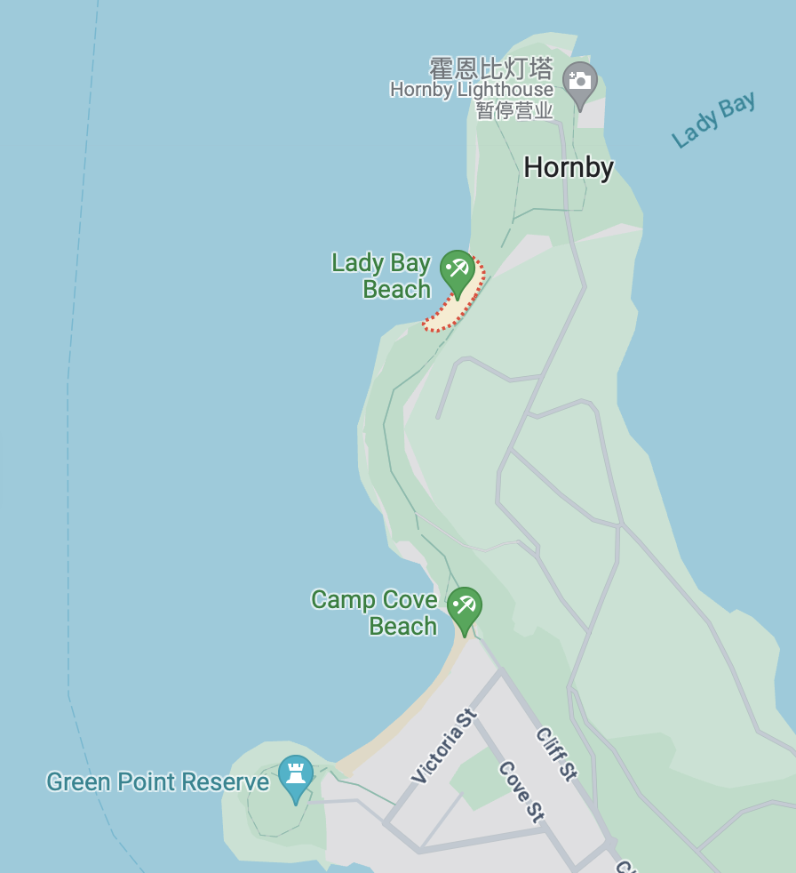
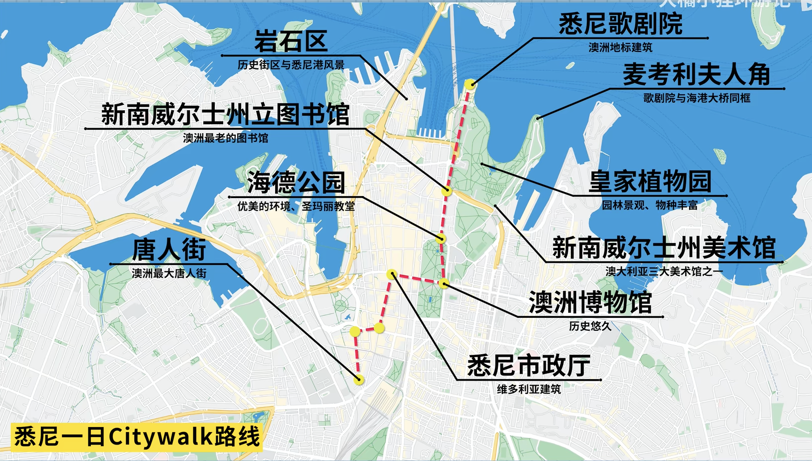
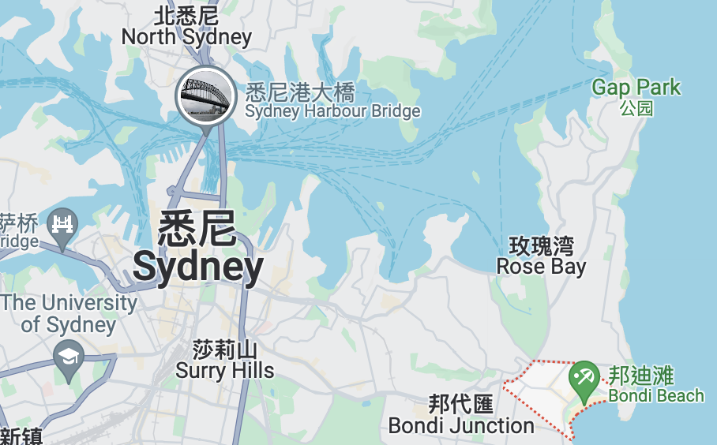
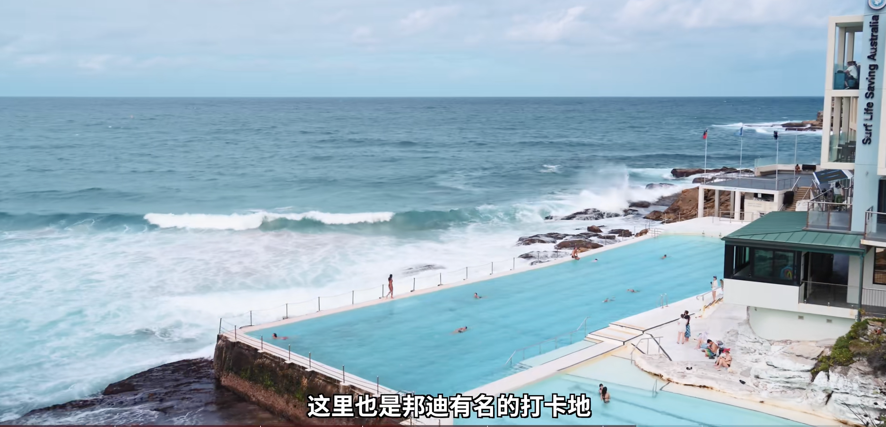

# 悉尼

### 准备

* 电话卡， 本地号码（非常需要，买Telstra）
* 现金（参考：19天1100澳币
* 信用卡
* 保险
* 防晒（大太阳，紫外线
  * 防晒霜，喷雾，晒后修复

### 交通住宿

#### 交通

* OPAL 卡，机场便利店可以拿到，卡本身不需要钱，直接跟店员讲充值多少就好了，其他地铁站啥的有自助的，一般最低20起充，多余不退，OPAL TRAVEL app可以看记录，只能悉尼用，墨尔本另说7刀办卡费
* 机场-市区：Sydney Airport Link T8 20刀，或者绕开机场再坐，上下车都需要刷卡
* 租车 hertz 100刀/天 一般21岁以上才能租
* 去别的城市一般只有开车和飞机（机票感觉还行）
* 

#### 住宿

推荐：达令港，CBD， 环形码头和岩石区，唐人街

价格：500-1000？？（1000也算正常价了

### 路线

#### Day1

**悉尼歌剧院 -> 环形码头 -> 沃森湾 -> 玫瑰湾 -> 环形码头**

看看有无兴趣，码头刷OPAL卡，轮渡全程10min，班次很多

路上会经过Lady Bay Beach 和 Camp Cove Beach 这两个当地人比较喜欢的沙滩和霍恩比灯塔

#### Day2 市区

**唐人街 -> 悉尼市政厅 -> 澳洲博物馆 -> 圣玛丽教堂 -> 海德公园 -> 新州图书馆 -> 美术馆 -> 皇家植物园** 

悉尼市政厅：维多利亚时期的建筑

Queen Victoria Building:悉尼地标购物中心， the great Australian clock

澳洲博物馆：很多动物标本，参观免费，特殊展览付费

圣玛丽大教堂：在博物馆对面，哥特式风格的建筑

悉尼观光塔：在海德公园附近

州立美术馆：好像很丰富

麦考利夫人角：拍照好地方，下午有些逆光

Rock Market 市集 Sat Sun 10a.m. - 5p.m.

达令港(Darling Harbour): 周六晚上9p.m.会放烟花 darling harbour fireworkssnow

#### Day3

**邦迪海滩 -> 库吉海滩**

邦迪海滩：离市区40min车程，冲浪圣地，旁边有个悬崖泳池，挺出名

邦迪-> 库吉海滩：比较有名的徒步路线，2小时左右，路上经过很多海滩，公园，咖啡馆等

**路上还会经过**

韦弗利墓地，名人的安息之地

戈登湾，海豚角：有名的潜水地

#### Day4

**翎羽谷野生动物园 -> 曼利海滩**

比较出名的野生动物园还有塔龙加动物园，不过人更多

考拉，袋熊，企鹅，门票40刀，和考拉合影30刀，喂动物饲料3刀，见考拉合影要中午之前来，全程2个小时左右

曼利海滩：

Manly Kayak Center 租皮划艇 一小时50刀，穿梭在帆船之间

### 美食

澳洲没有给小费的习惯

[美食视频传送门youtube](https://www.youtube.com/watch?v=2qsiRDR8SqY)

* **澳洲牛** macelleria Newtown 
* **澳洲肉派** Harry's Cafe de wheels 听说这家店历史挺久了，不过看google评论有点咸， 比较出名的是老虎派， 鸡肉派，要趁热吃，冷掉就不好吃了，热狗一般般不用点
* **澳洲海鲜** sydney fish market 评价又说骗游客的地方，可以过来看看，不一定要买。像生蚝，澳龙，澳洲虎虾？不建议买做好的东西，营业时间：7a.m. - 4p.m. 一般23点就开始收了，早点来
  * 看网友有讲到 金唐比较好吃，它里面的泥蟹和龙虾三吃
* **炸鱼薯条** Fish mongers 好像不是传统的炸的
* **法式甜点** 
  * Kingcross Cafe de la Fontaine 推荐法式薄饼和法式泡芙
* **汉堡** 
  * Sylvania Paul's Famous Burger 看网友评论的
  * Mary's burger 的 chicken burget 看网友称之为悉尼最强burger
* **啤酒** The Squire's landing 喝啤酒不错的地方， 还有Bondi beer 
* **澳洲冰淇淋**：好像有很多不同种的，可以了解一下 Gelato （意式冰淇淋）和 Sorbets（雪酪） 应该是牛奶和鲜奶油的比例不太一样。Gelato牛奶比较比例更高，鲜奶油比例更少，空气含量更少，口感更绵密而Sorbets 完全没有牛奶。说是不要点抹茶，很怪
  * Messina 招牌 Salt caramel和提拉米苏口味

### 花费参考

19天 

交通：3433（租车的邮费，停车费等杂费和公共交通，不包括租车本身的费用 8天房车16000

住宿：4445， 除去7天朋友家，房车

[参考视频b站](https://www.bilibili.com/video/BV1Ui421k7fK/?spm_id_from=333.337.search-card.all.click&vd_source=4ae85c9aa63e99071b3c53715d6ff461)
