# mermaid

## pie chart

```
pie
	title why always stay at home //optional
	"like_to" ：15
	"cold" : 20
	"poor" : 65
```

*   `pie` stands for the type of chart

*   `title` stands for the tile name

*   `like_to` stands for the variable

*   `numbers` stands for proportion

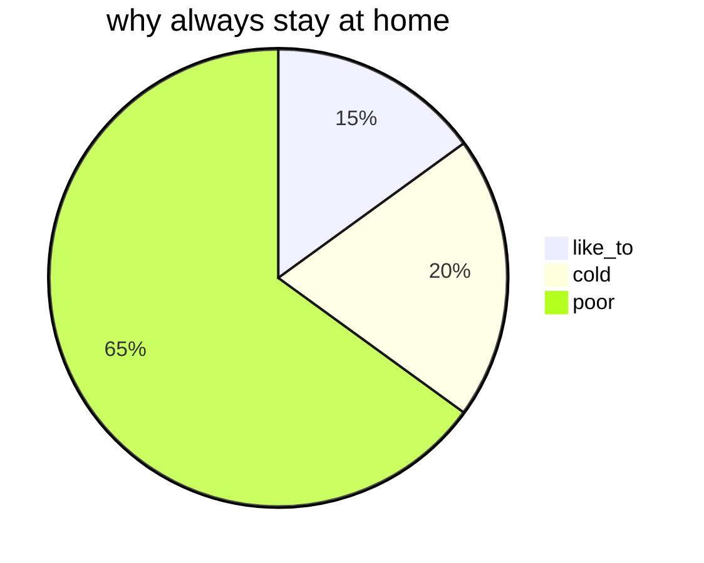

## graph chart

### example

```
graph LR
	A[start] --> B{Is it?}
	--> Yes --> C[OK] 
	--> D[rethink] --> B;
	B -- No --> E[End];
```

*   `graph` stands for flow chart
*   `BT` : button to top
*   `LR` : left to right

>   no defining of direction, default set to top to button


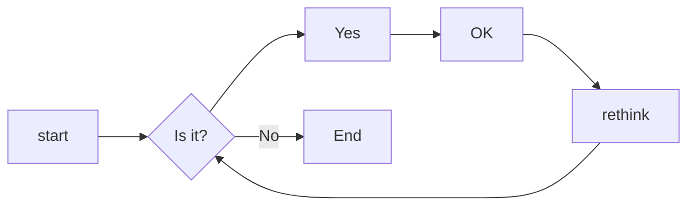

### connecting point

*   ==no name point== --> write directly, display in rectangle, **don't support space**
*   ==named point== --> enter the content after the name, **support space**

```
graph 
	default_rectangle
	id1[rectangle]
	id2(rounded rectangle)
	id3([ellipse])
	id4[[scroll]]
	id5[(cylinder)]
	id6((circle))
```

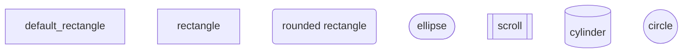

>   there are no arrow between the connecting point, so they are in the same row. id1-6 is the name of the point, can be 
>
>   define freely

```
graph 
	id1{diamond}
	id2{{hexagon}}
	id3[/parallelogram/]
	id4[\inverse parallelogram\]
	id5[/trapezoid\]
	id6[\inverse trapezoid/]
```

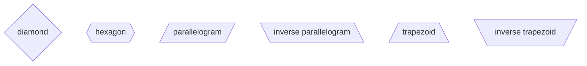


### connect line styling

*   ==in_text arrow== 

*   ==no_text arrow==

#### solid arrow

```
graph LR
a-->b--text1-->c--text2-->d
a-->b--text1-->c-->|text2|d
```


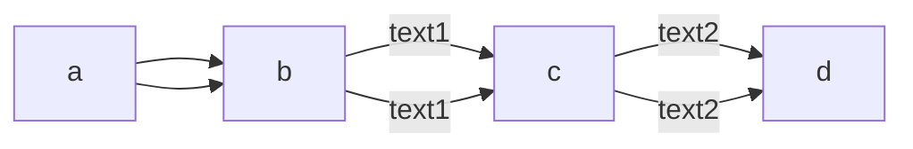

#### bold solid arrow

```graph LR
a==>b==text1==>c
```

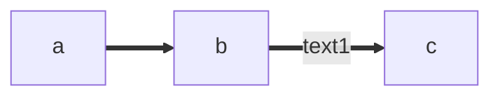

#### dotted arrow

```
graph LR
a-.->b-.text1.->c
```


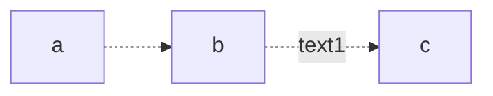

#### nohead arrow

```
graph LR
a---b
b--text1---c
```


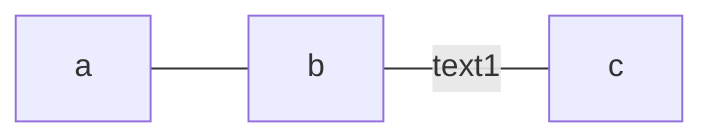

#### other arrow

change the `graph` to `flowchart`

```
flowchart LR
	A o--o B
	B <--> C
	C x--x D
	
	old -- text1 --> different
```

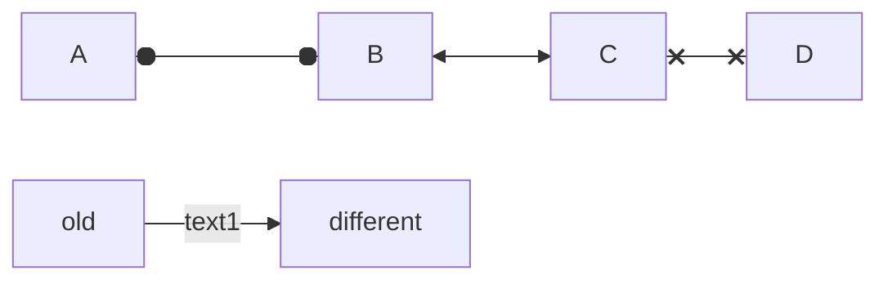

#### longer arrow

add `-` to elongate the line

```
graph LR
A --> B;
B ----> C;
```


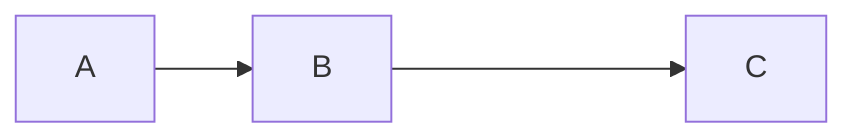

### connecting form

#### straight line

```
graph LR
 A -- text --> B -- text2 --> C
```

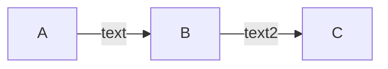


#### multiple line

```
graph 
	a --> b & c --> d
	
	A & B --> C & D
	
	x --> m
	x --> n
	y --> m
	y --> n
```

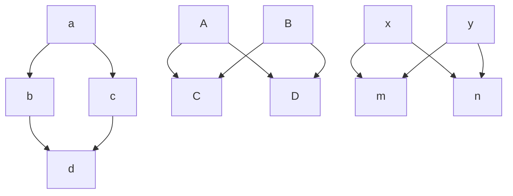


### other

*   ==subgraph== 

    change `graph` to `flowchart` , add `subgraph` to the start of a subgraph and `end` to the end of a subgraph

```
flowchart TB
    c1-->a2
    subgraph one
    a1-->a2
    end
    subgraph two
    b1-->b2
    end
    subgraph three
    c1-->c2
    end
    one --> two
    three --> two
    two --> c2
```

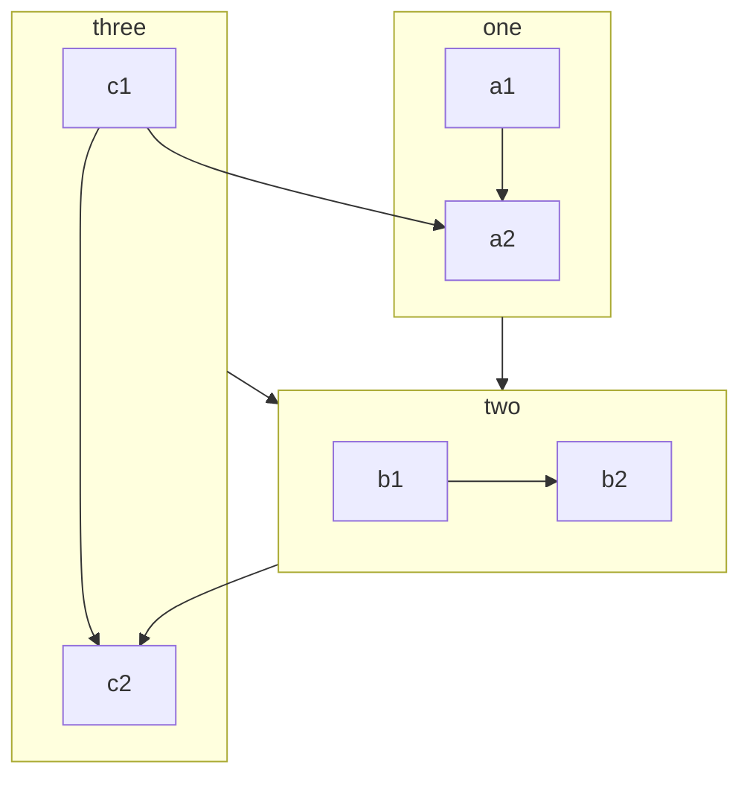


*   ==comment== 

    add `%%` at the front of the line

```
graph LR
%% this is a comment line, no see
a --> b
b --> c
```

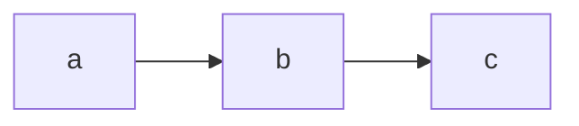

